# Artificer

Artificer is an early bottom-up effort to build a native Rust geometry and boundary-representation (B-rep) kernel for a mechanical CAD application.

The first experimental vertical slices are now executable. Artificer constructs and validates genuine native B-reps, publishes them as immutable content-identified snapshots, applies proper similarity transforms to authoritative geometry, records deterministic command journals and complete history, emits source-mapped diagnostic geometry, and displays it in an interactive native Rust workbench. New production documents start empty with the three origin planes. A staged reference-plane tool creates either a coincident plane from one planar face or a midplane from two parallel planar faces; committed planes enter history, persist in `.artificer`, remain hideable/selectable in the Browser, and can host exact sketches. Protocol v4 constructs exact prisms from deterministic planar material regions: separately authored and reversed line/arc uses may form a loop, nested loops become holes, even-depth islands become separate material regions, and one request may produce multiple disjoint solids. Standalone circles and connected line/arc profiles produce analytic circle edges, planar caps, cylindrical walls, seams, and p-curves rather than faceted product topology. Selected-face Add/Cut now uses one exact `PlanarProfile2` command for strictly inset line/arc/circle regions, including holes, parity islands, multiple selected material regions, and rigidly rotated planar supports within the declared local-prismatic domain. It retains coplanar shoulders, preserves unrelated sibling solids, and coexists with exact whole-cap push/pull. Supported cuts may cross an earlier boss/support interface, exit certified planar faces, or split the edited solid without OCCT or another embedded kernel. The M5/F1/F2/F3/S2D document foundation adds stable feature/body/sketch/parameter/component/joint identity, independent body branches, typed deterministic parameters, persistent role-based entity resolution, editable exact sketch authoring graphs, explicit arrangement-region selection, late-bound region replay, atomic fresh-process replay, native-document v6 Save/Open, a content-addressed local Part Library, and scale-free rigid occurrence placement above those immutable kernel snapshots.

M1 has begun with the dependency-free `artificer-geometry` crate and a deliberately conservative certified `orient2d` filter. It proves clockwise or counter-clockwise orientation only when outward-rounded interval arithmetic excludes zero, reserves `Collinear` for directly provable cases, and returns `Indeterminate` for unresolved cancellation, non-finite input, overflow, or underflow-sensitive cases. The same geometry layer now classifies exact polyline closure, winding, and certified self-intersection without an epsilon. This remains an early numerical foothold, not completion of the filtered/exact predicate ladder or the M1 milestone.

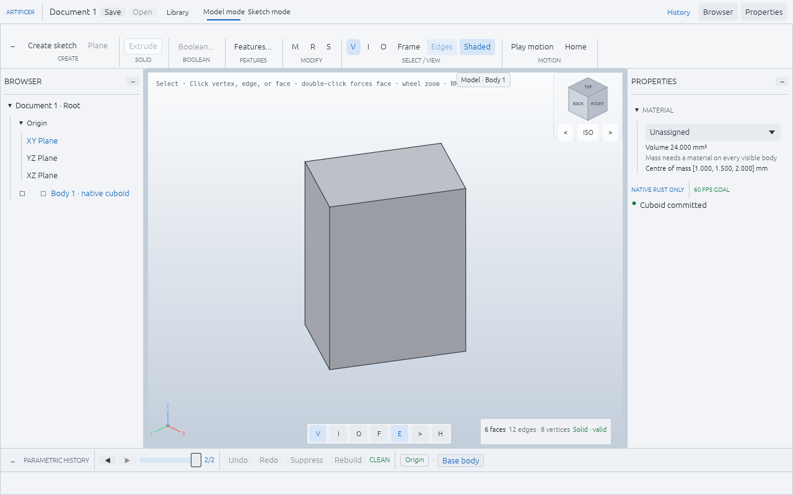

## Run the first slice

```sh
cargo test --workspace --all-targets
cargo test -p artificer-geometry
cargo run -p artificer-cli -- run tests/cases/m0-cuboid.json --journal /tmp/artificer-m0-journal.json
cargo run -p artificer-cli -- replay /tmp/artificer-m0-journal.json
cargo run -p artificer-cli -- run tests/cases/m1-transform-similarity.json --journal /tmp/artificer-m1-journal.json
cargo run -p artificer-cli -- run tests/cases/m4-extrude-rectangle.json --journal /tmp/artificer-m4-journal.json
cargo run -p artificer-cli -- run tests/cases/m4-extrude-concave.json --journal /tmp/artificer-m4-concave-journal.json
cargo run -p artificer-cli -- run tests/cases/m4-face-add.json --journal /tmp/artificer-face-add.json
cargo run -p artificer-cli -- run tests/cases/m4-face-cut.json --journal /tmp/artificer-face-cut.json
cargo run -p artificer-cli -- run tests/cases/m4-face-chain.json --journal /tmp/artificer-face-chain.json
cargo run -p artificer-cli -- run tests/cases/m4-face-push-pull.json --journal /tmp/artificer-face-push-pull.json
cargo run -p artificer-cli -- replay /tmp/artificer-face-chain.json
cargo run -p artificer-workbench --release
```

For a self-contained delivery build, use the dedicated packager instead of
launching through Cargo:

```sh
./scripts/build-standalone.sh
open artifacts/standalone/release/Artificer.app
```

For a complete handoff, `./scripts/check-delivery.sh` first runs the workspace
tests, strict lint and documentation checks, architecture boundary audit,
visual regressions, and release frame budget, then creates that standalone
build. This is the delivery command used after each completed development pass.

On macOS this produces both the double-clickable
`artifacts/standalone/release/Artificer.app` bundle and the raw native executable
at `artifacts/standalone/release/bin/Artificer`. The isolated Cargo build cache
lives under `artifacts/standalone/cargo-target`; the entire delivery folder is
ignored by Git and is refreshed by the same command for every tested handoff.
On Windows the script emits `Artificer.exe`, and on other Unix systems it emits
the raw `Artificer` executable.

## Try the F1/F2/F3 Part Library, assembly placement, and portable document

For an isolated hands-on run on macOS or Linux, start the workbench with explicit local paths:

```sh
ARTIFICER_CATALOG_DIR=/tmp/artificer-f1f2f3-catalog \
ARTIFICER_DOCUMENT_PATH=/tmp/artificer-f1f2f3.artificer \
cargo run -p artificer-workbench --release
```

Then exercise the complete visible path:

1. Click **Library** beside **Save** and **Open** in the header. The `20 × 20 Aluminium Extrusion` card shows immutable revision `1.0.0` and a verified digest. **Add to current workspace** remains unavailable until the required Length is valid.
2. Enter `310` mm and click **Add to current workspace**. This only stages the insertion. Click the red cross to prove cancellation is neutral, then stage it again and click the green tick or press bare `Enter`.
3. Confirm that the Browser gains a separate component/body, History gains `Component 1`, and the new 20 × 20 × 310 mm body is visible. Its exact volume is 124,000 mm³. Hide and show it with its Browser eye control. A narrow Browser truncates the visible component label; hover it to read the complete name.
4. Repeat the same Length and confirm a second insertion. Deterministic initial placement lays each 20 mm-wide occurrence after the occupied assembly bounds along +X with 10 mm clearance, so equal variants remain visibly separate.
5. Select a component and use **Move** or **Rotate**. The viewport previews the occurrence pose while its B-rep snapshot and digest remain unchanged; the green tick commits only the rigid placement. **Scale** is unavailable because authored component size belongs to its parameters. **Ground component** and **Release component** use the same confirmation gate.
6. Click **Add revolute joint**, then confirm. The named world-Z joint appears under **Joints** in the Browser and in Properties. **Play motion** animates the active occurrence about its pivot; this is the first solver-independent joint playback boundary, not a general mate solver.
7. Click **Save**, then add or change something. Click **Open** and use the red cross to retain the current workspace; stage **Open** again and confirm with the green tick to restore the saved document.
8. Quit, launch the same command again, and click **Open** then the green tick. Components, resolved values, rigid poses, joints, visibility, sketches, and the saved History position are reconstructed by replay rather than by loading serialized B-rep memory. A saved unconsumed closed origin- or face-supported sketch remains visible and can be extruded after restart.

Without the environment overrides, the catalog uses the operating system's local application-data directory and the document defaults to `current.artificer` beside it. The versioned `.artificer` workspace envelope stores the parametric document plus display settings and migrates the earlier raw JSON document on open. `Save` is immediate only when no operation is pending; `Open` always uses the shared confirmation gate. Document Properties also provides atomic ASCII STL and faceted STEP export of committed visible geometry in canonical millimetres; neither interchange format replaces the authoritative native workspace.

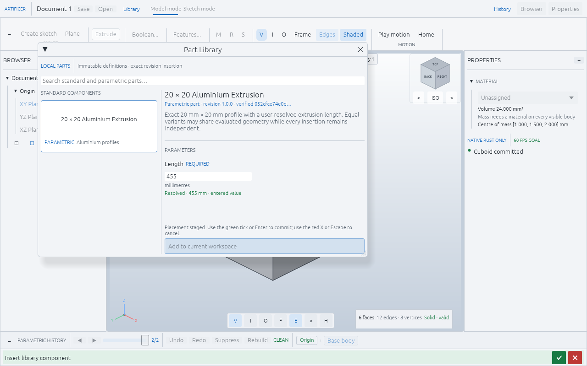

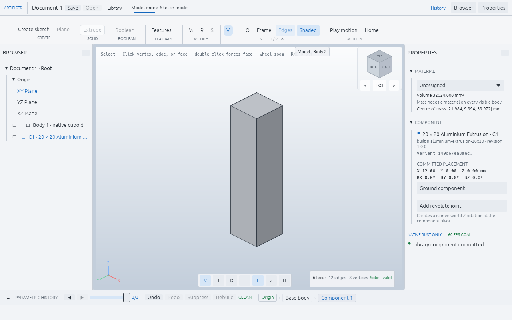

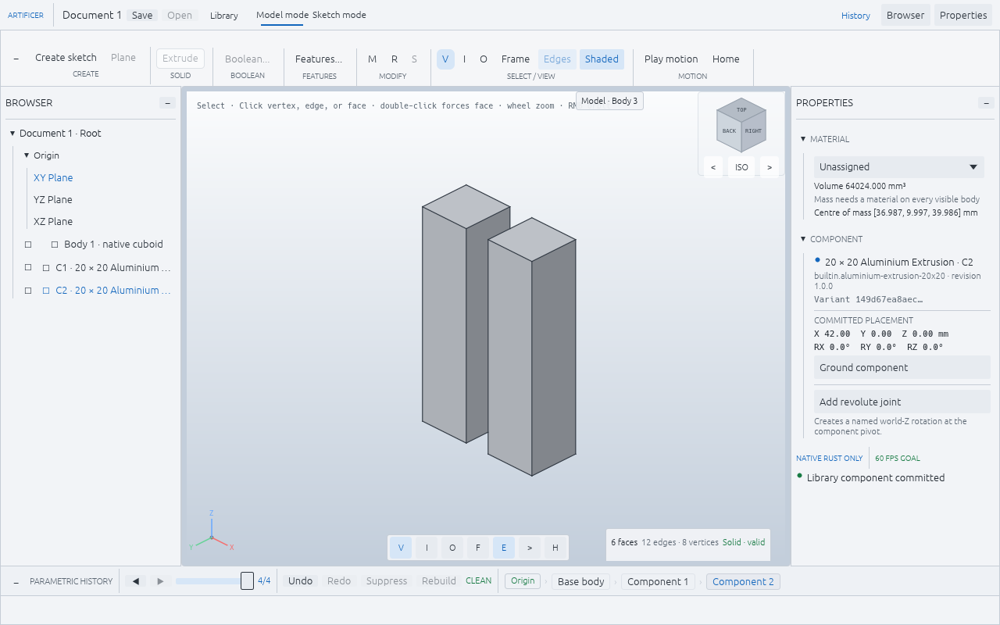

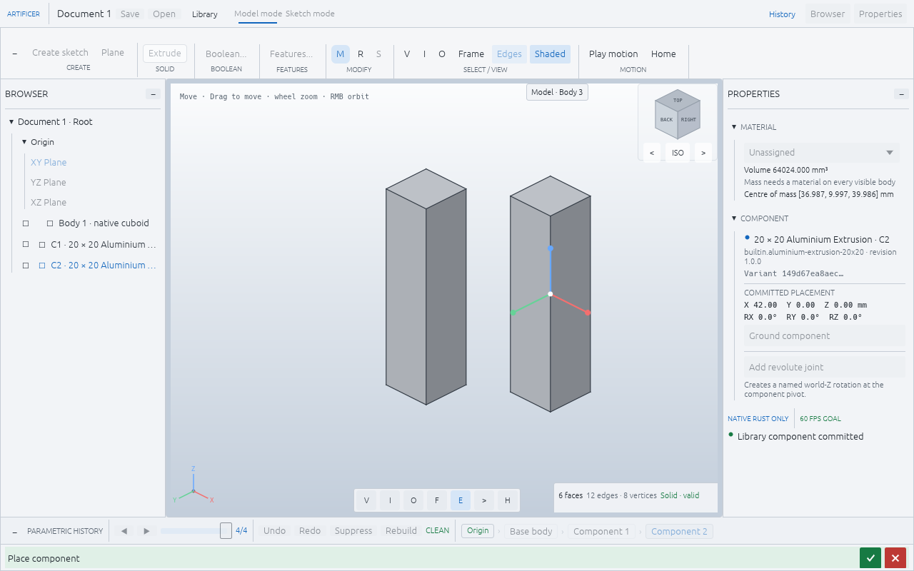

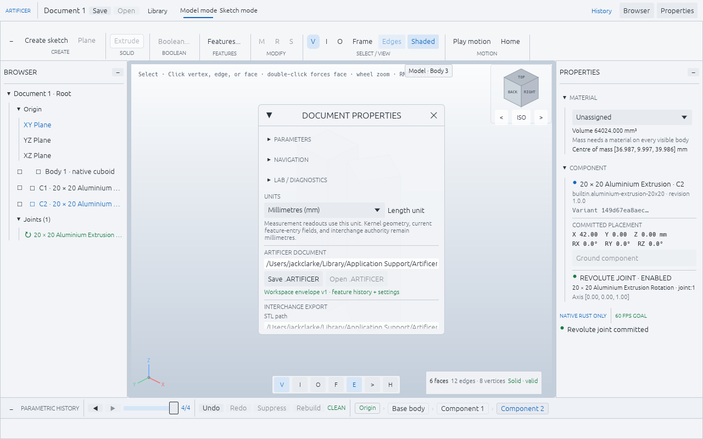

The native desktop workbench has Model and Sketch modes. Model mode retains validated solids, diagnostic cases, transforms, source-mapped selection, and animation. Sketch mode exposes origin and selected-face planes through an orthographic grid with pan, zoom, typed snapping, selectable exact arrangement regions, and live dimensional readouts. The top-left sketch tools use one compact 6 × 2 grid: Select, Point, Line, Rectangle, Circle, and Arc on the first row; Polygon, Slot, Trim, Fillet, Chamfer, and Pattern on the second. Each family occupies one square tile, variant choosers stay inside their tile, and hover help plus accessibility names identify the exact active variant without filling the ribbon with labels. The registry covers line/polyline/centreline, both rectangle and circle variants, centre/start/end and three-point arcs, inner/outer-diameter polygons, both slots, rectangular/circular patterns, and the modification tools. Each committed operation is represented by a persistent UI-neutral sketch recipe rather than by display geometry.

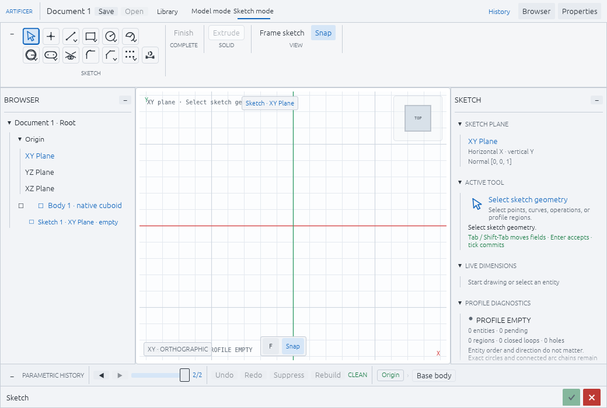

The M4b workbench shell separates those capabilities into an expandable command ribbon, a resizable/collapsible model browser, a resizable/collapsible contextual Properties or Sketch Palette panel, the central canvas, and a collapsible bottom History strip. The side panels reduce to narrow expansion rails, and dense inspector sections collapse independently. These layout actions are immediate presentation state and never change geometry. Extrude keeps one stable place in the command ribbon in both workspaces and becomes visibly available for an eligible closed active or previously committed sketch.

The Properties panel also carries two document-level preferences. **Navigation** offers the orbit, pan, and wheel conventions used across mainstream CAD packages, named for the gestures themselves — right orbit, middle pan, middle orbit with shift pan, each with an inverted-wheel variant — so whichever scheme your muscle memory already knows is there without rebinding anything; the left button always stays free for selection. **Material** assigns one entry of a small library (aluminium, brass, copper, mild and stainless steel, titanium, ABS, acrylic, nylon, PLA, polycarbonate, oak, glass) to the active body. The assignment is persisted by stable key in the `.artificer` envelope, tints the body in the shaded view, and drives mass and centre-of-mass readouts from the kernel's own exact volume and centroid. A body starts unassigned, and any quantity the kernel cannot certify — a mass with an unassigned body in the scene, a centroid the measures did not produce — is named as unavailable rather than filled in with a plausible number.

M5a replaces the old session-only feature preview with a projection of the authoritative `artificer-model` document. Successful Sketch, Extrude, Add, Cut, Transform, Boolean, and library-component features receive stable IDs and ordered dependencies; staging, cancellation, and rejection remain neutral. Browser body and sketch records have independent visibility, and each separate New Body or component insertion retains its own snapshot branch and Browser row. A multi-region extrusion or a cut that splits one body instead remains one compound snapshot and is shown explicitly as `Body group N · k solids`; hide/show and whole-body transforms address that group, not individual member solids. The document core supports suppression, branch-local rebuild transactions, rollback, bounded undo/redo, typed parameter evaluation and editing, persisted sketch constraints, digest-pinned rigid component occurrences, and a bounded persistent joint forest. Component Move/Rotate commits occurrence state without executing the kernel or mutating local B-rep geometry. The History strip has step controls and a persisted rollback slider: moving it evaluates an ordered prefix across the body branches while retaining later recipes and privately hydrated snapshots for exact roll-forward. New modeling actions stay gated until the marker returns to the end. The UI does not yet expose per-solid controls within a body group, feature reorder, a full nonlinear constraint/mate solver, or a complete regeneration/repair workflow, so this remains a foundation rather than completion of M5 or assemblies.

To move an entire supported extrusion cap, select the face and click **Extrude** directly. The selected B-rep face becomes the exact push/pull profile; no surrogate sketch or tessellation boundary is created. For a local prismatic feature, instead choose **Sketch on selected face**, draw or modify exact geometry, finish the sketch, and select one or more certified arrangement regions strictly inside the face material. Those selected regions may contain line, circular-arc, or complete-circle boundaries, direct holes, and parity islands. The camera moves smoothly to the exterior side of the selected face while the solid remains visible.

Both paths start the same live preview: type a distance or drag the arrow. Positive distance selects a green Add; dragging through zero selects a red Cut with the corresponding positive depth, and crossing back selects Add. The translucent volume, arrow, and measurement are not model truth until the shared confirmation tick or bare `Enter` publishes the validated result. Generated ends, floors, and supported planar sides can host later operations.

Every user-triggered model or sketch edit is staged behind the same visible confirmation contract: click the compact green tick square or press bare `Enter` to commit it, and click the compact red cross square or press `Escape` to abandon it. The icon-only controls retain explicit `Confirm operation` and `Cancel operation` accessibility names and explanatory hover text. The confirmation rail is a fixed shell invariant: it always reserves the same space and cannot be hidden or collapsed with the ribbon, browser, inspector, or feature preview. Move, Rotate, and Scale create an explicit presentation preview, a selected diagnostic case becomes a pending kernel request, and each newly drawn sketch entity remains provisional until confirmed. While drawing, `Tab` cycles exact values and typing locks the active measurement; the first `Enter` used by that editor applies/stages the dimension and can never also commit the global operation. Presentation actions such as selection, camera motion, sketch pan/zoom, panel layout, view-tool choice, and animation remain immediate. Conflicting operation tools stay disabled while an intent is pending. Leaving Sketch mode cancels an incomplete first/second-click drawing draft, so a stale gesture cannot unexpectedly complete after returning.

`Finish Sketch` is also gated. The analytic arrangement splits certified line/arc/circle intersections into stable fragments and bounded cells; unrelated open or construction geometry does not invalidate an otherwise selectable cell. Region clicks and Select All choose explicit canonical `RegionSignature` values. The profile compiler unions adjacent selected cells, assigns hole/island parity, normalizes winding, and emits deterministic material regions. It never closes a gap with an epsilon, and display tessellation is never reused as modeling input. Requests are bounded to 32 regions, 128 loops, and 1,024 exact curves.

The all-linear standalone path accepts multiple disjoint regions and strictly separated direct holes; an island inside a hole becomes another material region and therefore another independent solid in the returned snapshot. Linear loops retain the established three-to-256-use path. A request containing any analytic curve instead uses the native analytic builder: material-disjoint outer and direct-hole boundaries may be complete circles or exactly connected line/arc wires. The exact mixed-hole matrix includes both a rectangular outer with a circular hole and a circular outer with a linear rectangular hole. A depth-two region wholly inside another region's hole is valid material and becomes a separate solid; every cross-region boundary pair must still clear the active minimum, and an outer nested in another region's filled material rejects. Full circles become two exact semicircle edges with explicit vertical seam generators, while arc walls retain their exact cylindrical carriers. Validation, semantic hashing, analytic area/volume/centroid/bounds, similarity transforms, and source-mapped debug tessellation all understand those curves and surfaces; display sampling never becomes B-rep authority.

Selecting a supported face before Create Sketch binds the sketch to its exact face-local frame, outer boundary, inner boundaries, persistent target recipe, and supporting body branch. The unified selected-face command consumes one or more selected exact line/arc/circle material regions, including direct holes and parity islands, on finite planar supports in rigidly rotated frames. Add, blind Cut, and certified through Cut retain planar/cylindrical carriers, seams, p-curves, exact measures, complete history, and source-mapped display geometry. The implementation is a bounded regularized local-prismatic imprint/classify/rebuild path: profile and sweep contacts are certified before publication, unaffected sibling solids are preserved, and owner splitting emits complete one-to-many provenance. Confirmation sends the same versioned declarative request through the public kernel path used by the CLI and replaces the displayed body only after complete validation.

Open or branched selections without a bounded cell, self-intersections, touching/overlapping profile boundaries, numerically indeterminate arrangements, and features at or below modeling resolution reject. The selected-face implementation remains a strict-inset local-prismatic domain: tangency, coincidence, zero-thickness remnants, and contacts requiring unsupported non-transverse surface splitting or merging reject transactionally. A separate cross-body Boolean path supports regularized Union, Difference, and Intersection for all-planar B-reps; curved/general trimmed-surface Boolean reconstruction, NURBS operations, and general face offset remain deferred. Whole-face push/pull is narrower still: the selected face must be an unholed exterior extrusion cap with equal perpendicular rails, and an inward move must stop before its support plane. Native document v6 persists the editable authoring graph—including open and construction geometry, operations, stable identities, exact evaluated caches, frame, and support—while downstream features persist selected region signatures and resolve them again during rebuild. Display sampling never becomes modeling or saved-document authority.

| Area | Delivered in the current supported domain | Deferred or explicitly rejected |
|---|---|---|
| Sketch authoring | Requested point/line/rectangle/circle/arc/polygon/slot families; Trim, patterns, fillet, chamfer; stable transactional recipes | Constraint solver, splines/NURBS, ellipses, offset/mirror/projected geometry |
| Live UI controls | Compact 6 × 2 family/variant grid, contained variant choosers, hover/accessibility help, typed live dimensions, exact Trim hover, draggable pattern handles, and editable three-point-arc sweep | Additional primitive families and a future constraint-driven dimension editor |
| Persistence and replay | Native v6 editable graphs, v4/v5 exact-profile migration, explicit region signatures, late-bound downstream profile rebuild | Automatic repair/retargeting, general feature reorder and constraint-driven historical editing |
| Profile use | Exact New Body and strict-inset selected-face Add/Cut for line/arc/circle holes, islands, multiple regions, and rotated planar supports | Tangent/coincident/zero-thickness contacts, unsupported split/merge contacts, cross-body fusion, general Booleans and NURBS |

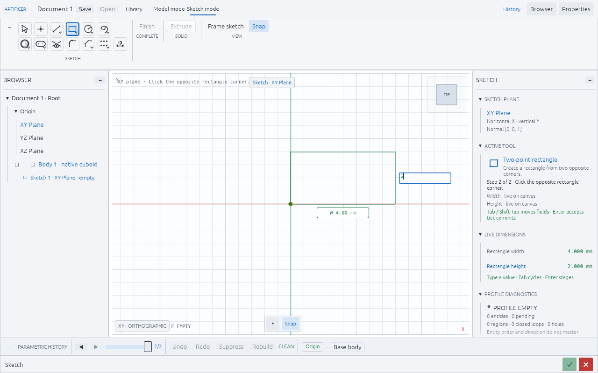

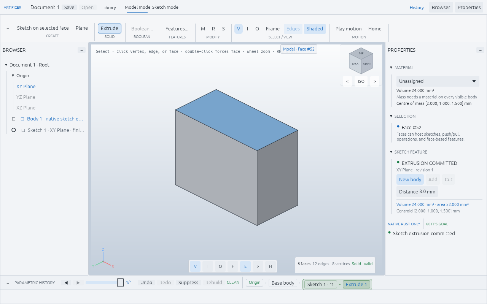

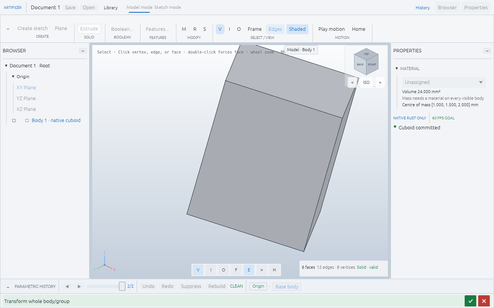

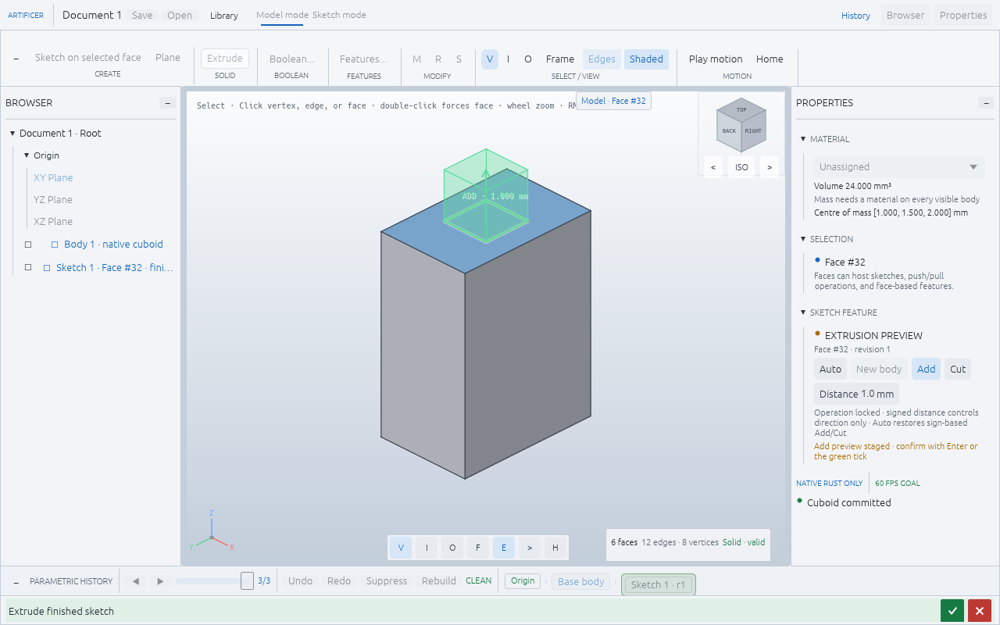

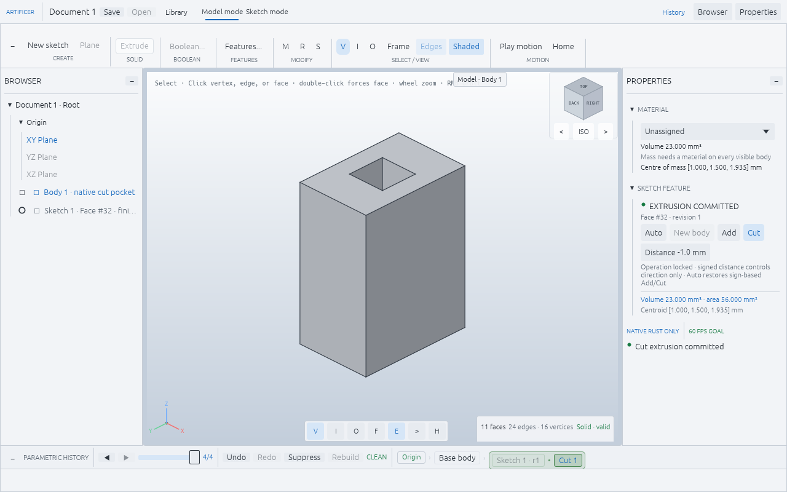

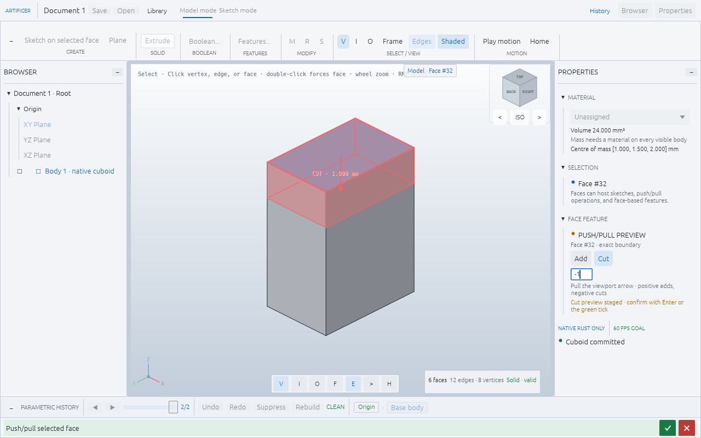

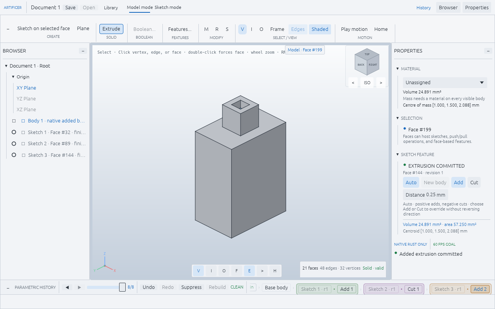

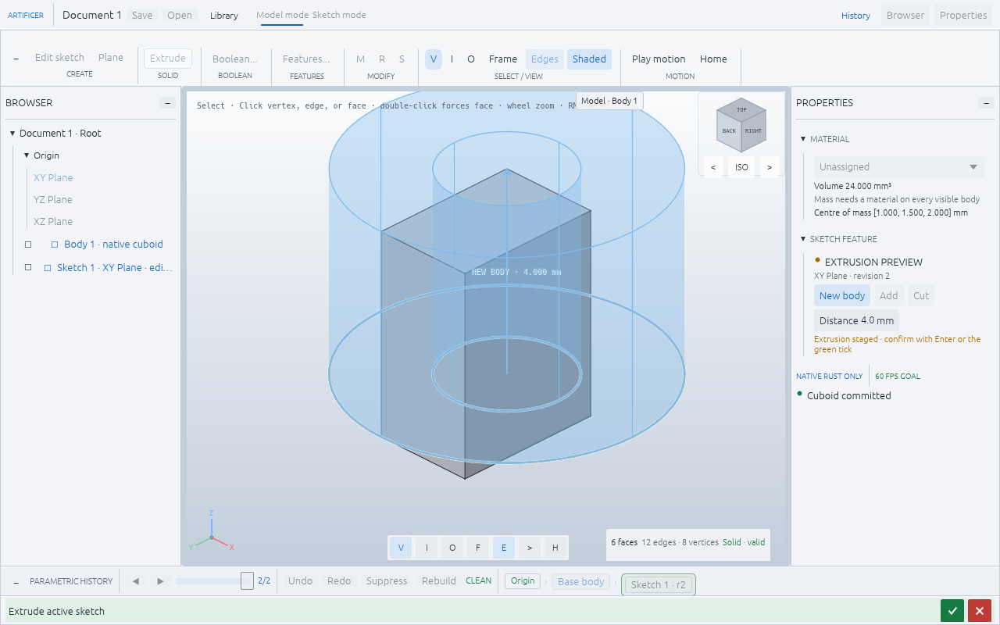

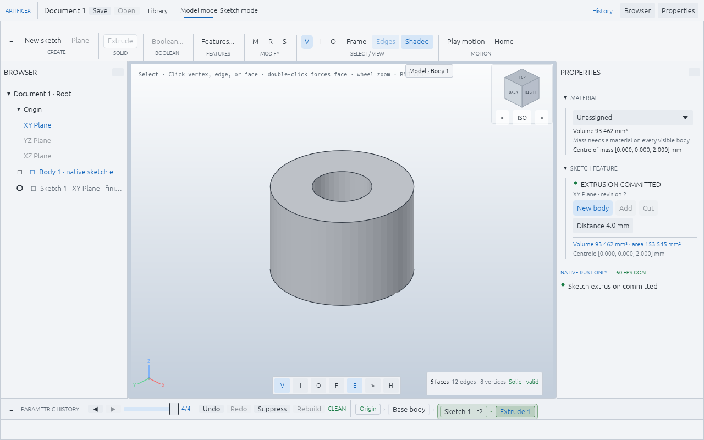

Shared confirmation input:

| Input | Action |
|---|---|
| `Enter` | Confirm the pending model or sketch operation |
| `Escape` | Cancel the pending model or sketch operation without executing it |

Model-mode input:

| Input | Tool or action |
|---|---|
| `V` | Select a source-mapped model face |
| `O` | Orbit the camera with the left mouse button |
| `M` | Preview moving the selected whole body or rigid component occurrence |
| `R` | Preview rotating the selected whole body or rigid component occurrence |
| `S` | Preview positive uniform scaling for a non-component whole body; unavailable for rigid occurrences |
| `F` | Frame the currently visible body and preview |
| Drag the extrusion arrow | Change signed preview distance; crossing zero switches Add/Cut |
| Right mouse drag | Orbit from any active tool |
| Mouse wheel | Zoom the camera |
| `Space` | Play or pause turntable motion |
| `Home` | Reset camera orientation and zoom only |

Sketch-mode input:

| Input | Tool or action |
|---|---|
| `V` | Select a sketch entity |
| `P` | Draw a point with one click |
| `L` | Draw connected line segments with successive clicks |
| `R` | Draw an axis-aligned rectangle from two opposite corners |
| `C` | Draw a circle from centre then rim |
| `A` | Draw an arc from centre, start, then end |
| `Tab` / `Shift+Tab` | Apply and cycle the active live dimension |
| Number keys | Replace and lock the active dimension in millimetres or degrees |
| Middle or right mouse drag | Pan the orthographic sketch plane |
| Mouse wheel | Zoom around the pointer |

Animation is time-based and requests continuous native repaints while playing; the window backend and vsync pace those frames, so a high-refresh display may run above 60. `60 FPS` is the minimum responsiveness goal, not a fixed scheduler rate or a guarantee for every machine. The UI reports measured repaint-start cadence only after it has a sample; otherwise it says `measuring` or `paused`. This is useful UI timing evidence, not GPU presentation telemetry. Headless UI tests run paused with a fixed 1/60-second step, and pixel tests use a fixed animation phase, so interaction and visual regressions remain repeatable.

The focused UI screenshots are checked-in pixel regressions, while semantic and visual UI tests cover the Model/Sketch shell, independent panel expansion, the fixed compact confirmation rail, direct-staging Extrude control, exterior-side face-camera motion, signed arrow drag and automatic Add/Cut switching, whole-face push/pull, hole-aware/analytic region previews and commits, order-independent sketch wires, document-backed History and Browser views, the rollback slider, body/sketch/component visibility, independent New Body rows, explicit multi-solid body groups, group hide/show and rollback restoration, origin-plane selection, live dimensions and keyboard ownership, staging without commit, visible confirmation and cancellation, rejected edits retaining state, native extrusion, repeated face-feature chains, stale snapshots, source-face selection, keyboard focus, the 1040×700 minimum layout, 60 Hz headless interaction cost, a stationary viewport across confirmation, staged/committed Part Library states, distinct placed occurrences, and joint creation. Document/history tests prove that staging, rejection, and cancellation are neutral while each successful feature appends once; model-layer tests additionally cover stable feature/body/sketch/parameter/component/joint IDs, typed bounded parameter evaluation and binding digests, component occurrence and joint-forest invariants, per-body replay, suppression, cursor/suppression independence, exact rollback/roll-forward, append blocking away from the timeline end, undo/redo, atomic rollback, native v1-through-v5 migration, exact sketch payload validation, serde validation, and explicit missing/split-ambiguous persistent-reference resolution. Fresh-process tests regenerate snapshots and reports, restore supported origin/face sketches, parameterized components, poses, and joints, retain the history cursor, and reject tampered clean provenance atomically. Catalog tests cover deterministic SHA-256 packages, idempotent no-overwrite publication, exact revision resolution, reopen/search, and corruption exclusion. Protocol/kernel tests cover bounded v4 line/arc/circle region payloads, exact disk/annulus/mixed-curve, reciprocal rectangle/circle hole, material-aware annulus/island, and disjoint-region constructors, circle/cylinder frames and p-curve loci, analytic measures/bounds/transforms/debug tessellation, atomic multi-solid group transforms, selected-face exact-circle Add/blind/through Cut with complete source mapping, circle-boss/concentric-through-hole and rectangular-boss/circle feature chains, transactional perpendicular-cylinder and sibling-body contact rejection, selected-face linear regions with holes and retained sibling solids, linear declaration-order and winding invariance, concave and safe-collinear Add/Cut, inner-loop topology and measures, blind cuts across feature interfaces, exact through cuts and stable overtravel, topology-preserving signed cap push/pull, deterministic replay, complete provenance, fail-closed invalid inputs, and retained snapshots after rejection. Geometry tests cover clear orientation signs, cyclic/reversal consistency, exact small-integer grids, certified segment crossings and loop classification, 100,000 large and near-collinear cases checked against an independent exact-integer oracle, representable translation and power-of-two scaling, conservative cancellation, overflow/underflow, non-finite input, and deterministic repetition; the full one-million-case M1 exact-oracle gate remains ahead.

The delivered S2D focused suites are green for the compact/minimum-window toolbar, keyboard and confirmation routing, live canvas interactions, every first-pass primitive and modifier recipe, native-v6 persistence/replay, exact profile compilation, New Body/Add/Cut routes, visual baselines, and the release-profile CPU frame budget. The workspace-wide test, lint, documentation, architecture, and snapshot checks remain the merge gate. Actual GPU-presented frame timing is deliberately not inferred from the headless harness and still requires the manual reference-machine presentation run described in the tooling plan.

OCCT is not a dependency, backend, fallback, or product capability. It may be added later only as a separately built offline development oracle that consumes declarative test cases and returns comparison evidence. The CI architecture audit rejects OCCT/OpenCascade dependencies, C/C++ product sources, and UI/rendering dependencies in the kernel.

This slice is intentionally bounded. M1/M5 plus F1/F2/F3/S2D now provides robust exact-fallback predicates, real document identity/replay, a persisted rollback cursor, typed parameter editing, persisted foundational sketch constraints, editable exact sketch graphs inside native document v6, explicit arrangement-region selection and late-bound replay, planar cross-body Booleans, atomic supported-part reconstruction, a content-addressed local catalog with one usable parametric definition, deterministic independent occurrence placement, and the first fixed/revolute hierarchy boundary. It does not claim a complete nonlinear sketch or mate solver, arbitrary constraint types, feature reorder, automatic reference repair, configurations, a dynamic catalog authoring browser, or a networked Vault. The exact feature kernel supports standalone and strict-inset selected-face line/arc/circle regions, holes, islands, multiple regions, rotated planar supports, an annular full-turn revolve, exact cylindrical holes, straight ribs, planar-body mirror/pattern, and complete-cuboid-edge chamfer/fillet. Tangential/coincident topology changes, general curved-surface Booleans, NURBS, general face offset, arbitrary-axis revolve profiles, and semantic analytic STEP import/export remain later gates; the current STEP writer is explicitly a faceted committed-view export. [ADR 0014](docs/architecture/adr/0014-m5a-parametric-document-foundation.md) records the original document foundation, [ADR 0017](docs/architecture/adr/0017-portable-native-document-v4.md) records portable v4 replay, [ADR 0018](docs/architecture/adr/0018-content-addressed-part-library-and-components.md) records the Part Library/component boundary, [ADR 0019](docs/architecture/adr/0019-rigid-occurrence-placement-and-joint-forest.md) records F3 placement and joints, [ADR 0020](docs/architecture/adr/0020-regularized-exact-planar-face-features.md) records the unified selected-face domain, and [ADR 0021](docs/architecture/adr/0021-editable-sketch-authoring-and-region-replay.md) records editable authoring and late-bound region replay.

## Programme

Start with:

- [Geometry and B-rep kernel programme](docs/architecture/geometry-kernel/README.md)
- [Kernel test and robustness strategy](docs/architecture/geometry-kernel/test-strategy.md)
- [ADR 0001: native Rust kernel with an external development oracle](docs/architecture/adr/0001-native-rust-kernel-with-reference-backend.md)
- [ADR 0002: numerical correctness and tolerance model](docs/architecture/adr/0002-numerical-correctness-model.md)
- [ADR 0003: entity identity across snapshots and regeneration](docs/architecture/adr/0003-entity-identity-and-persistent-references.md)
- [ADR 0004: first experimental cuboid slice](docs/architecture/adr/0004-first-experimental-cuboid-slice.md)
- [ADR 0005: display transforms and deterministic motion](docs/architecture/adr/0005-display-transforms-and-motion.md)
- [ADR 0006: committed whole-snapshot similarity transforms](docs/architecture/adr/0006-committed-similarity-transforms.md)
- [ADR 0007: universal confirmation for interactive model operations](docs/architecture/adr/0007-universal-model-operation-confirmation.md)
- [ADR 0008: plane/profile workbench boundary](docs/architecture/adr/0008-plane-profile-workbench.md)
- [ADR 0009: live sketch dimensions](docs/architecture/adr/0009-live-sketch-dimensions.md)
- [ADR 0010: first convex profile extrusion](docs/architecture/adr/0010-first-convex-profile-extrusion.md)
- [ADR 0011: expandable workbench shell and fixed confirmation rail](docs/architecture/adr/0011-expandable-workbench-shell.md)
- [ADR 0012: first selected-face Add and Cut](docs/architecture/adr/0012-first-selected-face-add-cut.md)
- [ADR 0013: repeatable rectangular face features](docs/architecture/adr/0013-repeatable-rectangular-face-features.md)
- [ADR 0014: M5a parametric document foundation](docs/architecture/adr/0014-m5a-parametric-document-foundation.md)
- [ADR 0015: linear-profile features, hole-aware faces, exact push/pull, and history rollback](docs/architecture/adr/0015-linear-profile-features-and-history-rollback.md)
- [ADR 0016: exact planar profile curves and deterministic material regions](docs/architecture/adr/0016-exact-planar-profile-curves-and-regions.md)
- [ADR 0017: portable native document v4 and atomic fresh-process replay](docs/architecture/adr/0017-portable-native-document-v4.md)
- [ADR 0018: content-addressed local Part Library and component occurrences](docs/architecture/adr/0018-content-addressed-part-library-and-components.md)
- [ADR 0019: rigid occurrence placement and persistent joint forest](docs/architecture/adr/0019-rigid-occurrence-placement-and-joint-forest.md)

No implementation schedule is estimated in calendar time. Progress is governed by capability and robustness gates: a phase is complete only when its supported input domain passes its invariant, regression, property, fuzz, replay, and performance requirements.
