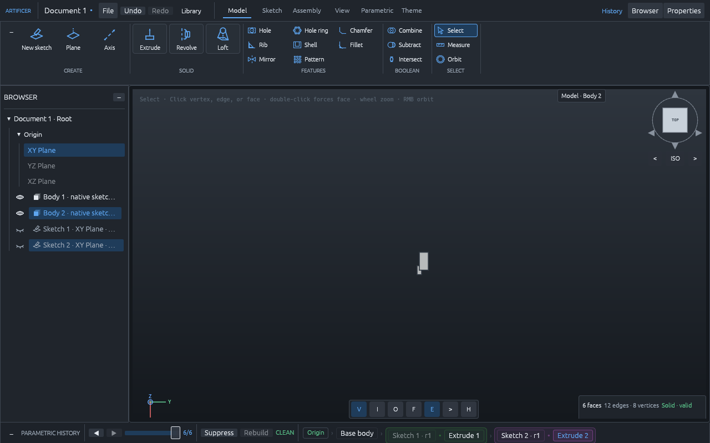
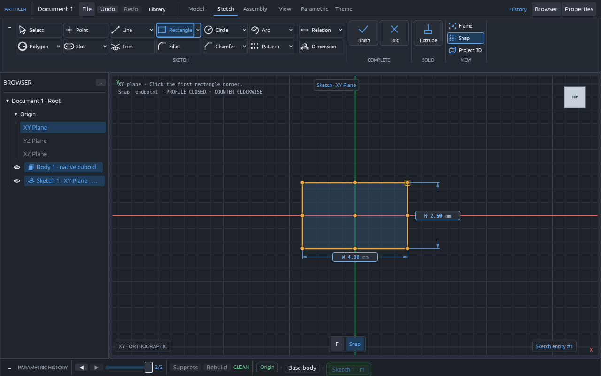
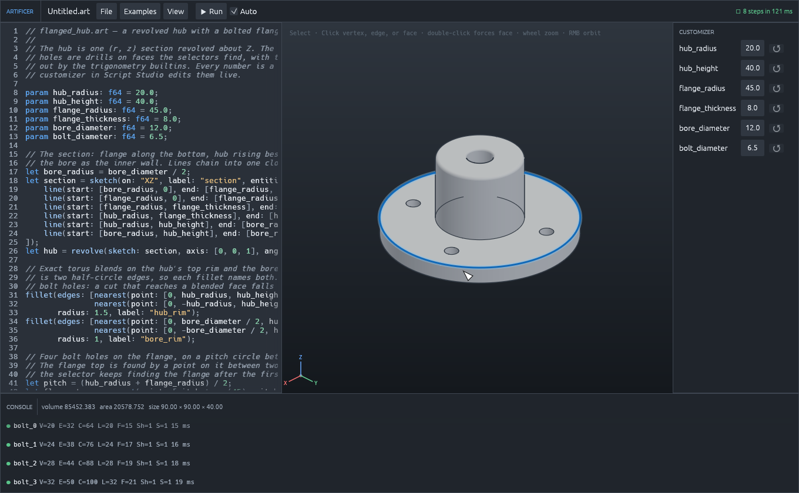
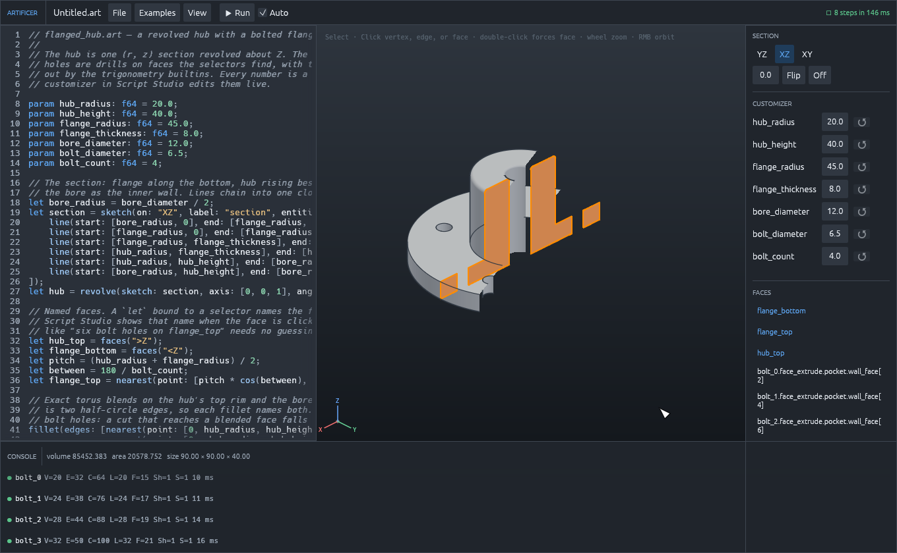
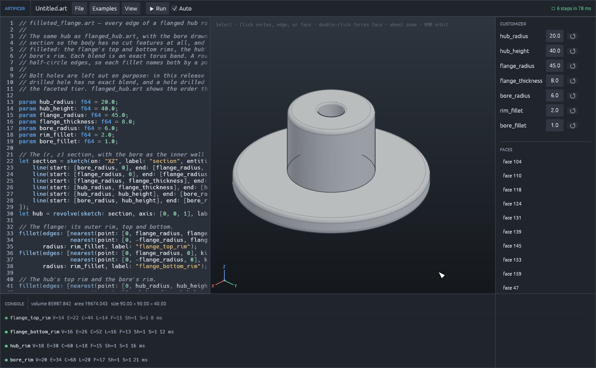

<div align="center">

# Artificer

**An exact boundary-representation geometry kernel, and the parametric CAD workbench built on it. Pure Rust, from scratch.**

[](https://github.com/JackClarkeAE/artificer/actions)
[](LICENSE)
[](#licensing)
[](https://www.rust-lang.org)

[The Kernel](#the-artificer-kernel) •
[Built for AI-driven CAD](#built-for-ai-driven-cad) •
[The Workbench](#the-artificer-workbench) •
[Quickstart](#quickstart) •
[Architecture](#architecture) •
[Roadmap](#roadmap) •
[Licensing](#licensing)

<br/>



</div>

---

## What is new in 0.97

This release is about verification-driven CAD: letting a program, not only a person, read what the kernel did and check the result — and then asking the question a drawing cannot answer, which is whether the parts actually go together.

- **The session report.** `artificer-api report part.art` (or `run --json`) prints a versioned JSON document: every step with the strategy **rung** that certified it (`face-feature/exact-prism`, `edge-finish/rim-blend`, `boolean/analytic`, ...) and whether it was exact or fell to the faceted tier, the body's exact volume, area and centroid, every face and edge described from its analytic carrier, the names the script gave, and the failing step with its diagnostic codes and script line when a run stops short. The shape is published as a JSON Schema in [`docs/report-schema.json`](docs/report-schema.json) and a test keeps its list of diagnostic codes equal to what the kernel source emits. The JSON-RPC methods `script.report`, `report` and `query.describe` give the same over the wire.
- **Interference studies.** `analysis.interference` measures every pair of named bodies and publishes a versioned document: apart, touching or overlapping, how close, where on each body, and the shared volume where the Boolean engine can supply it. Where the Boolean engine cannot carry the operands the pair keeps its measured clearance and records the engine's refusal code beside it, so a study never fails because a Boolean did. The workbench runs the same study over its visible bodies from View ▸ Interference and lists the pairs worst first. Its schema is [`docs/analysis-schema.json`](docs/analysis-schema.json), held to the kernel by a test.
- **Clearance between bodies.** `probe clearance` answers how close two bodies come, where, and whether they are apart, touching or inside one another. It runs over a bounding-volume hierarchy of each body's facets rather than through a Boolean, so it answers for bodies the Boolean engine refuses, and it publishes the chord bound when either body is curved.
- **Probes that change nothing.** `probe` answers volume, surface area, face area, edge length, minimum distance, the overlap volume of two bodies, point containment and thinnest wall, each with a tier and the method behind it, and leaves the session's digest untouched. The reference is [`docs/verification.md`](docs/verification.md).
- **Clearance profiles, so a measurement becomes an answer.** `0.42 mm` says nothing until a fit says what it wanted. `analysis.profiles` publishes a catalogue an agent can discover rather than guess — a machined running fit at 0.02–0.08 mm, masked stereolithography at 0.05–0.15, an FDM press fit at 0.10–0.20, an FDM sliding fit at 0.30–0.50, and plain assembly, which asks only that nothing shares space — and a study run against one earns every pair a verdict. `too_close` is the only verdict that fails; `loose` still reports a part meant to be held that is not. A fit of your own goes in inline, with no upper complaint if you omit one.
- **A heat map of where it is tight.** `analysis.clearance_field` reads the signed clearance at every corner and centre of every display facet — positive a gap, negative how far inside — and the workbench paints it straight onto the body, so the tight spot is somewhere you look at rather than a number you correlate. The palette is a measured ramp rather than a fixed scale, and the legend names what the colours are worth.
- **Joints that move.** A revolute joint on an occurrence gives it a coordinate. The solver poses every component from the drivers, carrying each child's whole subtree, and refuses by name rather than guessing: an unknown or fixed or disabled joint, a driver outside the joint's limits, a duplicate, a non-finite value, a cycle in the tree.
- **Sweeping a mechanism through its travel.** The harder question is not whether the parts fit where they sit, but whether they fit *anywhere they can go*. `analysis.sweep` measures every pair at every position and stops at the first collision, because past that the parts have already passed through one another and nothing beyond is a pose the real thing reaches. It reports how much of the travel it answered for against how much it was offered, so an interrupted sweep reads as unmeasured rather than clear. Its schema is [`docs/sweep-schema.json`](docs/sweep-schema.json). The workbench runs it over the joints the play button animates, off the UI thread, with a progress count.
- **A move gizmo you can grab.** Three arrows on X, Y and Z at the tool's origin. Grab one and the drag is constrained to that axis alone, with the other two dimmed so it is clear what you have hold of; the distance follows the cursor along the axis rather than raw pixels.
- **Insert a part into the design you have open.** In the Model tab's Create group: a catalogue part arrives as its own body and occurrence, which is how an assembly is built up and what the joint solver then poses.
- **Everything above is reachable over the wire**, not only from Rust, and [`docs/art-scripting.md`](docs/art-scripting.md) — the reference written to be handed to an AI agent as-is — now covers the analysis surface end to end, with the request an agent would actually send for each and a section on what the numbers are worth: facets are chords, so an approximate answer is never optimistic but can be short by one chord budget per curved body, and a conservative caller subtracts the published bound before concluding a part fits.
- **Every step result** now carries its rung, tier and construction warnings, and Script Studio prints them in the console.
- **Exact STEP.** `artificer-api export part.art part.step` (JSON-RPC `export.step`, the workbench's "STEP (exact B-rep)") writes the body as AP214 `advanced_brep_shape_representation`: planes, cylinders, cones, spheres and tori as the five STEP elementary surfaces, lines, circles and ellipses as themselves, cavities as `brep_with_voids`, nothing tessellated. The exporter's tests read every file back as a manifold B-rep and check each face's sense against the kernel's own normals; `tools/oracle-occt/step_measure.py` is the OpenCascade oracle a development machine runs to confirm imported volume and area to one part in a billion. Faceted STEP stays for mesh consumers (`--faceted`, "STEP (faceted)").
- **Journals back to scripts, and scripts compared.** `artificer-api journal session.json --art out.art` (JSON-RPC `journal.art`, `Session::to_art`) writes a session's journal as a `.art` script that rebuilds the same digest, with dimensions as `param`s, snapshot-bound references regenerated as history selectors, and faceted-tier steps annotated. `artificer-api diff a.art b.art --json` (JSON-RPC `script.diff`) compares two scripts semantically: parameters, steps added, removed, moved or changed, names renamed or retargeted. Script Studio pulls a journal into the open script behind that diff, and exports its own.
- **Shell.** `shell(open: faces(">Z"), wall: 3)` hollows a body to one uniform wall, open at one face, at two opposite faces, or closed with a void. A body is read as a prism about the open face first and as a solid of revolution second, so a box, a cylinder, a slot, a two-diameter turned hub and a tapered post all hollow exactly, with the wall measured square to the surface. The answers are closed-form: a shelled box open at the top has volume `bdh − (b−2w)(d−2w)(h−w)`, and `probe.min_wall` reads the wall back. A closed shell needs no Boolean at all, because the core is the body's own boundary offset inward and is enclosed directly as a void.
- **Exact mirror, and patterns of features.** `mirror` reflects any body exactly: every carrier is reflected as itself, blends included, so the mirrored part keeps its face count, volume and area with its centroid reflected, and takes exact features afterwards. `pattern(step: hole, axis: [0, 0, 1], axis_origin:, count: 6)` and `pattern(step: hole, direction:, spacing:, count:)` repeat a drilled hole or a face-sketch extrusion around an axis or along a row by replaying the same exact feature at each placement, each instance a step of its own under one journal entry, so a rim fillet on a patterned hole certifies through the same blend ladder as on the original. A whole-body `pattern(direction:, spacing:, count:)` is exact as well: every copy is the body under a rigid translation, so a cylinder patterns as cylinders rather than facets.
- **`.art` 0.3: functions, modules and typed parameters.** `fn standoff(on: face, at: [f64; 2], height: f64, label: str) -> body { ... return boss with faces { top: boss.top }; }` packages steps that recur, with labels scoped to the call so a loop of calls stays unique without string arithmetic, and exported faces that keep resolving after later steps. `use "lib/standoffs.art";` shares functions and constants between scripts. `param wall: f64 [mm] in 1.2..4.0 = 2.0 "wall thickness";` carries a unit, a range and a description, and `artificer-api params part.art --json` (or JSON-RPC `script.params`) lists them without running the script. Unbound names, arity and type mismatches, recursion and import cycles refuse with a line and column.

## What is new in 0.96

This release turns the kernel's scripting language into a product of its own and pairs it with a live editor.

- **`.art` scripting, version 0.2.** The language now reaches the whole kernel: sketches from lines, circles, arcs and rectangles on world planes or on faces; extrude with add, cut and draft; revolve; drill, push/pull, fillet, chamfer, mirror and pattern; union, difference and intersection between bodies; face and edge selectors by direction, position and history; the trigonometry in degrees. Errors name their line and column, and parameters have defaults a host can override. The full reference, written for people and for AI agents, is [`docs/art-scripting.md`](docs/art-scripting.md).
- **Artificer Script Studio.** A third program in the shape OpenSCAD made familiar: the script on the left, the exact model on the right, the `param` lines as a customizer, and a console that points at the failing line. It re-runs as you type, keeps the last good model on screen through an error, sections the model on any origin plane, and exports STL and OBJ.
- **Section analysis.** The workbench and Script Studio clip the model to one side of a plane and cap the cut, so the inside of a part can be checked for the solid it should be.
- **Oblique sections of cylinders are exact.** Angled holes, mitred cylinder ends and oblique cuts of round bodies meet on the ellipse curve through the analytic Boolean engine, with no faceting.
- **Sketch constraints from the canvas.** Coincident, horizontal, vertical, parallel, perpendicular, equal, tangent and collinear relations are applied by clicking geometry, from a constraint group on the sketch bar.
- **Named faces and loops, for a person in the loop.** A `let` bound to a selector names a face. Script Studio lists the names, shows one when its face is clicked, and describes the face in plain words, so a request such as "six bolt holes on `flange_top`" needs no guessing. `for` loops with `"bolt_" + i` labels make counts into parameters an agent can change. The agent workflow is written up in the language reference.
- **Selectors that mean what they say.** `faces(">Z")` is the highest upward face on a stepped part, and the nearest-face selector measures to the surface, so a point placed on a face finds it.
- **Presentation.** The three origin planes read as translucent datum cards with corner labels; the camera no longer zooms in when an extrusion commits; the outline of a revolved body no longer breaks at its seam.

---

## Three products, one repository

Artificer is three things, deliberately kept apart:

| | What it is | Where it lives | Depends on |
|---|---|---|---|
| **Artificer Kernel** | A standalone exact B-rep modelling kernel with its programmatic API built in: a Rust API, a JSON-RPC 2.0 server, the `.art` scripting language, headless PNG/SVG rendering, and STL/OBJ export. | [`crates/kernel`](crates/kernel) | Nothing but its own geometry, compute, and protocol crates. No UI, no GPU, no C or C++. |
| **Artificer Workbench** | A native desktop parametric CAD application: sketching, features, assemblies, a part library, and a parametric history. | [`apps/workbench`](apps/workbench) | The kernel, through the same protocol every other client uses. |
| **Artificer Script Studio** | A live `.art` visualiser in the OpenSCAD shape: the script on the left, the exact model on the right, a customizer built from the script's parameters, and a console that points at the failing line. | [`apps/script-studio`](apps/script-studio) | The kernel, through its API session, and the workbench's viewport and theme. |

The separation is enforced, not aspirational. The CI architecture audit fails the build if a UI or rendering dependency enters the kernel crate, and the kernel is exercised end to end by a headless test suite that never opens a window. You can embed the kernel in your own application, drive it from another language over JSON-RPC, or script it from a file, and you get exactly the same geometry the workbench would build.

---

## The Artificer Kernel

Every surface, curve, and boundary in an Artificer model is analytic. There are no mesh approximations standing in for solids, no tolerance stacking, and no healing heuristics that quietly change your geometry. An operation either produces a certified manifold solid or refuses with a named, structured reason.

### Exact by construction

- **Analytic geometry only.** Planes, cylinders, cones, spheres, and tori as surfaces; lines and circles as curves. A fillet on a cylinder's rim at its own radius is an exact sphere, not a patch of triangles.
- **Closed-form calculus.** Volume, surface area, centroid, and inertia are integrated analytically over the true surfaces. Test gates pin them against independent derivations at one part in a billion.
- **Transactional validation.** Every result passes Euler–Poincaré, edge-use, loop-orientation, locus, and self-intersection checks before it is published. A snapshot that fails is never returned.
- **Certified or refused.** Each operation is a ladder of exact strategies. When none applies, the kernel says which rung refused and why, with a diagnostic code, rather than guessing. The one remaining approximate tier, for cuts that cross curved voids, is labelled as an approximation in its report.
- **Deterministic and content-addressed.** Snapshots carry a semantic digest. The same commands produce bit-identical models on every platform, so replays, caches, and audits agree.

### The API is part of the kernel

The programmatic surface lives in `artificer_kernel::api` and ships with the kernel, not beside it. Three entry points cover most uses:

**Rust.** Embed the kernel directly:

```rust
use artificer_kernel::CancellationToken;
use artificer_kernel::api::{ApiCommand, Session};
use artificer_protocol::Point3;

let mut session = Session::new();
let token = CancellationToken::default();

session.execute(ApiCommand::MakeBox {
    label: "cube".into(),
    origin: Point3::new(0.0, 0.0, 0.0),
    size: [50.0, 50.0, 50.0],
}, &token)?;

let measures = session.snapshot.measures();
println!("Exact volume: {:.6} mm³", measures.volume);
println!("Bounds: {:?}", session.query().bounds()?);
```

**JSON-RPC 2.0.** Run the kernel as a headless service on stdin/stdout, one request per line, batches and notifications included:

```sh
cargo run --release -p artificer-api-server -- serve
```

```json
{
  "jsonrpc": "2.0",
  "id": "1",
  "method": "execute",
  "params": {
    "type": "make_box",
    "label": "base_block",
    "origin": { "x": 0.0, "y": 0.0, "z": 0.0 },
    "size": [100.0, 50.0, 25.0]
  }
}
```

Domain errors come back as JSON-RPC error `-32000` with the structured `ApiError` in `error.data`: a code, a plain-language message, a suggestion, candidate entities where a selector was ambiguous, and the kernel's own diagnostics.

**`.art` scripts.** A small parametric language evaluated straight into kernel commands:

```text
// bracket.art — parametric bracket with mounting holes
param width: f64 = 100.0;
param depth: f64 = 50.0;
param thickness: f64 = 10.0;

let base = box(origin: [0, 0, 0], size: [width, depth, thickness], label: "base");
let top = base.face("top_face");

// Hole centres are in the face's own frame, whose origin is the face centre.
drill(face: top, center: [-30.0, 0.0], diameter: 8.0, depth: thickness, label: "hole_l");
drill(face: faces(">Z"), center: [30.0, 0.0], diameter: 8.0, depth: thickness, label: "hole_r");

// Fillet every vertical edge of the block at once.
fillet(edges: edges("|Z"), radius: 2.0, label: "soften");
```

```sh
cargo run --release -p artificer-api-server -- run bracket.art --param width=120
cargo run --release -p artificer-api-server -- snapshot bracket.art bracket.png
cargo run --release -p artificer-api-server -- export bracket.art bracket.stl
```

The whole API is reachable from a script, one builtin per command, with named arguments and angles in degrees:

| Builtin | Makes |
|---|---|
| `box(size:, origin:, label:)`, `cylinder(radius: or diameter:, height:, center:, axis:, label:)` | A new body. |
| `sketch(on: "XY" \| "XZ" \| "YZ" \| face, entities: [...], label:)` with `line(start:, end:)`, `circle(center:, radius:)`, `arc(center:, radius:, start_angle:, end_angle:)`, `rect(origin: or center:, width:, height:)` | A profile on a plane or a face. Lines and arcs chain into loops; nested loops become holes. |
| `extrude(sketch:, distance:, operation: "new" \| "add" \| "cut", draft:, regions:, label:)` | A prism, or a drafted loft for a new body. |
| `revolve(sketch:, axis:, axis_origin:, angle:, operation:, label:)` | A solid of revolution. |
| `drill(face:, center:, diameter:, depth:)`, `push_pull(face:, distance:)`, `fillet(edges:, radius:)`, `chamfer(edges:, distance:)` | Face and edge features. |
| `shell(open:, wall:)` | Hollows the current body to one wall, open at one face, two opposite faces, or none; prisms and solids of revolution. |
| `mirror(origin:, normal:)` | Reflects the current body exactly. |
| `pattern(step:, axis:, axis_origin:, count:, angle:)`, `pattern(step:, direction:, spacing:, count:)` | Repeats a drilled hole or a face-sketch extrusion around an axis or along a row. |
| `pattern(direction:, spacing:, count:)` | Copies the whole body along a row, exactly. |
| `union(target:, tool:)`, `difference(target:, tool:)`, `intersection(target:, tool:)` | Booleans between two steps. |
| `faces(">Z")`, `edges("\|Z")`, `nearest(point:, kind:)`, `step.face("role")`, `step.edge("role")` | Selectors. |
| `fn name(a: f64, on: face, label: str) -> body { ... return step with faces { top: ... }; }` | Functions with typed arguments, call-scoped labels and exported faces. |
| `use "lib/parts.art";` | Modules of functions and constants. |
| `param wall: f64 [mm] in 1..4 = 2 "wall";` | Parameters with a unit, a range and a description. |
| `sqrt abs floor ceil round min max clamp pow hypot sin cos tan asin acos atan atan2`, `pi` | Arithmetic. |

Errors name their line and column, so an editor can point at them. `artificer-api report part.art` prints the machine-readable session report instead of prose, with every step's rung and tier, the body's exact measures and every face described. Open the same file in **Artificer Script Studio** to edit it live against the kernel's viewport, with the `param` lines as a customizer. The complete language reference, with every function, argument, selector and method — including the analysis surface: clearance, interference studies judged against a clearance profile, the per-facet heat map, and sweeping a mechanism through its travel — is [`docs/art-scripting.md`](docs/art-scripting.md); it is written to be handed to an AI agent as-is.

### What the kernel does today

- Primitives, planar-profile extrusion with holes and islands, revolve, drafted extrusion as an exact loft to the profile's offset section, push/pull, holes, ribs, shell, exact mirror, circular and linear patterns of face features, and exact whole-body patterns.
- Exact chamfers and constant-radius fillets, including fillets that run around a whole hole rim, with spherical corners where the rim turns in and elliptical mitre seams where it turns out.
- Regularized Boolean union, difference, and intersection, with an exact engine for plane and cylinder operands and a faceted fallback that says so.
- Analytic surface–surface intersections across the vocabulary, published as a supported-domain matrix.
- Geometric selectors (`faces(">Z")`, `edges("|Z")`, by extremum, by type, parallel to a direction) that resolve deterministically or refuse with candidates.
- Headless tessellation at display or authoritative chord budgets, SVG and PNG snapshots from any camera, and STL/OBJ export.

---

## Built for AI-driven CAD

Language models and agents are good at saying what a part should be and poor at nudging triangles. A kernel that serves them well has to be declarative, honest about failure, and inspectable without a screen. Artificer was shaped by those requirements:

- **A closed, typed command vocabulary.** Every operation is a serialisable command with named fields and documented domains. There is no hidden UI state to reproduce; a model is its command journal.
- **Refusals are data.** An operation that cannot be certified returns a diagnostic code, the reason, and where it applies a suggestion or the list of candidate entities. An agent can read the refusal and try the next thing instead of inheriting broken geometry.
- **Stable references.** Faces and edges are addressed by geometric selectors and by persistent, provenance-tracked references, so a plan written before the model exists still resolves after it is built.
- **Deterministic replay.** Journals replay to bit-identical snapshots with content digests, which makes results cacheable, diffable, and safe to verify independently.
- **Headless eyes.** Snapshots render to PNG or SVG from standard or explicit cameras, so a vision-capable model can look at what it built without a GPU or a window.
- **Exact measurements.** Volumes, areas, centroids, bounds, and distances are closed-form answers, not mesh estimates, so a planner can trust a number it reads back.
- **A report, not prose.** A run ends in a versioned JSON report naming the rung that certified each step, whether it was exact, the body's measures, every face and edge, and the first failure with its codes; probes answer questions about the model without changing it. See [`docs/verification.md`](docs/verification.md).

The same properties are what make the kernel a sound foundation for any programmatic CAD: generative design, automated tooling, cloud pipelines, and your own front end.

---

## The Artificer Workbench

The desktop application is the reference client for the kernel and a complete single-part and small-assembly modeller in its own right.

<div align="center">



*Sketching with live profile detection: every bounded region is selectable the moment it closes.*

</div>

- **Sketching.** Lines, rectangles, circles, arcs, polygons, slots, splines, text set from a bundled typeface as exact outlines, fillets, chamfers, trims, patterns, relations, and dimensions. Intersecting geometry splits into separately selectable regions. Live dimensions edit in place.
- **Features.** Extrude, drafted extrude, revolve, push/pull, holes, hole patterns, ribs, shell, mirror, patterns, chamfers, and fillets, each staged behind one confirmation gate and recorded in an editable parametric history. A shell's wall and its open face are both parametric, so the face survives a replay like any other feature target.
- **Face sketches.** Sketch on any planar face with the body always in view; project the geometry hidden below the surface as an x-ray when you need to line up with it.
- **Assemblies and library.** A content-addressed part library, rigid placements, grounding, and revolute joints with live motion.
- **Documents.** Several documents open at once in tabs along the top of the window; a portable native document format with a versioned schema.
- **Viewport.** Exact silhouettes, hidden-line rendering, smooth shading from analytic normals, a view cube, and themes.

---

## Artificer Script Studio

The third program is for people who would rather type a model than draw one. Script Studio is a live `.art` editor in the shape OpenSCAD made familiar, built on the same kernel, viewport, and theme as the workbench.

<div align="center">



*The flanged hub example: the script, the exact model it builds, its parameters as a customizer, and every step in the console.*



*The same part under section analysis, cut through the axis: the cut faces are capped, the bore and a bolt hole show in the caps, and the FACES panel lists the names the script gave.*



*`filleted_flange.art`: every rim of the hub rounded with exact torus blends, each fillet naming both half-circle edges of its rim.*

</div>

- **Live.** Every edit re-runs the script on a worker thread after a short pause; a run that an edit supersedes is cancelled rather than waited for, and the last good model stays on screen while you type.
- **Customizer.** The script's `param` lines become a panel of values you can drag. A dragged value re-runs the script without touching the text, and one click puts the script's own default back.
- **Console.** Every step lists its label, topology, and time. A parse or evaluation error names its line and column, a failing step names the line that labels it, and clicking the error puts the cursor there.
- **Editor.** Syntax colouring for the `.art` vocabulary, line numbers, and the error's line washed in red.
- **Files.** Open and save scripts, drop a file onto the window, export the model as STL or OBJ, and start from the bundled examples.

```sh
cargo run --release -p artificer-script-studio -- crates/kernel/examples/flanged_hub.art
```

---

## Quickstart

### Prerequisites

- Stable Rust 1.95 or newer.
- For the workbench only: a GPU toolchain (Metal on macOS, Vulkan or DX12 on Windows, Vulkan with Wayland or X11 on Linux). The kernel and its server need none.

### Build and run

```sh
git clone https://github.com/JackClarkeAE/artificer.git
cd artificer

# The kernel and its API: the headless test suite
cargo test -p artificer-kernel

# The JSON-RPC server on stdin/stdout
cargo run --release -p artificer-api-server -- serve

# Run, render, or export an .art script
cargo run --release -p artificer-api-server -- run crates/kernel/examples/bearing_mount.art

# The desktop workbench
cargo run --release -p artificer-workbench

# The live .art visualiser, on a script of your own
cargo run --release -p artificer-script-studio -- crates/kernel/examples/flanged_hub.art

# Everything
cargo test --workspace
```

### Prebuilt binaries

Installers are published on the [Releases page](https://github.com/JackClarkeAE/artificer/releases). Each one carries the workbench and Script Studio side by side:

- Windows: `Artificer-Setup.exe` installs `Artificer.exe` and `ArtificerScriptStudio.exe`
- Linux: `Artificer.AppImage`, with `ArtificerScriptStudio` alongside it in the plain archive
- macOS (Apple Silicon): `Artificer-macOS-arm64.zip` with `Artificer.app` and `Artificer Script Studio.app`

---

## Architecture

| Layer | Crate | Purpose |
|---|---|---|
| **Kernel** | [`crates/kernel`](crates/kernel) | The exact B-rep kernel: topology, analytic surfaces, strategy ladders, validation, measures, tessellation, and the `api` module (sessions, selectors, JSON-RPC server, `.art` scripting, snapshots, export). |
| **Geometry** | [`crates/geometry`](crates/geometry) | Certified predicates, interval arithmetic, planar and spatial intersection mathematics. |
| **Compute** | [`crates/compute`](crates/compute) | The work pool, cancellation, and performance spans the kernel runs on. |
| **Protocol** | [`crates/protocol`](crates/protocol) | The serialisable command, snapshot, and diagnostic vocabulary shared by every client. |
| **Sketch** | [`crates/sketch`](crates/sketch) | Exact 2D authoring: recipes, constraints, the arrangement into regions, profile compilation, text outlines. |
| **Model** | [`crates/model`](crates/model) | The parametric document: features, persistent references, parameters, journals, and the native file schema. |
| **Kernel server** | [`apps/api-server`](apps/api-server) | The command-line front for the kernel API: `serve`, `run`, `snapshot`, `export`, `journal`. |
| **Presentation** | [`crates/viewport`](crates/viewport), [`crates/sketch-ui`](crates/sketch-ui), [`crates/ui-core`](crates/ui-core) | The 3D viewport, the sketch canvas, and the shared theme and widgets. None of these can see the kernel's internals. |
| **Workbench** | [`apps/workbench`](apps/workbench) | The desktop application. |
| **Script Studio** | [`apps/script-studio`](apps/script-studio) | The live `.art` visualiser: editor, customizer, console, and the shared viewport, driving the kernel through its API session. |
| **Test kit** | [`crates/testkit`](crates/testkit), [`apps/cli`](apps/cli) | Deterministic cases, journals, and the conformance runner. |

The dependency rules between these layers are checked by `scripts/check-architecture-boundaries.sh` on every CI run. Design decisions are recorded as ADRs under [`docs/architecture/adr`](docs/architecture/adr), and the kernel programme itself in [`docs/architecture/geometry-kernel`](docs/architecture/geometry-kernel).

---

## Roadmap

- [x] Analytic B-rep topology, primitives, planar profiles, exact calculus.
- [x] Regularized Booleans, chamfers, fillets, and hole-rim blends.
- [x] Parametric documents, assemblies, part library, joints.
- [x] The kernel API: Rust, JSON-RPC, `.art` scripts, headless snapshots and export.
- [x] Multi-document workbench, sketch text, drafted extrusion as the first loft rung.
- [ ] Sweeps along paths and lofts between arbitrary sections; draft on existing faces; shell.
- [x] The ellipse curve, first slice: the mitre seam of a fillet turning a sharp corner, so fillets round square holes and L-shaped rims are exact.
- [x] Oblique plane sections of cylinders on the same curve, through the analytic Boolean: angled holes, mitred cylinder ends, oblique cuts of round bodies.
- [ ] Oblique cone sections, and pipe tees (equal cylinders crossing) on the same ellipse.
- [ ] Native STEP read and write with exact surfaces, IGES import, DXF drawing sheets.

---

## Licensing

Artificer is dual-licensed.

**Open source: AGPL-3.0-or-later.** The kernel and the workbench are free software under the [GNU Affero General Public License, version 3 or later](LICENSE). You may use, study, modify, and redistribute them, including for commercial purposes, provided you honour the licence: derived works and network services built on Artificer must themselves be released under the AGPL, with their source available to their users.

**Commercial licence.** Organisations that want to build proprietary or closed-source products, cloud services, or internal tools on the Artificer Kernel or Workbench without the AGPL's copyleft obligations can obtain a commercial licence. It covers embedding the kernel in your own software, running it as a service, and shipping the workbench under your own terms, with the same code and the same guarantees.

| You are | You need |
|---|---|
| An individual, a student, a researcher, or an open-source project | Nothing more: the AGPL applies. |
| A company whose product or service will itself be released under the AGPL | Nothing more: the AGPL applies. |
| A company shipping or hosting a proprietary product built on Artificer | A commercial licence. |

To enquire about a commercial licence, open an issue on GitHub titled "Commercial licence enquiry" or contact the maintainers. Contributions to the repository are accepted under the AGPL-3.0-or-later.
