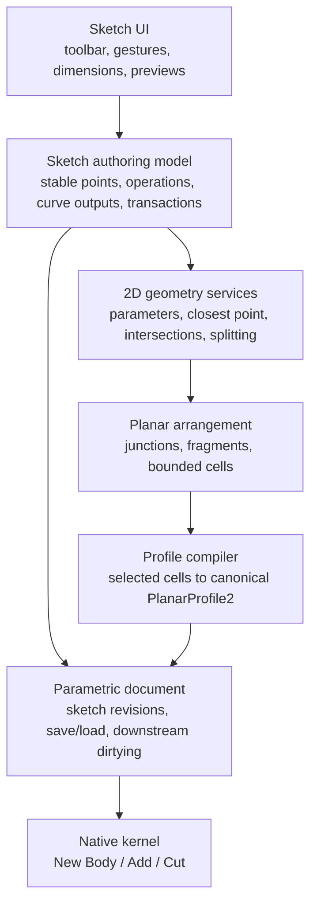
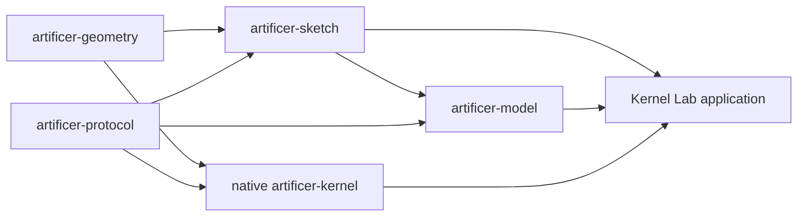
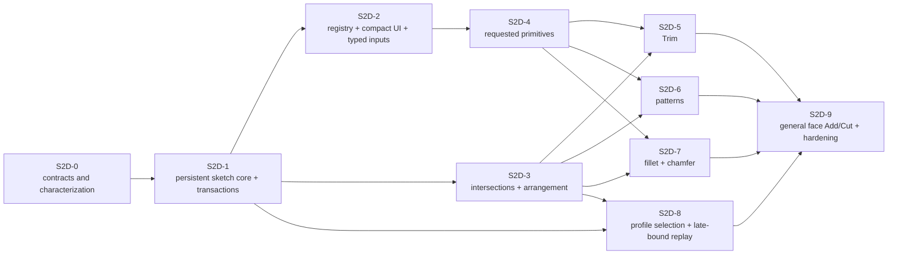

# First-pass 2D sketch tooling plan

Status: first-pass feature set delivered in the declared domain; release verification remains continuous
Last reviewed: 2026-07-30
Programme position: mechanical sketch foundation delivered before returning to Vault, assembly analysis, animation studies, or other advanced product work

The requested first-pass authoring, modification, persistence, profile, and supported extrusion routes are implemented. Focused registry, minimum-window UI, interaction, primitive/modifier, persistence/replay, profile/extrusion, visual, and release CPU frame-budget suites are green. The workspace-wide semantic, UI, visual, migration, architecture, lint, and documentation checks remain the merge gate. GPU-presented frame timing is a separate manual reference-machine verification and is not claimed by the headless CPU result.

## Outcome

This workstream turns the sketch laboratory into an editable, persistent, and extensible 2D authoring system. Its delivered first product pass provides:

- compact square icon controls arranged in a grid, with hover help, accessibility names, and variant dropdowns;
- the requested line, centreline, rectangle, circle, polygon, slot, arc, trim, pattern, fillet, and chamfer tools;
- live dimensional input for every creation or modification gesture;
- one green-tick/`Enter` confirmation and red-cross/`Escape` cancellation contract for every operation;
- stable authored geometry that survives save, load, undo, redo, and later parameter edits;
- deterministic profile regions, including holes, islands, disjoint regions, and regions formed by intersecting curves;
- exact line/circular-arc/circle transport into `PlanarProfile2`, without using display tessellation as geometry; and
- a tested route from every supported closed profile to New Body, Add, and Cut within the declared kernel domain.

The goal is not to add many special-case buttons to the existing canvas. The goal is to establish one system in which a new primitive or modifier supplies a recipe, interaction controller, icon, dimensions, validation, and tests while reusing the same transaction, persistence, intersection, profile, and extrusion machinery.

## Scope decision

### Included in this first pass

| Family | Variants or commands |
|---|---|
| Selection | Entity/edge selection, region selection, staged Delete |
| Point | Sketch point |
| Line | Single line, chained polyline, centreline |
| Rectangle | Two-point corner rectangle, centre-point rectangle |
| Circle | Centre-point diameter circle, two-point diameter circle |
| Arc | Centre/start/end arc, three-point arc |
| Polygon | Inner-diameter/across-flats polygon, outer-diameter/across-corners polygon |
| Slot | Two-point centre-to-centre slot, centre-to-outer-point slot |
| Modify | Trim, 2D fillet, 2D chamfer |
| Pattern | Rectangular pattern, circular pattern |
| Profile use | Selectable regions, holes, multiple regions, New Body, Add, blind Cut, and supported through Cut |

“Two-point circle” means that the two points are the ends of a diameter. “Polygon inner diameter” means the diameter of the circle tangent to every side; “outer diameter” means the diameter of the circle through every vertex. Those definitions also work for odd-sided polygons and will appear in the tooltips.

The two-point slot uses two cap centres followed by a width point. The centre-to-outer-point slot uses the overall slot centre, one outer tip, and a width point; its opposite tip is reflected through the centre. These gestures are deliberately named in the tooltip so “length” never ambiguously means both centre distance and overall length.

### Delivered versus deferred checkpoint

| Area | Delivered in the first-pass domain | Deferred or explicitly rejected |
|---|---|---|
| Creation | Point; line/polyline/centreline; both rectangles and circles; centre/start/end and three-point arc gestures; inner/outer polygons; both slots | Ellipse/conics, spline/NURBS, text, offset, mirror, projection |
| Modification | Exact Trim; every bounded no-extension line/arc/circle fillet carrier pair; equal/two-distance line-line chamfer; staged Delete | Circular-carrier chamfer, distance-angle chamfer, general offset |
| Patterns | Bounded rectangular and circular patterns, stable semantic roles, count-edit ID survival | Recursive procedural dependency graphs beyond the proven source rules |
| UI and live input | Compact 6 × 2 family grid, contained variant choosers, hover/accessibility help, shared staged-input engine, typed dimensions, exact Trim hover, draggable pattern handles, and editable three-point-arc sweep | Constraint-driven dimensions and tools outside the listed first-pass families |
| Regions and replay | Analytic arrangement, explicit region selection, canonical holes/islands/multiple regions, native-v6 editable authoring, late-bound downstream region replay | Automatic missing/ambiguous-region repair and a general constrained regeneration UI |
| Profile use | Exact New Body and unified strict-inset selected-face Add/Cut for line/arc/circle regions, holes, parity islands, multiple regions, and rotated planar supports | Tangent/coincident/zero-thickness topology, unsupported non-transverse split/merge contacts, cross-body fusion, general Boolean and NURBS operations |

### Explicitly deferred, but supported by the architecture

- Ellipses and elliptical arcs.
- Bézier, B-spline, and NURBS sketch curves.
- Conics, equations, text, and image tracing.
- Offset, mirror, projected/intersection geometry, and silhouette tools. Sketch offset and the projection it needs for body edges are now specified in [the sketch offset plan](sketch-offset-plan.md); its control surface ships and its engine does not.
- Tangent-circle and additional arc/slot construction variants.
- A complete geometric/dimensional constraint solver and degrees-of-freedom display.

These need new curve types or solver work and are not honestly part of the current line/circular-arc/circle exact domain. The registry and geometry interfaces must leave an additive path for them; no placeholder tool is shown before its full path is ready.

## Delivered implementation checkpoint

The authoring boundary described by this plan is now present:

- `artificer-sketch` owns persistent points, recipes, semantic curve outputs, transactions, analytic intersections, arrangement cells, explicit region signatures, profile compilation, queries, Trim, patterns, fillet, and chamfer;
- the compact application registry and typed gesture controllers expose the requested 6 × 2 family/variant grid through the universal tick/Enter and red-cross/Escape gate;
- native document v6 persists the editable authoring graph, while v4/v5 profiles migrate without invented primitive intent;
- downstream extrusion recipes retain selected region signatures and resolve/compile them again after an upstream edit or fresh-process load;
- `PlanarProfile2` remains the one exact line/arc/circle bridge; and
- `ExtrudeFacePlanarProfile` consumes the unified strict-inset selected-face line/arc/circle domain, including holes, parity islands, multiple selected regions, and rotated planar supports.

The first-pass feature boundary is delivered. Ongoing merge/release work reruns the complete workspace gate, grows fuzz evidence, and keeps every unsupported contact visibly transactional. Foundational persisted constraints and all-planar cross-body Booleans are now present; a complete nonlinear constraint solver, automatic reference-repair UI, curved/general trimmed-surface Booleans, and NURBS support remain deliberate later scope. Manual GPU presentation verification also remains separate from the automated CPU frame-construction gate.

For a physical release-profile check of the toolbar, gestures, confirmation gate, extrusion preview, and animation, run:

```sh
cargo run -p artificer-workbench --release
```

## Governing invariants

These rules apply to every phase:

1. **Authored sketch data is authoritative.** A `PlanarProfile2` and any preview mesh are derived products.
2. **Exact curve class is retained.** Lines remain lines, complete circles remain circles, and split circles/arcs remain circular arcs.
3. **Display sampling never decides model topology.** It is only for painting and coarse hit feedback.
4. **Every model-changing gesture is transactional.** Preview changes no document state; confirm publishes the whole edit; cancel publishes nothing.
5. **Cancellation is identity-neutral.** Draft identifiers are temporary. Permanent IDs are allocated only during a successful commit in deterministic output-role order.
6. **Undo does not recycle published IDs.** Removed or undone IDs remain retired.
7. **No hidden tolerance repairs geometry.** Screen hit radius, user snapping, modeling resolution, and certified geometric uncertainty stay separate.
8. **Unsupported and indeterminate are visible outcomes.** They never become a guessed success or a faceted fallback.
9. **Resource work is bounded before allocation.** Entity, generator, intersection, and expanded-pattern budgets use checked arithmetic.
10. **OCCT remains offline evidence only.** It is not linked, called by the product, or used as an implementation fallback.

## Target architecture



### Crate and module boundary

The UI-neutral `artificer-sketch` crate prevents the application module from becoming the sketch kernel. Its implemented source boundary is:

```text
crates/sketch/src/
  ids.rs                 stable IDs and typed input keys
  definition.rs          persisted points, operations, entities, roles, validation
  geometry.rs            exact line/arc/circle evaluation and transforms
  recipes.rs             typed persistent recipes and values
  transaction.rs         atomic edits, replay, impact reports, local undo/redo
  intersections.rs       analytic pair classification and split parameters
  arrangement.rs         junctions, fragments, half-edges, stable cells
  profile.rs             selected cells -> canonical PlanarProfile2
  queries.rs             hit testing and typed snap candidates
  primitives.rs          primitive, pattern, fillet, and chamfer evaluation
  trim.rs                exact adjacent-span selection

apps/workbench/src/
  sketch_toolbar.rs      registry-driven compact family/variant grid and icons
  sketch.rs              camera/session/input/render adapters over the core
```

`artificer-geometry` continues to own robust predicates. `artificer-protocol` owns the serialized precision policy and compiled profile types. `artificer-model` owns feature dependencies, document parameters and their bindings, support recipes, persistence, and replay. The product kernel never depends on egui or the authoring controllers.

The dependency direction is fixed:



`artificer-sketch` may use protocol curve/profile/precision-policy types, but it cannot use model-owned `ParameterId`. Model parameter bindings wrap sketch-owned typed input slots, described below. This prevents a model/sketch crate dependency cycle.

The extraction was performed incrementally: legacy point/line/rectangle/circle/arc behavior was adapted first, followed by the remaining requested tools and persistence/replay path.

## Authoritative sketch model

### Identity levels

Use three persisted, monotonic, non-zero ID spaces:

- `SketchPointId`: an authored endpoint, centre, or control point;
- `SketchOperationId`: a primitive, pattern, trim, fillet, or chamfer operation; and
- `SketchEntityId`: one evaluated atomic curve output.

The `SketchId` continues to identify the whole document sketch. Draft gestures use a separate non-serializable `DraftId` namespace.

An operation owns a recipe and semantic output roles. Examples include:

- rectangle: `Side(0..3)`;
- polygon: `Side(index)`;
- slot: `Rail(0..1)` and `Cap(0..1)`;
- rectangular pattern: `(source, column, row)` excluding the identity `(0,0)` seed; and
- circular pattern: `(source, instance)` for generated instances `1..count-1`.

When a recipe is edited, an output with the same semantic role retains its entity ID. Removed roles become tombstones; new roles receive new IDs. Downstream references never depend on vector position or a display-geometry hash.

### Records

The exact Rust types will be refined during implementation, but the ownership shape is:

```rust
struct SketchDefinition {
    points: BTreeMap<SketchPointId, SketchPointRecord>,
    operations: Vec<SketchOperationRecord>,
    entities: BTreeMap<SketchEntityId, SketchEntityRecord>,
    allocator: SketchIdHighWaterMarks,
    revision: SketchRevision,
}

struct SketchOperationRecord {
    id: SketchOperationId,
    recipe: SketchRecipe,
    outputs: BTreeMap<OutputRole, SketchOutputRef>,
}

enum SketchOutputRef {
    Point(SketchPointId),
    Curve(SketchEntityId),
}

struct SketchPointRecord {
    id: SketchPointId,
    owner: SketchOutputOwner,
    evaluated_position: SketchPoint,
}

struct SketchEntityRecord {
    id: SketchEntityId,
    role: SketchEntityRole,
    geometry: SketchCurve2,
    provenance: CurveProvenance,
    visible: bool,
    active: bool,
}

enum SketchEntityRole {
    Profile,
    Construction,
    Reference,
}

enum SketchCurve2 {
    Line { start: SketchPointId, end: SketchPointId },
    CircularArc {
        center: SketchPointId,
        start: SketchPointId,
        end: SketchPointId,
        direction: ArcDirection,
    },
    Circle {
        center: SketchPointId,
        radius: f64,
        direction: ArcDirection,
    },
}
```

The ordered operation recipes, input references, semantic output-role map, and literal/input-slot values are authoritative. Point positions and curve geometry in these records are revision-tagged evaluated outputs that are deterministically reconstructed and may be persisted only as checked caches.

Every newly constructed point has exactly one owner operation/output role. A later operation may reference that point as an input but cannot mutate it. For example, a line snapped to a rectangle corner references the rectangle’s corner output; changing the rectangle reevaluates that corner first and then reevaluates the dependent line. Selecting the shared point directs edits to its owner rather than writing a second coordinate. Operations may refer only to earlier outputs, so evaluation is acyclic without pretending shared IDs are a general constraint solver.

Snapping to an existing endpoint reuses its `SketchPointId` as a backward input reference. An authored intersection split constructs one canonical junction output and both replacement curves reference it. Geometry validation still verifies that an arc endpoint lies on its carrier within certified construction bounds; shared identity is not permission to accept inconsistent geometry.

Construction geometry participates in display, selection, snapping, dimensions, and supported patterns. It never enters material-region compilation. Reference geometry can be used for snaps and later as a modifier boundary but cannot be modified by ordinary sketch tools.

### Compound primitive and modifier policy

Rectangles, polygons, and slots are recipes whose evaluated outputs are atomic curves. They are not opaque compound curve types. This gives each edge a stable selectable identity while retaining the dimensions and intent needed to regenerate the complete primitive.

Trim, fillet, and chamfer are ordered modifier operations that reference prior semantic outputs and publish retained/replacement outputs. They do not silently dissolve the source primitive. If an upstream parameter edit makes a downstream modifier ambiguous, replay reports the unresolved reference and retains the last valid result; it never restores the removed span by accident. An explicit “dissolve to independent curves” command can be added later.

Pattern instances are also stable evaluated outputs, not paint-only copies. Downstream modifiers may reference a generated output role. If a later pattern-count edit removes that role, the downstream operation becomes visibly unresolved.

## General transaction model

Replace the single-insert `PendingSketchEdit` with one candidate transaction:

```rust
struct SketchTransaction {
    expected_revision: SketchRevision,
    label: String,
    point_edits: Vec<PointEdit>,
    operation_edits: Vec<OperationEdit>,
    entity_edits: Vec<EntityEdit>,
    impact: SketchImpactReport,
}
```

An edit may insert, replace, retire, or rebind multiple points, operations, and entities. It carries a complete impact report for deleted dimensions, changed construction intent, unresolved downstream references, and profile changes. Entity and profile-region selection remain session/feature-command state and do not increment the sketch revision merely because the user clicked a different region.

Transaction lifecycle:

1. The gesture creates immutable intent and a preview overlay against revision `N`.
2. Each pointer or numeric change evaluates a candidate without mutating `SketchDefinition`.
3. Candidate validation checks finiteness, coordinate and resource bounds, reference validity, operation ordering, geometry, and profile diagnostics.
4. The green tick or bare `Enter` reruns validation against the current revision.
5. A successful commit allocates permanent IDs, applies every edit, increments the sketch revision once, creates one undo checkpoint, and refreshes derived caches.
6. Stale, invalid, over-budget, ambiguous, or indeterminate candidates publish nothing and keep editable intent visible.
7. The red cross or `Escape` drops the candidate and returns exactly to revision `N`.

Creation of a polygon, slot, rectangle, pattern, fillet, or chamfer is therefore one user action and one confirmation, not a sequence of partially committed edges.

Within an open sketch, local edits belong to its undo journal. `Finish Sketch` creates or revises one document sketch feature. Reopening and confirming a finished sketch publishes a new sketch geometry revision and dirties downstream features; it does not append one global feature row per individual line.

## Declarative tool and icon registry

### Typed command model

Use exact tool variants plus a family enum:

```rust
enum SketchTool {
    Select,
    Point,
    Line(LineVariant),
    Rectangle(RectangleVariant),
    Circle(CircleVariant),
    Arc(ArcVariant),
    Polygon(PolygonVariant),
    Slot(SlotVariant),
    Modify(ModifyTool),
    Pattern(PatternVariant),
}
```

Each exact tool has one static descriptor containing:

- stable semantic key and family;
- full accessible name;
- short and extended tooltip text;
- optional mode-scoped shortcut;
- vector icon kind;
- cursor and selection requirements;
- point-acquisition phases;
- ordered typed input fields;
- construction/profile output role;
- capability predicate and disabled reason; and
- controller factory or typed controller variant.

`ToolFamily::variants()` is the only menu source. Toolbar, shortcut handling, tooltips, canvas prompts, inspector fields, and semantic tests consume the same descriptors. Geometry behavior remains strongly typed; it is not dispatched through strings.

`SketchToolPreferences` retains the last-used variant per family for the current user/session. It is not document geometry and does not affect replay or semantic digests. `L`, `R`, `C`, and `A` activate the last-used variant in those families; `V` remains Select, `P` remains Point, and `T` becomes Trim. Other shortcuts wait for an explicit conflict review because `F` is already Frame.

### Gesture controllers

Each family owns a small controller state struct implementing a common interface:

```text
begin(context)
pointer_moved(model_point)
click(model_point)
selection_changed(selection)
set_input(field, value)
preview() -> SketchPreview
stage() -> Result<SketchTransaction, SketchDiagnostic>
cancel()
```

`ActiveSketchGesture` can remain an exhaustive enum delegating to those structs, which gives compile-time coverage without one monolithic match. Controllers produce recipes and transactions; they never push directly into the committed entity list.

### Compact ribbon

The persistent shape menu is an icon-only 6 × 2 grid in the top-left ribbon:

```text
SKETCH
[select]   [point]   [line⌄]      [rectangle⌄] [circle⌄]  [arc⌄]
[polygon⌄] [slot⌄]  [trim]       [fillet]     [chamfer⌄] [pattern⌄]

COMPLETE / SOLID / VIEW
[Finish] [Extrude] [Frame sketch] [Snap]
```

- Every family occupies one 32 logical px square with a persistent boundary and 4 px gaps; rasterized accessibility bounds may measure 28–34 px after platform scaling.
- Multi-variant families are split buttons: the square invokes the last-used variant and a contained bottom-right chooser opens the dropdown without changing tools. The chooser is separately keyboard focusable and never appears as a detached neighbouring control.
- Icons are code-painted vectors in normalized coordinates, not Unicode glyphs or raster files. They remain crisp, themeable, and deterministic in visual tests.
- Active state uses shape/border and colour; it is not colour-only.
- Menu rows may show icon, full name, and shortcut. The persistent ribbon shows no shape names.
- Finish and Extrude remain text-labelled high-consequence commands.
- Sketch mode reserves the two-row control height before laying out neighbouring command groups, so a selected tile and its chooser cannot intersect the ribbon divider. Model mode retains its shorter single-row layout.
- The complete sketch ribbon fits at the supported 1040×700 minimum without clipping. Narrower unsupported sizes use horizontal overflow rather than clipping or an unbounded third row.

Every icon and chevron has a separate accessible node. A primary tooltip follows this form:

```text
Centre-point circle (C)
Click the centre, then a point on the circumference.
Tab edits the diameter. Enter stages; the green tick commits.
```

The chevron is named, for example, “Choose circle type; current default: Centre-point circle.” Tab reaches controls in visual order. Space/Enter activates a primary tool; Down or Alt+Down opens its menu; arrows move within it; Enter chooses; Escape closes and restores focus.

Popup Escape must be consumed before the workbench raw-key handler so it does not also cancel an active drawing. When any operation awaits confirmation, both halves of every tool selector are disabled and explain that the current operation must first be confirmed or cancelled.

### Sketch Palette

Add an `ACTIVE TOOL` card under `SKETCH PLANE` containing:

- exact active variant and icon;
- current gesture step;
- selection requirements and counts;
- typed operation parameters; and
- “Tab edits values · Enter stages · tick commits” guidance.

Side counts, pattern quantities, fillet radii, and chamfer modes belong in this card rather than inside the family dropdown.

## Generic typed live inputs

Preserve the current useful pointer-plus-Tab workflow while replacing primitive-specific field matches with a typed schema:

| Type | Examples | Validation |
|---|---|---|
| `Length` | diameter, width, spacing, radius | finite, positive, coordinate-safe |
| `SignedLength` | directional spacing | finite, coordinate-safe |
| `Angle` | line angle, rotation, pattern extent | finite, normalized, tool domain |
| `Integer` | polygon sides, pattern count | bounded integer; no float coercion |
| `Choice` | spacing/extent, orientation, chamfer mode | known stable variant only |
| `Boolean` | second pattern direction, full circle | explicit true/false |

Each field defines its label, unit, domain, pointer-follow policy, editable/derived state, and deterministic Tab order. The active controller owns the pure reconstruction function. Invalid text retains the last valid preview, displays a typed error, and blocks confirmation.

`Enter` used by an active editor applies the field or stages the gesture, but cannot also trigger global commit in the same key event. `Escape` first leaves an editor or popup, then cancels the draft, then reaches the global pending-operation path. This preserves ADR 0009 and ADR 0007.

### Persisted recipe values and future constraints

Live inputs are not discarded after creation. Every generator or modifier stores its defining typed values—such as rectangle width/height, polygon side count, slot width, pattern count, fillet radius, or chamfer distances—in its recipe. Editing those values reevaluates the same semantic outputs and creates a new sketch revision.

Recipe scalars must be represented as typed values rather than UI strings or arbitrary JSON paths. To preserve the crate dependency direction, the sketch definition refers only to a sketch-owned typed input slot:

```text
SketchValue<Length>  = Literal(length) | Input(SketchInputId<Length>)
SketchValue<Angle>   = Literal(angle)  | Input(SketchInputId<Angle>)
SketchValue<Integer> = Literal(count)  | Input(SketchInputId<Integer>)
```

`artificer-model` owns the separate `SketchInputId -> ParameterId` binding table. Binding evaluation occurs before recipe construction, checks dimensional compatibility, and contributes to the feature binding digest. A failed or missing binding leaves the last valid sketch/body revision intact. The sketch crate can therefore evaluate supplied typed values without importing model identity types.

The first pass does not pretend to be a free-form constraint solver. Relationships intrinsic to a recipe—rectangle symmetry, polygon equality, slot tangency, pattern transforms, fillet tangency—remain recipe invariants. Shared point IDs preserve deliberate endpoint coincidence. Future arbitrary horizontal, perpendicular, equal, tangent, symmetry, and dimensional constraints receive their own stable IDs and solver graph; modifier impact reports are already capable of listing constraints that would be rebound or retired. Nothing infers a lost constraint from visual proximity.

## Selection, snapping, and hit testing

Creation and modification tools need a shared selection/query layer rather than separate pixel-distance loops.

### Selection granularity

- A click can resolve an authored operation, one atomic curve output, one control point, one generated pattern output, or one arrangement region.
- Normal curve selection returns the atomic output. A second inspector action may select its owning primitive/pattern operation.
- `Shift` adds/removes entities from a bounded selection set; clicking empty space clears it.
- Pattern, fillet, and chamfer consume explicit selection requirements from their descriptors and explain missing or unsupported selections.
- `Delete`/`Backspace` stages retirement of the selected editable entities or operation. It uses the same preview, tick, red-cross, undo, persistence, and downstream-impact contract as every other edit.
- Reference geometry is selectable but read-only. Generated output edits retain their stable producer/output role rather than copying display coordinates.

Hit testing returns curve ID plus canonical curve parameter and closest model point. Screen-space hit radius only chooses what the user meant to point at; it never changes the stored curve or certifies an intersection. Curve and control-point indices are cached per sketch revision.

### Typed snap candidates

The snap query returns a ranked candidate with a semantic kind, source references, exact model point, and display glyph:

1. existing endpoint/shared point;
2. certified intersection;
3. circle/arc centre;
4. line/arc midpoint;
5. circle quadrants in the sketch frame;
6. grid; and
7. unsnapped pointer position.

Only candidates within the configured screen-space acquisition radius participate. Stable priority resolves ties; cycling overlapping candidates is added if two distinct candidates remain visually indistinguishable. Construction geometry can supply snap candidates even though it cannot form profile material. Perpendicular, tangent, and alignment inference may be added after their exact construction and constraint semantics are tested; they must use the same candidate interface rather than hidden cursor heuristics.

The canvas always paints the chosen snap glyph and label so an endpoint, centre, midpoint, intersection, or grid capture is visible before the click. Tests prove that zoom changes screen acquisition but not the exact stored point.

## Primitive recipes and acceptance rules

All primitives validate finite inputs, the current ±`1e9` sketch-coordinate envelope, minimum feature size, checked output counts, and exact endpoint connectivity before they can be staged.

| Tool | Gesture and live inputs | Exact evaluated output | Invalid/degenerate cases |
|---|---|---|---|
| Point | Click; U and V | One point record; no profile curve | Non-finite/out-of-envelope coordinate |
| Single line | Start, end; length, angle; deltas derived | One profile `Line`; second point stages the operation | Coincident endpoints or too-short line |
| Chained polyline | First point, successive vertices; current length/angle; deltas derived | One ordered recipe with one profile `Line` per segment | Any degenerate segment, self-overlap where disallowed, or output overflow |
| Centreline | Start, end; length and angle | One construction `Line`, dashed | Same as line; never a profile edge |
| Two-point rectangle | First and opposite corners; width, height | Four counter-clockwise profile lines with shared corner IDs | Zero/too-small width or height |
| Centre-point rectangle | Centre and corner; total width, total height | Four profile lines; centre relation retained by recipe | Coincident centre/corner in either axis |
| Centre-point circle | Centre and circumference point; diameter | One exact `Circle` | Non-positive radius |
| Two-point circle | Diameter endpoints; diameter | Midpoint centre and one exact `Circle` | Coincident endpoints |
| Centre/start/end arc | Centre, start, end direction; radius, sweep | One exact directed `CircularArc` | Radius disagreement, zero/full sweep, indeterminate angle |
| Three-point arc | Start, end, point on arc; radius and sweep derived | One exact directed `CircularArc` through the three points | Coincident or certified-collinear points |
| Inner-diameter polygon | Centre, apothem direction; sides, inner diameter, rotation | `n` equal profile lines; `R = apothem / cos(π/n)` | Sides outside 3–256, zero apothem, unrepresentable radius |
| Outer-diameter polygon | Centre, vertex direction; sides, outer diameter, rotation | `n` equal profile lines on the circumcircle | Same side/size bounds |
| Two-point slot | First and second cap centres, width point; centre distance, overall length derived, width, angle | Two tangent lines and two exact semicircular arcs | Coincident cap centres or non-positive width |
| Centre-to-outer-point slot | Overall centre, outer tip, width point; overall length, width, angle | Symmetric rails and two exact semicircular caps | Overall length less than or equal to width |

Rectangle, polygon, and slot preview is one compound ghost, but commit publishes one recipe and all curve outputs in one transaction. Shared endpoints are constructed once and reused; repeated trigonometric evaluation cannot leave microscopic gaps between adjacent sides.

The single-line tool stages after its second point. The polyline tool keeps an uncommitted local chain: each ordinary click accepts the current provisional segment and starts the next. Clicking the first point closes and stages the chain; double-click, an explicit `Finish chain` action, or bare `Enter` while no dimension editor is active stages an open chain. `Backspace` removes the last provisional segment. `Escape` first abandons an active field, then removes the current provisional segment/anchor, and a further `Escape` cancels the complete chain. Only the subsequent green tick or bare `Enter` commits every segment as one transaction. No click in the chain consumes permanent IDs or creates a partial sketch revision.

## Certified intersections and planar arrangement

### Reusable curve API

Every exact sketch curve exposes:

- canonical parameter domain and periodicity;
- evaluate, tangent, reverse, rigid-transform, bounds, closest-parameter, arc-length, and split operations;
- stable endpoints where applicable; and
- conversion to `PlanarCurve2` without sampling.

Parameter domains are normalized to `[0,1]` for lines and directed arcs. A complete circle is periodic `[0,1)` from the sketch +U direction and remains seam-free until an operation splits it.

The intersection layer supports the complete pair matrix:

- line–line;
- line–circle and line–arc;
- circle–circle, circle–arc, and arc–arc.

Each result reports parameters on both curves and one of:

```text
Disjoint
ProperCrossing
Tangent
EndpointEndpoint
EndpointInterior
Overlap(intervals)
CoincidentFull
Indeterminate
```

Line predicates use the existing filtered/exact orientation ladder. Circular construction uses compensated arithmetic plus explicit error bounds and escalates or returns `Indeterminate` near an uncertified discriminant. Coincident overlap is never collapsed or merged implicitly.

Broad-phase exact curve bounds avoid an unconditional all-pairs narrow phase. Duplicate events are clustered under the versioned modeling policy, not a screen-space tolerance, and produce one canonical arrangement junction. The same junction data drives profile cells, Trim, snap-to-intersection, and modifier previews.

### Arrangement pipeline

The evaluated profile-role curves are compiled into a bounded analytic arrangement:

1. Validate all active profile curves and compute conservative bounds.
2. Query broad-phase candidate pairs.
3. Classify intersections and collect bounded split events.
4. Split curves into exact analytic fragments at canonical junctions.
5. Build directed half-edges and twins.
6. Sort outgoing half-edges by certified tangent direction, breaking a tie between tangent departures by signed curvature (left-bending after straight after right-bending), so a tangent contact is an ordinary junction rather than an ambiguity.
7. Walk bounded cells with a DCEL-style rotation system.
8. accept ordinary shared endpoints—including the G1 rail/cap and fillet joins, polygon vertices resting on another curve, and spokes meeting at one centre—and interior tangencies (a circle resting on a side splits both carriers there, and pinches the surround into a loop that may visit that junction twice), while rejecting zero-area cells, coincident overlap, or numerically indeterminate ordering with typed diagnostics; two loops that kiss at a point each remain a selectable cell, and selecting both is refused later as a pinched boundary;
9. canonicalize every cell into a stable `RegionSignature`; and
10. cache the arrangement by sketch revision and dirty-curve set.

Open or dangling profile geometry does not suppress an unrelated valid bounded cell. A T-junction splits its carrier and may leave a dangling half-edge; it is not confused with an invalid kissing loop. Construction and reference curves are excluded from cell formation. Crossing profile curves may form several selectable cells even before the source curves are physically trimmed.

Every bounded cell is separately selectable by a click inside it with the Select family of tools (Shift-click adds), and every cell wears a faint standing tint on the canvas so a closed profile is visible before it is hovered or picked; the hovered cell tints amber and selected cells tint stronger. A lone cell selects itself. Extrude pressed with cells present but none usable hands the canvas to Select rather than refusing.

Junction identity is semantic rather than coordinate-hash based:

```text
JunctionKey =
    Endpoint(SketchPointId)
  | Intersection {
        first_entity: min(SketchEntityId),
        second_entity: max(SketchEntityId),
        branch: IntersectionBranch,
    }
  | PeriodicSplit { source_entity }   -- the antipode a circle with exactly one
                                       -- junction receives, so it still yields
                                       -- two non-degenerate arc fragments

JunctionClusterKey = canonical sorted set of coincident JunctionKey values
```

Every fragment ends on its junction's one point: an evaluated arc endpoint is trigonometry and a line's is arithmetic, and the kernel reads a profile whose uses do not chain bit-exactly as open. Fragments of a circle also carry the sense in which they run round it, because two junctions cut a circle into two arcs with the same endpoint pair; a signature written before that field existed still resolves through a sense-agnostic comparison.

`IntersectionBranch` is the deterministic analytic solution order after canonical operand ordering and parameter normalization; it is not the order returned by a floating-point solver. A multi-curve junction uses the complete cluster key. After an upstream edit, operation provenance first remaps source entity IDs, then the intersection is recomputed and the same branch key is resolved. Missing, changed-multiplicity, one-to-many, or coincident-overlap outcomes are `Missing` or `Ambiguous`; no nearest-coordinate fallback silently retargets a feature.

A fragment identity is semantic:

```text
FragmentKey {
    source_entity,
    start: JunctionKey or JunctionClusterKey,
    end: JunctionKey or JunctionClusterKey,
    direction,
}
```

A `RegionSignature` is a canonical cycle of fragment keys, not a sampled-coordinate hash. This gives an extrusion a replayable selection recipe while still failing visibly if later edits remove or ambiguously replace the selected region.

### Region selection and profile compilation

- With exactly one bounded cell, it may be selected automatically.
- With several cells, the canvas supports explicit click selection and a visible Select All action.
- Adjacent selected cells are unioned by cancelling their shared half-edges.
- Remaining loops are normalized to counter-clockwise outers and clockwise holes.
- Nesting parity produces holes and material islands.
- An unsplit circle exports as `PlanarCurve2::Circle`; a split circular carrier exports exact `CircularArc` uses.
- Several disjoint selected material sets become several deterministic `PlanarRegion2` records.
- No display polyline or fill mesh may enter the exported profile.

Canvas region selection is transient command/session state, not part of `SketchDefinition`. When the user stages New Body, Add, or Cut, that individual downstream feature recipe copies the chosen `RegionSignature` values. Two extrusions may therefore consume different cells from the same sketch without fighting over one global selection, and merely clicking a region does not dirty the sketch or add history.

Profile certification is independent of whether the overall sketch also contains open curves. Extrude eligibility depends on the selected certified regions, no active gesture, no pending sketch transaction, current history position, and the target feature’s kernel capability.

## Trim

Trim acts on a curve span, not merely on a whole entity:

1. Hit testing returns the target entity and closest curve parameter.
2. The shared intersection cache supplies ordered certified junction parameters on that curve.
3. Open curves include their endpoints as interval limits; complete circles use periodic predecessor/successor lookup.
4. The tool selects the interval containing the click, highlights only that span, and previews its removal.
5. Confirming retires the source output and publishes every retained exact fragment with source-interval provenance.

Rules:

- A line or arc with one interior junction can trim from that junction to an endpoint.
- A complete circle needs at least two distinct junctions to identify a removable finite arc; otherwise the UI recommends Delete.
- Clicking inside the uncertainty band around a junction asks the user to choose a span, not the junction.
- Coincident/overlapping curves report “No unique trim span.”
- A tangent event is usable only when it produces an unambiguous bounded interval.
- Profile targets use other profile curves as trim limits. Construction targets use construction curves. Reference geometry can become a read-only limit only after that behavior has its own tests.
- A trim may leave an open sketch. It is still a valid sketch edit; only affected regions lose extrusion eligibility.
- Repeated Trim clicks may accumulate in one staged transaction. One tick commits the batch; one red cross restores the exact starting revision.

The permanent regression from this request is: two crossing shapes create two ordered intersections on a target curve and three spans; clicking the enclosed middle span removes only that span.

## Rectangular and circular sketch patterns

Patterns are procedural operations over a bounded source selection, not duplicated display geometry.

### Rectangular pattern

The persisted inputs are a bounded source selection, column and row counts,
signed column and row spacing, and one grid direction angle. Counts include the
source instance. `(column=0,row=0)` is the existing seed and is never emitted
as a generated curve; row-major semantic roles cover every other requested grid
coordinate exactly once. Each axis count is `1..=256`, the product is
`2..=256`, and a spacing is required to clear the minimum feature size whenever
its corresponding count exceeds one. Extent-mode spacing and a separately
selected direction line remain additive UI/recipe variants rather than hidden
interpretations of this first persisted recipe.

### Circular pattern

Inputs:

- source entity selection;
- centre;
- total count;
- full-circle or bounded angular extent; and
- rotate-with-pattern or keep-orientation mode.

Count includes the source and is `2..=256`; circular instance `0` is the existing seed rather than a generated output. For a complete distribution, generated roles are `1..count-1` at steps of `360°/count`, so no 360° duplicate is created. For an extent distribution, steps are `extent/(count-1)` and the final instance lies at the requested extent. The recipe also persists whether instances rotate with the pattern or keep their orientation. A zero angular extent rejects.

### Common pattern rules

- Rigid transforms preserve line/circle/arc types and construction/profile role.
- Output roles contain source ID and integer instance coordinates.
- The source is referenced, never re-emitted at the identity transform; evaluated output cardinality is checked against the exact formulas before allocation.
- Pattern sources must resolve to earlier active outputs; cycles and stale references reject.
- Recursive pattern-of-pattern support is deferred until a dependency-DAG matrix exists.
- Zero directions, duplicate transforms, non-finite results, and expanded output beyond the curve budget reject before allocation.
- A count edit keeps IDs for surviving semantic instance roles and tombstones removed roles.
- Seed, generated ghosts, direction handles, and count/spacing readouts are visually distinct.
- The complete pattern is one staged, cancellable, undoable transaction.

## 2D fillet and chamfer

Both modifiers use a shared analytic `CornerModifier` pipeline:

1. Resolve two selected local branches and their intended retained sides.
2. Construct candidate tangent/setback solutions.
3. Filter candidates against finite curve domains, no-extension policy, minimum retained length, and supported numeric bounds.
4. Use the corner/cursor hint to select one unique branch.
5. Preview source trimming plus the new exact connector.
6. Validate continuity and profile impact before enabling confirm.
7. Commit every source retirement and replacement atomically.

### Fillet

For radius `r > 0`, offset each carrier by signed distance `r`, intersect candidate offset loci, and project the candidate centre onto both source carriers. Lines produce parallel offset lines; circles/arcs produce concentric offset circles with radius `R ± r`. The selected solution trims both parents and inserts an exact `CircularArc`.

Acceptance requires positional continuity and tangent-direction agreement at both join points. Symmetric ambiguity asks for a clearer branch pick. An impossible or oversized radius retains the last valid preview and disables confirm.

The implemented interface covers every unordered pair of `Line`,
`CircularArc`, and `Circle` for which the user’s two persisted branch picks and
corner hint define a unique bounded no-extension fillet: line–line, line–arc,
line–circle, arc–arc, arc–circle, and circle–circle. Exact offset loci,
finite-domain checks, source splitting, retained-interval provenance, connector
tangency, operand reversal, stable replay IDs, and serde round trips are covered
by the core matrix. Tangent, concentric, oversized, near-degenerate, or
topologically ambiguous selections reject precisely.

### Chamfer

The dropdown exposes:

- Equal distance; and
- Two distances.

Equal distance supplies the same persisted length to both sides; Two distances supplies independent positive lengths. Distance–angle remains additive later. The locked first-pass chamfer domain is connected line–line. Chamfering circular carriers is explicitly deferred because its extension/branch semantics need a separate product decision.

The inspector shows radius or distances and any constraints/dimensions that the transaction will retire or rebind. No constraint is silently discarded.

## Persistence and parametric replay

### Native-v6 sketch payload

Native document v6 persists the authoritative sketch definition. Conceptually:

```text
SketchPayloadVNext {
    frame
    support
    precision_policy_version
    ordered_operations
    point/entity output-role mappings and ownership
    allocator high-water marks
    optional evaluated-geometry and compiled-profile caches + source digest
}
```

Evaluated points/curves and the compiled profile are verified caches and replay aids, never a second authority. Save/load validation checks unique/non-zero IDs, high-water marks, one owner per point/output, finite coordinates, output-role uniqueness, backward-only operation references, generator bounds, exact recomputed-geometry/profile agreement, support validity, and all streaming allocation limits.

Open and construction-only sketches become valid saved document objects. Loading reconstructs the same editable points, operations, entity identities, and visibility. Region signatures are persisted by each consuming feature recipe, not by the sketch payload.

### Document migration

The current writer is native document v6, which persists the editable authoring graph. A v5 `PlanarProfile2` migrates to one deterministic `LegacyImportedProfile` operation:

- traverse canonical region, loop, and curve order;
- preserve every exact line, arc, circle, frame, and support;
- assign deterministic point, entity, and output roles; and
- mark original high-level primitive and construction intent as unavailable.

Migration must not claim that a four-line loop was authored as a rectangle or invent geometry that the old payload never stored. Legacy open/construction entities cannot be recovered because they were not saved.

### Downstream regeneration

Editing and confirming a finished sketch routes through the model’s `OutputDraft::ModifySketch` capability, creates a new geometry revision, dirties dependent features, and is carried through hydration and rebuild. Extrusion replay is late-bound:

```text
SketchExtrusionRecipe {
    sketch_id
    selected_region_signatures
    distance_parameter
    operation: NewBody | Add | Cut
    target_support/reference where required
}
```

The application now carries this path through hydration and rebuild. Rebuild evaluates the current sketch, resolves the selected regions, compiles a fresh exact `PlanarProfile2`, then issues the ordinary native kernel request. It never replays an old embedded profile after the source sketch changed. Missing or ambiguous regions fail visibly and retain the last valid body revision.

## The “any closed shape extrudes” boundary

This promise has two separate gates:

### Gate A: profile compilation

Every supported line/arc/circle primitive and modifier must produce selected certified regions and a canonical `PlanarProfile2`. This includes polygons, slots, trimmed cells, filleted/chamfered corners, patterns, holes, disjoint regions, and parity islands. Construction geometry is excluded.

### Gate B: kernel consumption

- **New Body:** the existing standalone exact-profile path is the first target and already supports much of this line/arc/circle domain.
- **Face Add/Cut:** one semantic `ExtrudeFacePlanarProfile` command accepts the complete first-pass exact profile within the strict-inset local-prismatic domain.

[ADR 0020](../adr/0020-regularized-exact-planar-face-features.md) records the implemented regularized prismatic imprint/classify/rebuild architecture. Existing exact constructive paths may remain only as validated fast paths under the same command, result, provenance, and failure contract. The UI and document recipe never choose “linear,” “circle,” or “Boolean” implementations.

The locked first-pass face-feature matrix is:

| Dimension | Required positive domain |
|---|---|
| Support | Any finite, non-degenerate planar face frame within the supported coordinate/precision envelope, including rigidly rotated faces |
| Source body | One target owner made from the existing exact line/arc/circle prismatic feature domain; planar and cylindrical sibling faces may already exist |
| Profile | One or several selected exact line/arc/circle regions, including direct holes and parity islands |
| Add | One or several bosses whose sweeps regularize into the target owner without fusing a different body |
| Blind Cut | Pocket floors retain material; mixed line/arc/circle boundaries and holes remain exact |
| Through Cut | One or several certified planar exits; owner splitting is allowed and must return complete one-to-many history |
| Existing contacts | The positive regression set includes prior planar shoulders, parallel cylinders, transverse cylinders, and an earlier hole/void whose empty region must not be classified as material |
| Compound snapshot | Non-target sibling solids remain bit-for-bit/semantically unchanged unless a future explicit cross-body Boolean is requested |

Tangential-only contact, coincident sweep walls, zero-thickness remnants, separations at or below modeling resolution, contacts requiring unsupported non-transverse surface splitting/merging, cross-body fusion, and contacts requiring a surface class outside the declared line/arc/circle prismatic domain reject with stable diagnostics and no publication. General Boolean reconstruction and NURBS/general trimmed-surface operations remain deferred. These are mandatory negative outcomes, not unspecified behavior.

The face path must preserve siblings, validate exact topology and measures, emit complete provenance, and reject every unsupported contact transactionally. Slots and filleted mixed loops must never be silently polygonized to bypass this work.

Until Gate B passes, the UI may show a precise capability message for a profile that is valid but not yet supported by the chosen face operation. The first-pass workstream is not complete until the positive extrusion matrix below passes for the declared face domain.

## Resource and performance policy

Initial named ceilings:

| Resource | Initial ceiling |
|---|---:|
| Profile regions | 32 |
| Profile loops | 128 |
| Exact profile curves | 1,024 |
| Active authored/evaluated sketch curves | 1,024 |
| Polygon sides | 3–256 |
| Pattern instances | 256, and always within total curve budget |
| Selected pattern sources | 256 |
| Intersection events | 16,384 |
| Curve edits in one transaction | 1,024 |
| Absolute sketch coordinate | `1e9` current units |

These are initial versioned product limits, not incidental vector capacities. The intersection broad phase, event budget, and output budget produce distinct typed diagnostics. Every multiplication such as `sources × rows × columns` uses checked arithmetic before reserving memory.

Interactive performance gates:

- hit testing and Trim span lookup: p95 under 2 ms on a representative 250-curve sketch;
- incremental dirty-pair intersection/arrangement refresh: p95 under 8 ms for representative edits;
- complete render/interaction frame: p95 under 16.67 ms with 1,024 visible curves;
- the 256-instance pattern preview remains within the same frame budget; and
- dense all-crossing input reaches the event ceiling and reports a diagnostic rather than freezing.

Profile/arrangement results are cached by sketch revision and dirty curve set. Pointer-only frames do not rebuild unchanged topology. A worst-case full recomputation is bounded, cancellable, and may run off the UI thread; publication carries a revision token so a stale result cannot replace a newer sketch. Preview and cancellation execute no B-rep kernel command and clone no kernel snapshot.

### 60 FPS measurement contract

“60 FPS” remains the user-experience goal from ADR 0005; one headless timing does not claim monitor presentation telemetry. Evidence is split into:

1. **CPU interaction construction gate.** `apps/workbench/tests/frame_budget.rs` (or its extracted successor) runs a release-profile deterministic 1040×700 headless harness after at least 100 warm-up frames and records at least 500 measured frames. It reports median, p95, maximum, allocation count where available, fixture digest, Rust profile/toolchain, OS, CPU model, and power mode.
2. **Reference presentation evidence.** A release evidence manifest names at least one dedicated reference machine/graphics stack and records end-to-end presented-frame timings while continuously moving the pointer or dragging a handle. p95 must remain at or below 16.67 ms with no multi-frame synchronous recomputation spike. This evidence is refreshed for a release candidate; ordinary noisy shared CI does not pretend to measure GPU presentation.

The checked-in fixtures are fixed and versioned:

- `sketch.trim.250`: a 250-curve mixed line/arc/circle sketch exercising hover and Trim lookup;
- `sketch.arrangement.1024`: 1,024 visible curves with bounded, non-adversarial cells and one dirty edit per frame;
- `sketch.pattern.256`: a live 256-instance maximum pattern preview; and
- `sketch.event_limit`: a dense crossing input that must reach the event diagnostic within its bounded watchdog rather than render interactively forever.

The 2 ms and 8 ms sub-budgets measure CPU work inside their named query/update stages. The 16.67 ms automated gate measures complete application frame construction in the headless harness. Only the separate reference presentation run supports an actual 60 FPS claim. Baseline hardware is not left implicit: the first implementation change must check in the benchmark manifest before accepting performance results.

## Test-driven delivery

Every phase lands with semantic, persistence, keyboard/accessibility, visual, and performance evidence appropriate to its scope. Tests use the same production recipes and profile compiler as the UI.

### Registry and interaction tests

- Every exact tool belongs to exactly one family and every family default is valid.
- Stable tool keys, accessible labels, prompts, icons, dimension schemas, and supported-domain messages are non-empty and unique where required.
- Family shortcuts are mode-unique and activate the last-used variant.
- Every icon node has a 28–34 px square hit target, selected state, tooltip, keyboard focus, and disabled reason.
- Every chevron opens only its declared variants; keyboard selection updates the icon/name/default and restores focus.
- Popup Escape is consumed once and never also cancels geometry.
- Opening or closing a menu changes no sketch revision, kernel snapshot, attempt counter, or canvas rectangle.
- A pending operation disables both split-button halves while leaving tick/Enter and red-cross/Escape authoritative.

### Primitive tests

- Reversed click order and every drag quadrant.
- Pointer-driven and typed dimensions, every Tab position, and invalid-text retention.
- Polygon side equality, apothem/circumradius formulas, winding, and 3/256-side boundaries.
- Slot rail parallelism, cap radius, exact semicircle sweep, G1 tangency, width, centre distance, and overall length.
- Centreline snapping/dimensions plus proof it creates no profile cell.
- Endpoint/intersection/centre/midpoint/quadrant/grid snap priority, visible snap kind, overlapping-candidate stability, and zoom-invariant stored coordinates.
- Entity, curve-output, point, operation, generated-output, and region selection; bounded multi-select; staged Delete and cancellation neutrality.
- Non-finite values, repeated points, zero/tiny dimensions, coordinate overflow, and checked-count overflow.
- One stage, one confirmation, one revision, and one undo checkpoint for every multi-curve primitive.

### Intersection and arrangement matrix

Test operand order, curve reversal, endpoint ownership, translation, rotation, reflection, and positive scale for:

- line–line: disjoint, proper crossing, endpoint touch, endpoint/interior, collinear disjoint, point contact, overlap;
- line–circle/arc: zero, tangent, two intersections, endpoint tangent, excluded-by-arc-domain;
- circle/arc–circle/arc: external/internal tangent, two intersections, concentric unequal, coincident, disjoint, excluded-by-domain; and
- immediately below, at, and above every discriminant/precision boundary.

Arrangement cases include rectangle, circle, polygon, slot, mixed line/arc loop, disjoint regions, nested hole, parity island, overlapping rectangles, rectangle/circle, overlapping circles, X and T junctions, dangling geometry, tangent boundaries, coincident curves, zero-area cycles, open geometry beside a valid cell, and event-budget rejection.

Slot rail/cap and fillet G1 shared-endpoint tangencies are mandatory positive cells. Interior tangential kissing, coincident overlap, and ambiguous tangent ordering are distinct mandatory negatives. Input permutation and authored direction must not change canonical region output. Half-edge/twin invariants, analytic signed area, selected-cell union cancellation, circle preservation, and split-circle arc export are asserted.

### Modify and pattern tests

- Trim every span of a twice-crossed line, one-junction open curve, periodic circle wraparound, arc, endpoint, tangent, click-at-junction, no-junction circle, overlap ambiguity, role policy, and stale target.
- Rectangular patterns cover one/two directions, spacing/extent, rotated directions, mixed seeds, count edits, stable surviving IDs, identity-seed omission, exact `(columns × rows - 1) × sources` generated cardinality, duplicates, and output overflow.
- Circular patterns cover partial/full angle, identity-seed omission, exact `(count - 1) × sources` generated cardinality, no 0°/360° duplicate, both orientation modes, line/arc/circle seeds, and removed generated targets.
- Fillet covers acute/right/obtuse corners, every quadrant/branch, maximum and impossible radius, positional/tangent continuity, all six required line/arc/circle pair classes, stale inputs, and near-degenerate candidates.
- Chamfer covers the locked line–line Equal distance and Two distances variants, branch order, insufficient carrier length, and resulting closure.
- Every modifier proves stage neutrality, cancel neutrality, one atomic confirm, exact undo/redo, no ID reuse, and no partial publication.

### Persistence and parametric tests

- Save/load round trips every primitive, construction role, pattern, modifier, tombstone, and allocator high-water mark; each downstream New Body/Add/Cut feature independently round trips its own selected region signatures.
- v5 migration preserves exact profile geometry/support without inventing primitive intent.
- Malformed IDs, cycles/forward references, stale outputs, cache mismatch, hostile nested counts, unknown schema versions, and invalid supports fail atomically.
- A fresh process opens an editable sketch with identical IDs and semantic digest.
- Editing a sketch dirties only its dependants; rebuild substitutes the new profile rather than the old embedded command.
- An unresolved region or generated output retains the last valid downstream solid with a structured repair diagnostic.
- Undo-to-start and redo-to-end recover the exact authored graph and derived digest after randomized valid edit sequences.

### Extrusion matrix

For rectangle, circle, polygon, slot, trimmed cell, rectangular pattern, circular pattern, filleted loop, chamfered loop, mixed line/arc loop, hole, and multi-region selection, cover:

- standalone New Body;
- selected-face Add;
- selected-face blind Cut;
- through Cut with one and several certified planar exits in the locked first-pass domain; and
- all six signed planar face directions plus any newly supported rotated planar frame.

The mandatory contact fixtures include a prior planar shoulder, parallel and transverse cylinders, an earlier hole/void, multiple planar exits, owner splitting, and an unchanged non-target sibling solid. Tangential-only/coincident walls, zero-thickness remnants, below-resolution separation, cross-body fusion, and outside-domain surface contacts are mandatory transactional rejections.

Assertions include exact or certified volume, area, centroid, bounds, curve/surface types, topology validation, sibling retention, complete operation history, stable persistent targeting, deterministic replay, and transactional failure. No extrusion test may pass through a sampled polygon substitute.

### Property, fuzz, and oracle evidence

- Constructive random valid curves and controlled intersections.
- Translation/rotation/positive-scale equivariance; reflection reverses winding/direction correctly.
- Arrangement area scales by `s²`; extrusion volume scales by `s³`.
- Input permutation and curve reversal invariance.
- Pattern cardinality formulas, fillet tangency, and chamfer endpoint-on-carrier properties.
- Bounded hostile deserialization and stateful create/trim/pattern/fillet/chamfer/delete/undo/redo/save/load sequences.
- No panic, non-termination, unbounded allocation, NaN publication, or stale background-result publication.
- Every minimized failure seed becomes a permanent regression.

OCCT may compare offline fixture areas, volumes, topology classes, or point-classification samples. The native product operation and its tests must still pass without OCCT installed.

### Visual and responsive tests

Add semantic and pixel evidence at 1040×700 and wider sizes, plus 1×, 1.5×, and 2× scale where the harness supports it:

- idle two-row icon grid;
- every family dropdown and one non-default last-used variant;
- hover tooltip, keyboard focus, selected and disabled states;
- menu containment without reflowing the canvas;
- every primitive’s live dimensions and active Tab field;
- permanent compact tick/red-cross rail;
- centreline dash treatment and exclusion from region fill;
- Trim highlighting only the selected span;
- pattern seed/generated ghosts and draggable directions;
- fillet/chamfer tangent or setback points;
- region hover/selection, holes, and multiple selected cells; and
- preview and committed extrusion for every exact profile class.

The existing tests that search for labels such as `R  Rectangle` must move to stable accessible names; tests must not parse visible shortcut prefixes. The sketch-specific ribbon height changes intentionally, so affected snapshots are reviewed rather than bulk-accepted blindly.

## Delivery sequence and exit gates



All phases below are implemented in the declared first-pass domain. Their `Deliver` and `Exit gate` text remains the permanent regression contract. The automated focused suites are green; workspace-wide checks remain the merge gate, and manual GPU-presented timing remains a release-candidate activity.

### S2D-0 — Contracts and characterization

Deliver:

- this supported-domain manifest and exact nomenclature;
- an accepted general face-profile ADR fixing the single semantic command, regularized imprint/classify/rebuild architecture, mandatory positive contact matrix, and transactional negative domain;
- characterization tests around current tools, confirmation, dimensions, profile output, persistence, and frame budgets;
- named resource limits and structured diagnostic categories; and
- a no-regression adapter plan for existing sketches.

Exit gate: current behavior is fully observable before extraction, and no product code has acquired an OCCT dependency.

### S2D-1 — Persistent sketch core and transactions

Deliver:

- `artificer-sketch` crate and core validation;
- persistent points, operations, atomic curve outputs, semantic roles, provenance, and high-water marks;
- general staged transaction with insert/replace/retire and candidate overlays;
- model schema/persistence path and v5 migration;
- local sketch undo/redo; and
- adapters for current point, line, rectangle, circle, and arc tools.

Exit gate: existing sketches have identical exact profiles, current visual behavior, one-gate semantics, and automated CPU frame-budget evidence; save/load reconstructs an editable graph. GPU-presented 60 FPS evidence remains the separate manual release check.

### S2D-2 — Registry, compact UI, and typed input engine

Deliver:

- typed family/variant registry;
- code-painted icon grid and dropdown keyboard routing;
- `ACTIVE TOOL` inspector card;
- generic length/angle/integer/choice/Boolean inputs; and
- migrated accessible/visual/minimum-window tests.

Exit gate: adding a test-only tool descriptor requires no edit to toolbar iteration, shortcut enumeration, tooltip lookup, or inspector layout, and no control clips at 1040×700.

### S2D-3 — Certified intersections, arrangement, and region identity

Deliver:

- shared exact-curve API and complete line/arc/circle intersection classification;
- spatial broad phase and event budget;
- parameter-aware curve hit testing and the typed endpoint/intersection/centre/midpoint/quadrant snap query;
- exact fragment/half-edge arrangement;
- stable region signatures, hover, multi-select, and canonical `PlanarProfile2`; and
- incremental/cancellable caches.

Exit gate: crossing curves expose deterministic selectable cells; unrelated open geometry does not invalidate a valid cell; all numeric and automated CPU frame-budget gates pass.

### S2D-4 — Requested creation primitives

Deliver:

- line/polyline and centreline;
- both rectangle variants;
- both circle variants;
- both arc variants;
- both polygon variants; and
- both slot variants.

Exit gate: every tool has exact semantic, gesture, dimension, confirmation, visual, persistence, and standalone extrusion evidence; centreline never changes a material region.

### S2D-5 — Trim

Deliver exact adjacent-span selection for lines, arcs, and periodic circles, plus repeated staged trimming and impact diagnostics.

Exit gate: the crossing-shapes middle-span regression and complete ambiguity/rollback matrix pass without tessellation authority or hidden epsilon repair.

### S2D-6 — Rectangular and circular patterns

Deliver bounded procedural patterns, stable generated roles, interactive handles, exact numeric fields, and downstream reference behavior.

Exit gate: count/spacing/angle edits are deterministic, surviving IDs persist, overflow fails before allocation, and maximum preview remains within frame budget.

### S2D-7 — Fillet and chamfer

Deliver the shared corner framework, line–line first, then every required line/arc/circle fillet pair as its matrix passes. Chamfer includes the locked line–line Equal distance and Two distances variants.

Exit gate: all six required fillet pair classes and both required chamfer variants prove exact carrier membership, fillet tangency or chamfer setbacks, source replacement, closure, rollback, and persistence.

### S2D-8 — Editable parametric replay

Deliver per-downstream-feature region persistence, application use of the existing model `OutputDraft::ModifySketch` path, downstream dirtying, and a late-bound sketch extrusion recipe.

Exit gate: after save/load and an upstream sketch edit, downstream extrusion rebuilds from the new exact profile and an unresolved selection retains the last valid result with a repair diagnostic.

### S2D-9 — General face profile use and hardening

Deliver the S2D-0-selected regularized face-profile pipeline behind the single exact command, including mixed line/arc/circle Add/Cut, holes, multiregion behavior, rotated planar supports, and the locked plane/cylinder contact matrix, then run the full semantic, fuzz, visual, performance, migration, and extrusion matrices.

Delivered gate: each supported first-pass closed region can be selected and used for New Body, Add, or Cut without a primitive-specific code path or faceting fallback. Focused semantic, UI, visual, persistence/replay, extrusion, and automated CPU performance matrices are green. The complete workspace semantic, UI, visual, migration, architecture, lint, documentation, fuzz-smoke, and performance checks remain mandatory before merge.

## Definition of done

The first-pass 2D workstream is complete only when all of the following are true:

- every requested family appears as a compact square icon, has a truthful tooltip/accessibility name, and uses a dropdown where variants exist;
- every creation, modification, and pattern stages one visible candidate and obeys the same tick/Enter and red-cross/Escape gate;
- all committed curve outputs have stable identities and exact line/arc/circle geometry;
- sketches, including open and construction geometry, reopen as editable definitions;
- changing a finished sketch regenerates downstream extrusion from the new selected profile;
- construction centre lines cannot create or alter material regions;
- selection, Delete, curve hit parameters, and visible semantic snapping use the shared transaction/query foundation;
- crossing curves create deterministic selectable cells, and Trim removes only the clicked bounded span;
- rectangular/circular patterns and every enabled fillet/chamfer domain are procedural, persistent, bounded, and undoable;
- every selected supported closed region compiles through one canonical `PlanarProfile2` bridge;
- every declared New Body/Add/Cut case passes exact topology, measure, provenance, replay, and rollback tests;
- no display mesh, UI tolerance, or OCCT call is needed for product geometry;
- the minimum-window UI does not clip and all representative interaction paths remain within the automated CPU frame-construction budget;
- the full workspace semantic, architecture, persistence, visual, fuzz-smoke, and performance suites pass.

The functional first-pass boundary can be delivered while GPU presentation verification remains manual. An actual 60 FPS presentation claim is made only after the reference-machine run records presented-frame p95 at or below 16.67 ms; the headless CPU gate is not relabelled as that evidence.
