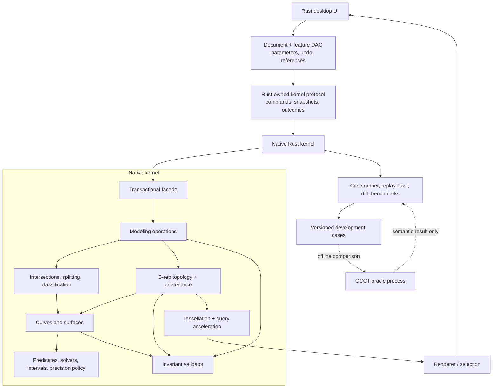

# Geometry and B-rep kernel programme

Status: working blueprint
Last reviewed: 2026-07-29

This document turns the ambition of a Fusion- or SOLIDWORKS-class modeller into a sequence of independently testable systems. It is intentionally a programme rather than a calendar estimate. A useful CAD product can appear well before every advanced kernel operation exists, while the native kernel can mature behind a stable Rust-owned interface.

The short answer is that this is feasible, provided we do not define success as “rebuild all of commercial CAD at once.” The difficult parts are not drawing triangles or representing a cube. They are numerically reliable intersections, trimmed surfaces, regularized booleans, offsets and fillets, persistent references after model edits, and healing imperfect exchange data. Those concerns must shape the architecture and test harness from day one.

## Executive recommendation

1. Target a **native Rust B-rep kernel** as the permanent implementation.
2. Build a **headless kernel lab and conformance system first**. The validator, replay format, failure bundles, and benchmark runner are kernel deliverables, not later tooling.
3. Use **Open CASCADE only as an external development oracle** for offline differential tests. It is never linked into Artificer, never implements the product protocol, never generates product geometry, and never supplies an unsupported operation. The UI advances only as native capabilities become available.
4. Make the first product a **history-based, single-part mechanical modeller**, not a complete general-purpose CAD suite.
5. Deliver the first complete product vertical slice across M0–M5: constrained planar sketch -> profile -> extrude/revolve -> B-rep -> validation -> tessellation -> selection -> parameter edit -> deterministic regeneration. M4 is the earlier profile-to-solid kernel preview; M5 closes the loop with constraints and feature history.
6. Treat every operation as a transaction: it either returns a valid result, entity history, and diagnostics, or returns a structured error without changing the previous model.
7. Define and publish a **supported numerical domain** for every capability. Outside that domain, `Unsupported` or `NumericallyIndeterminate` is acceptable; corrupt geometry is not.

## Working assumptions

These assumptions let work begin without prematurely fixing product policy. They can be changed through architecture decisions.

- Primary use case: mechanical parts, fixtures, enclosures, and small assemblies.
- Native implementation language: stable Rust. Initial kernel and product crates are pure Rust; any future production FFI requires its own accepted ADR. C/C++ is permitted only in isolated development-oracle tooling.
- Desktop UI: Rust-based and asynchronous; the kernel itself has no UI or GPU dependency.
- Core model: exact topology plus bounded-approximate geometry using `f64`, filtered/exact predicates, interval/error bounds, and explicit modeling resolution.
- First interchange target: STEP, followed by 3MF/glTF for meshes and DXF/SVG for planar data. STL is export-only and never an authoritative model format.
- Licensing and commercial distribution are not yet decided. Optional third-party backends therefore remain isolated and replaceable.
- The roadmap has no time estimate. Readiness gates, not dates, determine when a phase is complete.

## What belongs to the kernel

Commercial CAD applications combine several systems that are often casually called “the kernel.” Keeping their boundaries explicit makes both testing and replacement possible.

| System | Responsibilities | In the native geometry kernel? |
|---|---|---:|
| Numeric foundation | Predicates, root isolation, solvers, error bounds, tolerance policy | Yes |
| Geometry | Analytic, Bézier, B-spline, and NURBS curves/surfaces; evaluation, projection, extrema | Yes |
| Topology/B-rep | Vertices, edges, coedges, loops, faces, shells, solids, incidence, orientation | Yes |
| Modeling algorithms | Construction, intersections, splitting, sewing, booleans, offsets, blends | Yes |
| Queries | Classification, closest point, mass properties, bounding volumes | Yes |
| Tessellation | Watertight display/analysis meshes tied back to source faces and edges | Yes |
| Operation provenance | Generated/modified/deleted entity mappings and diagnostics | Yes |
| Sketch constraint solver | Degrees of freedom, equations, dimensions, solver diagnostics | Separate subsystem |
| Parametric document | Parameters, feature DAG, regeneration, suppression, undo/redo, persistence | Separate subsystem |
| Topological reference resolver | Persistent user selections using operation history and context | Primarily document layer; fed by kernel history |
| Assembly solver | Components, instances, joints/mates, interference | Separate subsystem using kernel queries |
| Renderer and selection UI | Camera, GPU resources, highlighting, manipulators, snapping | Separate subsystem using tessellation/query APIs |
| STEP/IGES translator and healing policy | Schema mapping, attributes, units, repair workflow | Adapter subsystem over kernel primitives |
| Drawings, CAM, simulation | Downstream consumers of exact model and tessellation | Later product programmes |

## Capability map: learn from Fusion and SOLIDWORKS without copying their scope

Fusion currently groups design work around solid, surface, mesh, form/T-spline, sheet-metal, plastic, assembly, and history-based workflows. SOLIDWORKS similarly combines sketch-driven features, multibody parts, surfaces, assemblies, sheet metal, configurations, drawings, and downstream tools. That is a product map, not a sensible first kernel backlog.

| Capability family | Representative behaviour | Kernel contribution | Programme position |
|---|---|---|---|
| Reference geometry | Origins, planes, axes, local frames | Transforms, planes, queries | First vertical slice |
| 2D sketches | Lines, arcs, circles, splines, dimensions, geometric constraints | Curve primitives and projection; solver is separate | First vertical slice |
| Prismatic features | Extrude, cut, revolve, holes, ribs | Profile regions, sweeps, booleans, provenance | First useful modeller |
| Body management | Multiple bodies, combine, split, move/copy | B-rep ownership, transforms, booleans | First useful modeller |
| Repeated features | Mirror, linear/circular pattern | Transform/copy plus feature semantics | Early product layer |
| Edge/face features | Chamfer, fillet, draft, shell, thicken | Offsets, intersections, local topology rewrite | Later; individually gated |
| General sweeps | Path sweep, loft, guide rails, boundary surfaces | Frame transport, surface construction, trimming | After robust core booleans |
| Surface modelling | Patch, trim, extend, stitch, replace face | Trimmed-surface and sewing algorithms | Advanced kernel phase |
| Direct editing | Move/offset/delete/replace face | Local operations plus healing and provenance | After naming/history foundations |
| Parametric history | Feature tree, edit, suppress, reorder, rollback | Kernel commands are pure; document owns DAG | Begin early, expand continuously |
| Stable references | Downstream features survive upstream edits | Operation history plus contextual resolver | Designed from first operation |
| Interchange | STEP import/export and repair | Geometry/topology mapping, validation, healing | Native milestone after useful solids |
| Assemblies | Instances, joints/mates, interference | Transforms, collision/classification, mass properties | Separate programme after parts |
| Sheet metal | Bends, reliefs, unfold/flat pattern, rules | Specialized offsets and developable geometry | Separate later programme |
| Freeform/T-spline | Subdivision sculpting and conversion | Separate representation and conversion | Defer until NURBS/B-rep is mature |
| Mesh workflows | Import, repair, B-rep/mesh conversion | Tessellation and optional mesh tools | Display/export early; mesh editing later |
| Drawings/CAM/CAE | Associative views, dimensions, toolpaths, analysis | Reliable geometry queries and stable IDs | Consumers, not kernel prerequisites |

### Deliberate first product boundary

The first genuinely useful target is:

- One document containing reference geometry, parameters, sketches, features, and multiple solid bodies.
- Sketch entities: point, line, arc, circle, polyline, and cubic spline.
- Sketch constraints: coincident, horizontal/vertical, parallel/perpendicular, tangent, equal, symmetry, distance, radius/diameter, and angle.
- Features: extrude/add/cut and revolve/add/cut in M4/M6; combine and split in M6; holes, ribs, mirrors, and linear/circular patterns in M8; chamfers and constant-radius fillets only after their M9 robustness gates.
- Queries: bounding box, volume, area, centroid, inertia, point/body classification, ray hit, nearest entity.
- Associative tessellation, selection, parameter edits, undo/redo, deterministic regeneration, and a versioned native document.
- STEP import/export is native work. OCCT may compare test fixtures and semantic round trips, but it never imports or exports on behalf of the product.

Not in the first product: variable-radius fillets, arbitrary shelling, Class-A surfacing, T-splines, sheet-metal unfolding, large assembly solving, drawings, CAM, simulation, or feature recognition.

## System architecture



The kernel protocol is semantic rather than object-oriented. Commands bind a serialized, snapshot-scoped entity ID to an immutable snapshot; they never serialize an arena/generational storage handle. Results return a new snapshot, explicit old-to-new provenance, warnings, and structured errors. Document-level persistent references are intent/context recipes resolved against a snapshot, not kernel entity IDs. [ADR 0003](../adr/0003-entity-identity-and-persistent-references.md) defines these identities. The protocol must be usable in-process for low latency and serializable for deterministic replay, crash isolation, remote execution, and differential tests.

## Native kernel design

### 1. Numerical foundation

The policy is **not** “use a small epsilon everywhere.” Four ideas stay separate:

1. **Predicate correctness**: orientation, sidedness, ordering, containment, and other topology-changing decisions must have a certified sign.
2. **Geometric uncertainty**: approximated points, curves, and intersection traces carry a bounded error.
3. **Modeling resolution**: the document defines which separations/features are intentionally indistinguishable.
4. **Display tolerance**: tessellation error affects pixels and meshes, never B-rep truth.

Core rules:

- Use `f64` for ordinary evaluation and construction.
- Use fast floating-point filters with proven error bounds, then adaptive expansion or exact arithmetic for critical determinant/polynomial-sign predicates.
- Return `Negative | Zero | Positive | Indeterminate`, not a Boolean formed by comparing to an arbitrary epsilon.
- Use interval arithmetic, subdivision, and higher precision for root isolation and spline intersection certification.
- Normalize hard operations into a local coordinate frame, then transform both results and error bounds back to model space.
- Reject NaN, infinity, illegal knot vectors, non-positive NURBS weights where unsupported, and out-of-domain parameters at API boundaries.
- Record an uncertainty/tolerance ledger. An operation may consume a documented error budget but may not silently enlarge it until geometry happens to connect.
- Keep length, angle, parameter, curvature, and approximation bounds dimensionally distinct.
- Establish the initial supported model-size and smallest-feature envelope experimentally in Milestone 0; encode it in fixtures and version it as product behaviour.
- Correctness builds disable unsafe floating-point reassociation and run deterministic single-threaded reductions where necessary.

Exact representation of every NURBS construction is neither necessary nor generally practical. The target is exact or certified decisions and bounded approximate constructions.

### 2. Geometry representation

The geometry layer owns mathematical objects, not connectivity:

- 2D/3D points, vectors, directions, rays, axis systems, initial public similarity transforms, and bounding intervals. The initial committed-model contract allows translation, rotation, reflection/mirroring, and positive uniform scale; non-uniform scale and shear are deferred because they change analytic surface classes and conditioning.
- Curves: line, circle, ellipse, parabola/hyperbola when needed, Bézier, B-spline, NURBS, trimmed curve, and composed curve.
- Surfaces: plane, cylinder, cone, sphere, torus, extrusion, revolution, Bézier, B-spline, NURBS, offset, and trimmed views.
- Common traits for domain, periodicity, evaluation through required derivative order, reversal/reparameterization, conservative bounds, projection, extrema, and serialization.
- Analytic specializations before generic spline algorithms. A plane/cylinder intersection should not immediately become a generic NURBS problem.
- Knot insertion, degree elevation, splitting, interpolation, approximation, and continuity classification with geometry-preservation properties.
- Two-dimensional parameter-space curves (“p-curves”) as first-class geometry, because trimmed faces and periodic seams cannot be made robust with 3D edge curves alone.

### 3. B-rep topology

Geometry and topology are stored separately. Internal topology refers to geometry through typed, generational storage handles so stale process-local references fail safely. Those handles never cross a snapshot/protocol boundary; serialized commands use the identity model in [ADR 0003](../adr/0003-entity-identity-and-persistent-references.md).

| Entity | Meaning | Essential invariants |
|---|---|---|
| Vertex | Topological point with a model-space position/error bound | Finite position; incident edges agree within their certified bounds |
| Edge | Bounded portion of a 3D curve between vertices | Valid parameter interval; endpoint consistency; one or more oriented uses |
| Coedge | Oriented use of an edge by a face, with a face p-curve | Orientation, parameter mapping, and 3D/p-curve same-locus agreement |
| Loop | Ordered closed chain of coedges in a face | Connectivity, closure, valid UV embedding, outer/inner orientation |
| Face | Bounded portion of an oriented surface | Valid loops; seam/pole handling; non-self-intersecting trim region |
| Shell | Connected oriented collection of faces | Incidence agreement; orientability; watertightness when closed |
| Solid | Region bounded by one outer and optional inner shells | Closed manifold boundary, consistent nesting, non-negative oriented volume |
| Shape | General compound of vertices through solids | Explicit validity profile; no assumption that every intermediate is a solid |

The current planar/analytic subset stores `Face { surface, outer_loop, inner_loops }` as authoritative topology. `Curve3`/`Curve2` distinguish lines from exact circles with explicit parameter ranges, while `Surface` distinguishes planes from exact cylinders. Inner loops have opposite face-local winding and participate in incidence, Euler checks, measures, semantic history, planar-support queries, and source-mapped display triangulation. Full-circle extrusion uses two exact semicircle edges and two cylindrical wall patches with explicit vertical seam generators, avoiding an ambiguous zero-vertex or one-use loop. The validator certifies curve/cylinder frames, parameter ranges, exact authored endpoints, complete p-curve loci and tangents, loop orientation, and manifold incidence. This supports exact standalone and strict-inset selected-face line/arc/circle prisms with direct holes, parity islands, multiple regions, and rigidly rotated planar supports inside the declared local-prismatic domain. It is not the general trimmed analytic/NURBS representation described by this programme: periodic singularities, tangential/coincident topology changes, unsupported non-transverse surface split/merge, cross-body fusion, and general Boolean reconstruction remain later gates.

The editing representation should allow temporarily incomplete or non-manifold intermediate topology inside a transaction. A committed `Solid` must satisfy its stronger profile. Never expose a half-mutated body after an operation fails.

#### Periodic and singular topology policy

This representation is required before sphere, cone, cylinder, and torus primitives can be considered complete:

- A regular seam is one topological edge used twice by the same face through two distinct coedges/p-curves. Each use has its own orientation and parameter branch; seam uses are not merged merely because their 3D loci coincide.
- Periodic surfaces store explicit periods. Face loops are validated in an unwrapped/lifted UV domain with winding information, then mapped to the canonical domain for evaluation.
- An ordinary edge must have a non-collapsed 3D curve and two endpoint uses, even when both endpoints refer to the same vertex for a legitimate closed curve.
- A surface singularity may use an explicit `DegenerateEdge`: one vertex, no independent non-constant 3D locus, and a nontrivial p-curve along a collapsed UV boundary. It is legal only when the surface image of that entire p-curve stays inside the vertex's certified uncertainty.
- Degenerate edges have separate incidence/Euler rules and cannot enter algorithms that require an ordinary edge without explicit dispatch.
- Cone apices and sphere poles must pass dedicated orientation, seam, UV-wrap, tessellation, and mass-property fixtures. If that representation is not ready, M3 exposes only the nonsingular subset rather than faking zero-length ordinary edges.

### 4. Intersection and Boolean pipeline

Booleans are a pipeline, not one algorithm:

1. Conservative bounding-volume candidate generation.
2. Curve/curve, curve/surface, and surface/surface intersection with analytic dispatch and generic certified fallback.
3. Build an intersection graph containing branches, overlaps, tangencies, event ordering, and error bounds.
4. Imprint/split participating edges and faces in both 3D and UV parameter space.
5. Classify cells and face fragments against the other body without sampling on uncertain boundaries.
6. Select fragments according to union/intersection/difference semantics.
7. Rebuild and regularize topology, deliberately handling coincident domains and zero-volume remnants.
8. Sew, orient, validate, calculate semantic measures, and emit entity provenance.

Every stage must be inspectable in a failure bundle. A single opaque `boolean_failed` message is not debuggable enough for a decade-long kernel project.

### 5. Modeling operations

Operations build on the lower layers in this order:

- Constructors and transforms: box, cylinder, cone, sphere, torus; wire/face creation; copy and rigid transform.
- Planar region operations: loop validation, nesting, winding/classification, offset where supported.
- Kinematic construction: linear extrusion and revolution, then sweep and loft.
- Imprinting, split, sew, and regularized boolean set operations.
- Local features: chamfer, draft, constant-radius blend, variable blend, face offset, shell/thicken.
- Healing: remove/merge small entities under an explicit policy, same-domain unification, gap repair, orientation repair, and diagnostics.

Fillets and shelling are not “small follow-up features.” Both rely on offsets, difficult intersections, corner construction, local topology replacement, and robust trimming. They each receive separate milestones and supported-domain manifests.

### 6. Provenance and persistent references

Each operation returns a many-to-many history relation:

- `Generated(input or operation role -> output entities)`
- `Modified(old entity -> output entities)`
- `Deleted(old entity)`
- `Unchanged(old entity -> output entity)`

The document layer uses this history plus semantic context to resolve selections after regeneration. Geometry hashes and output array positions are hints, never identity. References should prefer intent such as “the cylindrical face generated by feature F from sketch edge E” and use adjacency/geometry only to disambiguate.

M5a implements the first product form of this boundary in `artificer-model`. A versioned persistent recipe identifies a producing `FeatureId`, exact `OperationRole`/ordinal, `EntityKind`, and optional upstream lineage. Resolution composes explicit `OperationReport` history and returns one resolved entity or a structured missing/ambiguous result. Snapshot-scoped face IDs retained in command templates are never authoritative and are overwritten only after successful resolution. Broader adjacency, orientation, and geometric qualifiers remain later naming work.

This must begin with primitive creation and extrusion. Retrofitting history after booleans and fillets are implemented would require rewriting every algorithm.

### 7. Tessellation, queries, and rendering boundary

- Tessellation consumes a B-rep snapshot and a separate chord/angle/display policy.
- Shared topological edges are tessellated once and reused by adjacent faces to prevent display cracks.
- Every triangle and polyline segment maps back to source face/edge IDs for selection.
- Coarse preview tessellation can stream before a finer committed mesh, but both derive from the same snapshot.
- BVHs and other acceleration data are immutable caches keyed by snapshot and policy, not part of model truth.
- The renderer owns GPU buffers, materials, camera, highlighting, and picking presentation. The kernel never depends on `wgpu`, a window system, or a UI framework.

### 8. Transactional API and concurrency

A conceptual operation boundary is:

```text
execute(
  snapshot,
  command,
  precision_policy,
  cancellation_token
) -> Result<OperationOutcome, KernelError>

OperationOutcome = {
  new_snapshot,
  entity_history,
  validation_summary,
  warnings,
  performance_counters
}
```

The exact Rust types will be designed during scaffolding, but the semantics are fixed:

- Inputs are immutable snapshots; results are new snapshots with structural sharing where useful.
- Commands and errors are versioned and serializable.
- Cancellation never publishes a partial result.
- Stable diagnostic IDs survive serialization and replay.
- Traversal and reduction order is deterministic in test mode.
- Expensive operations run on a worker pool; UI previews may be cancelled and superseded.
- Invalid user input becomes typed errors. In-process unwind capture and failure-bundle creation are best-effort; aborts, stack exhaustion, undefined behaviour, and out-of-memory cannot be safely contained in-process. Stable execution of untrusted imports, fuzz cases, and external development-oracle tools uses a worker-process protocol when crash/resource containment is required.

## Build, borrow, or use as an oracle

The goal is a custom kernel, but “custom” should mean ownership of the semantics and hard algorithms—not reimplementing every matrix type or ignoring decades of prior art.

| Technology | Proposed use | Why / boundary |
|---|---|---|
| Open CASCADE Technology 8.0 | External development oracle only | Broad B-rep, modeling, healing, STEP, and test-harness capability. It lives under `tools/oracle-occt`, is never linked, and exchanges test data only. |
| `truck` | Readable Rust reference and optional differential peer | Apache-2.0 and already separates geometry/topology/modeling/shape operations. Its types and algorithms are not the Artificer kernel implementation or protocol. |
| Manifold | Independent mesh-solid test oracle | Useful for coarse solid/mesh comparison, but never a product fallback or canonical model. |
| CGAL / Shewchuk work | Design reference and offline exact oracle | Establishes filtered exact predicates versus inexact/exact constructions. Avoid a broad C++ dependency in the shipping Rust core unless a later ADR justifies it. |
| `ezpz` | Candidate sketch-solver experiment | MIT, Rust, CLI/WASM and fuzz-oriented tooling. Evaluate against the Artificer sketch contract before adopting. Keep the solver replaceable. |
| SolveSpace solver | Behavioural reference or separate test oracle | Mature constraint-solver ideas, but GPL-3.0 licensing makes direct inclusion a product-policy decision. |
| General Rust math crates | Internal implementation aid | Accept permissively licensed dependencies only behind Artificer-owned geometry types; do not leak third-party vector/matrix types through public APIs. |

The OCCT path has one mode: an optional development test sends a declarative case to a separately built/running oracle process and compares semantic outcomes. No Artificer application code can invoke that path. A dependency/binary audit enforces the boundary.

## Proposed repository shape

Avoid dozens of crates before the domain boundaries settle. Begin with a small workspace and modules, then split hot or independently reusable layers when evidence supports it.

```text
Artificer/
  Cargo.toml
  crates/
    geometry/               # typed primitives and dependency-free certified numerical filters
    kernel/                 # math, geometry, topology, algorithms, tessellation, validation
    kernel-protocol/        # commands, outcomes, errors, replay schema
    kernel-testkit/         # cases, semantic digests, generators, failure bundles
    sketch/                 # constraint model and replaceable solver boundary
    model/                  # parameters, feature DAG, regeneration, references, undo
    render/                 # render meshes, source mapping, GPU-facing abstractions
  apps/
    kernel-cli/             # case/check/replay/diff/bench entry points
    desktop/                # Rust UI; framework decision remains separate
  tools/
    oracle-occt/            # isolated C++ development oracle; never a product dependency
  tests/
    cases/
      analytic/
      topology/
      intersections/
      booleans/
      features/
      regressions/
      interoperability/
    legacy-documents/
  artifacts/                # ignored; generated failure and benchmark output
  docs/
    architecture/
      adr/
      geometry-kernel/
```

Developer commands should remain few and composable:

- `kernel-case`: execute a declarative case.
- `kernel-check`: validate a shape and produce structured diagnostics.
- `kernel-replay`: reproduce a saved command journal.
- `kernel-diff`: compare native and external-oracle semantic results.
- `kernel-fuzz`: run structured and parser fuzz targets.
- `kernel-bench`: run fixed performance/complexity suites.

These may initially be subcommands of one binary to minimize maintenance.

## Parallel workstreams and critical path

The work is not one serial queue. After M0 fixes the protocol and evidence format, several tracks can advance without waiting for the whole native kernel.

| Workstream | Can start | Critical dependencies | Continuous output |
|---|---|---|---|
| Native numeric/geometry/topology | M0 | None beyond contracts | Predicates, entities, validators, supported-domain cases |
| Test platform and corpus | Immediately | Protocol schema | Replay cases, generators, shrinkers, oracle evidence, performance history |
| Document/feature engine | After protocol draft | Commands, snapshot/identity ADR | Parameters, DAG regeneration, history and reference resolution |
| Sketch solver | After planar geometry contract | Geometry types and solver interface | Constraint cases, degrees-of-freedom diagnostics, solved profiles |
| Renderer/kernel lab | After tessellation/result schema draft | Native source mapping only | Inspectable native models and failure bundles, UI latency feedback |
| OCCT development oracle | After case/protocol draft | Strict process isolation and semantic comparison | Optional differential evidence only; zero product capability |
| Interchange corpus | Immediately for fixture collection | Native import waits for M7+ | Versioned real-world STEP/mesh fixtures and healing expectations |

The critical native path remains numerical policy -> curves/surfaces -> B-rep topology -> intersections -> booleans -> offsets/blends -> interchange. The test platform, document layer, UI, and fixture corpus should develop alongside it.

## Milestone roadmap and acceptance gates

No milestone is complete because its demo “looks right.” Each one must meet the corresponding gates in [the test strategy](test-strategy.md).

### M0 — Contracts and kernel lab

Deliver:

- Rust workspace, CI skeleton, coding and dependency policy.
- Versioned case/replay schema and semantic result digest.
- Transaction API, error taxonomy, cancellation contract, and deterministic mode.
- Failure-bundle layout and a minimal viewer/export path.
- Validator framework with deliberately invalid fixtures.
- Documented candidate coordinate/feature-size envelope and numerical experiments.
- Optional OCCT oracle executable with license notice isolated under `tools/`.

Exit gate: the same deliberately failing operation replays with one semantic outcome on two supported machines; validator fixtures return stable expected codes; 100 repeated runs have one digest.

Implemented foundation (2026-08-03): the CLI now owns a deterministic `repeat`
gate (100 runs by default), portable failure bundles (`manifest.json`, source
case, journal, and SVG), and a Linux/macOS CI matrix for both successful and
deliberately rejected cases. The candidate coordinate envelope and its
executable numerical evidence are versioned under `evidence/`. The OCCT oracle
remains optional and external; no OCCT code or dependency is present in the
product workspace.

### M1 — Robust linear/planar foundation

Deliver:

- Typed points, vectors, directions, transforms, units, bounds, and precision policy.
- Filtered/exact orientation, sidedness, ordering, and intersection predicates.
- Lines, segments, planes, circles/arcs; 2D region loops and classifications.
- Analytic unit/property tests plus adversarial scale and near-degeneracy matrix.

Exit gate: no wrong predicate signs against an independent exact oracle in the conformance domain; uncertain cases report `Indeterminate`; planar cases satisfy transformation and serialization properties.

Current foothold (2026-07-28): the dependency-free `artificer-geometry` crate now owns the kernel's shared 2D/UV `Point2`, `Vector2`, `Segment2`, the four-way `Orientation2` result, the first `orient2d` filter, and a conservative polyline-profile classifier. The predicate encloses binary64 subtraction, multiplication, and determinant subtraction with outward-rounded intervals, and reports clockwise or counter-clockwise only when the enclosure excludes zero. A canonical cyclic anchor makes the certification decision independent of a loop's starting vertex. Duplicate points and shared x/y coordinates provide the currently implemented directly provable `Collinear` cases. Close cancellation, other unresolved collinearity, non-finite input, overflow, and underflow-sensitive evaluation return `Indeterminate`.

The classifier uses exact endpoint equality for closure, the certified orientation predicate for segment crossings, and an outward-rounded signed-area enclosure for winding. It reports open, simple closed clockwise/counter-clockwise, self-intersecting, invalid, or indeterminate rather than closing a gap with an epsilon. Focused tests cover reversal, crossings, repeated points, open paths, winding, exceptional values, and determinism in addition to the predicate's cyclic/reversal, small-integer-grid, power-of-two scale, representable-translation, cancellation, exceptional-value, and 100,000-case independent exact-integer checks.

The workbench now exercises this subset through a plane/profile lab. Model and Sketch modes expose the XY, YZ, and XZ origin planes; Sketch mode provides an orthographic grid, pan/zoom, endpoint-before-grid snapping, and point, line, rectangle, circle, and three-click arc tools. Every draft carries live on-canvas dimensions: point coordinates, line length/angle and deltas, rectangle width/height, circle diameter, and arc radius/sweep. `Tab` cycles accessible numeric editors and accepted values lock the relevant construction degree of freedom. Each completed entity remains provisional until it passes the shared green-tick/bare-`Enter` confirmation gate.

The sketch analyser treats entity order and authored direction as presentation history rather than region topology. Its analytic arrangement classifies line/arc/circle intersections, splits exact fragments, and exposes deterministic bounded cells while allowing unrelated open and construction geometry to remain in the sketch. Explicitly selected cells are compiled through canonical outer/hole/island winding into exact `PlanarProfile2`; sampled display polylines never become modeling input. Native document v6 persists the full editable `SketchDefinition`, including open/construction entities, operations, semantic output roles, retired IDs, checked evaluated caches, frame, and support. Downstream features persist canonical region signatures and resolve them late during rebuild. [ADR 0008](../adr/0008-plane-profile-workbench.md) and [ADR 0009](../adr/0009-live-sketch-dimensions.md) record the original geometry boundary; [ADR 0011](../adr/0011-expandable-workbench-shell.md) records the surrounding presentation shell and fixed confirmation rail; [ADR 0016](../adr/0016-exact-planar-profile-curves-and-regions.md) records the widened exact profile contract; [ADR 0017](../adr/0017-portable-native-document-v4.md) records portable profile replay; and [ADR 0021](../adr/0021-editable-sketch-authoring-and-region-replay.md) records editable v6 authoring and late-bound region replay.

M1 foundation completion (2026-08-03): ambiguous interval evaluations now fall
back to owned exact dyadic integer arithmetic, so all finite binary64 inputs
receive an exact represented-value sign and non-finite inputs alone remain
`Indeterminate`. The fixed one-million-case independent exact-integer corpus is
part of the normal geometry suite. Public line, segment, circle, arc, and
certified segment-relation types complete the planar entity boundary; units,
directions, bounds, planes, transforms, and precision policy remain owned and
dependency-free.

### M2 — Parametric curves and surfaces

Deliver:

- Bézier, B-spline, and NURBS curves/surfaces; domains and periodicity.
- Evaluation and derivatives, splitting, knot insertion, degree elevation, bounds, projection, and extrema.
- Analytic surfaces and conversion/equivalence tests.

Exit gate: identities and geometry-preservation properties hold inside certified error bounds; invalid parameterizations fail safely; the versioned M2 evidence manifest completes with no unallowlisted panic, hang, invariant failure, or invalid successful object.

Implemented foundation (2026-08-03): `artificer-geometry::parametric` owns
validated Bézier, B-spline, and NURBS curves and tensor-product surfaces,
domains/periodicity, evaluation, derivatives, exact Bézier splitting and degree
elevation, B-spline knot insertion, conservative control bounds, deterministic
projection/extrema candidates, and plane/cylinder/cone/sphere/torus analytic
surfaces. Preservation, rational-equivalence, projection, split, and malformed
input suites are fixed in `evidence/m2-evidence-v1.json`.

### M3 — B-rep topology and primitives

Deliver:

- Generational entity storage for vertices through solids.
- Coedges and p-curves, periodic seams, shell orientation, topology editing transaction.
- Complete validator profiles and canonical semantic digest.
- Box, cylinder, cone, sphere, and torus constructors plus rigid transforms.

Exit gate: primitives and 100k constructive topology cases validate; corrupted topology maps to precise error codes; serialization and transform properties pass.

Implemented foundation (2026-08-03): `artificer-kernel::brep` provides typed
generational arenas from vertex through solid, explicit coedges/p-curves,
periodic seam uses and singular pole topology, atomic clone/validate/publish
edits, stable validation codes, a canonical semantic digest, proper rigid
transforms, and native box/cylinder/cone/sphere/torus constructors. The fixed
100,000-case constructive gate is a normal kernel integration test and its
manifest is `evidence/m3-evidence-v1.json`.

### M4 — Profile-to-solid kernel preview

Deliver:

- Planar profile builder with holes/islands.
- Extrude and revolve without general boolean dependency where possible.
- Watertight tessellation, source-entity mapping, BVH, ray selection, mass properties.
- Minimal Rust desktop/workbench view showing topology and validation results.

Exit gate: declarative profile fixtures regenerate deterministically into valid solids; shared display edges are crack-free at tested policies; analytic volume/area/centroid cases pass. This is a profile-to-solid kernel preview, not yet a constrained-sketch product.

Historical M4a baseline (2026-07-29): protocol version 2 introduced a finite planar frame, one strictly convex polygon, and a positive extrusion distance. The constructor normalized winding and cyclic start, built cap/side topology with shared edges and p-curves, validated the complete solid before publication, emitted exhaustive generated provenance, and replayed through declarative fixtures. [ADR 0010](../adr/0010-first-convex-profile-extrusion.md) preserves that initial decision.

Historical M4c/M4d baseline (2026-07-29): protocol version 3 bound a strictly inset rectangle to a snapshot-owned axis-aligned face and implemented repeatable Add/blind Cut by replacing the target with four shoulder patches, one end, and four walls. It proved exact transactional editing and successive face selection, but every rectangular operation added eight faces, rejected through cuts and non-rectangular targets, and left artificial coplanar shoulder seams. [ADR 0012](../adr/0012-first-selected-face-add-cut.md) and [ADR 0013](../adr/0013-repeatable-rectangular-face-features.md) preserve those narrower stepping stones.

Historical M4e linear-profile slice (2026-07-29): the same bounded protocol sequences accepted one certified simple linear polygon with three to 256 vertices. Convex, concave, and safe collinear turns constructed a New Body; the same profile class could Add or Cut when strictly inset in the actual material of an axis-aligned planar face. The target outer boundary could be rectangular, triangular, or concave and could already own inner loops. Repeated features worked on supported generated ends and sides.

The topology editor constructs one hole-aware coplanar shoulder directly rather than splitting it and then healing it. The first rectangular cuboid feature is exactly 16 vertices, 24 edges, 48 coedges, 12 loops, and 11 faces. Blind cuts may cross the void in a prior boss/support shoulder and continue into supporting material. A cut reaching one unambiguous opposite axis-aligned planar face becomes an exact through cut; overtravel is canonicalized to the first certified exit. Add contacts, ambiguous/intervening boundaries, and unsupported sweeps reject without changing the source snapshot. This remains a local rewrite, not a general Boolean.

Capability `native.push_pull_face.v0` adds a distinct whole-face path. `PushPullFace` uses an unholed exterior extrusion cap itself as the exact profile, with signed distance along its authoritative outward normal. It supports any simple linear cap outline—including triangular and concave caps—when every boundary vertex has one equal-depth perpendicular rail and each boundary edge owns one orthogonal quadrilateral side. Positive motion extends the prism; negative motion shortens it while retaining material before the common support plane. Topology counts and IDs stay unchanged, and complete one-to-one history distinguishes modified target/side entities from preserved entities. Holed, non-cap, rotated, unequal-rail, support-contact/crossing, and topology-deleting cases reject transactionally. [ADR 0015](../adr/0015-linear-profile-features-and-history-rollback.md) records both exact domains.

Current protocol-v4 exact-region/analytic slice (2026-07-29): `PlanarProfile2` carries up to 32 material regions, 128 total loops, and 1,024 exact `Line`, `CircularArc`, or `Circle` uses. The bounded deserializer counts regions, loops, and curves while decoding, and kernel preflight repeats the ceilings. The workbench extracts wires independently of sketch insertion order/direction and emits deterministic region order, winding, and cyclic starts; the kernel re-certifies the payload rather than trusting it.

The all-linear standalone path accepts disjoint regions with direct holes, with three to 256 line uses per loop. Declaration order, cyclic starts, and winding are canonicalized in that path; a parity island inside a linear hole publishes as another solid. The exact analytic standalone path accepts multiple material-disjoint regions whose outer and direct-hole boundaries are complete circles or exactly connected line/arc wires. Its conformance matrix includes a rectangular outer with a circular hole and the reverse mixed case, a circular outer with a linear rectangular hole. Cross-region validation compares every boundary loop pair for minimum clearance, then tests outer representatives against outer-minus-holes material. Consequently, a depth-two island wholly inside an annulus void is valid and publishes as another solid, while nesting inside filled material rejects. One multi-region command publishes one compound snapshot, which the Browser presents as one `Body group N · k solids`; a split result keeps that same group identity. Separate New Body commands remain independent body rows/branches, while visibility and whole-body transforms are group-scoped and individual solids inside a group do not yet have separate Browser controls. Analytic edges/surfaces remain authoritative through semantic hashing, validation, exact measures and extrema-aware bounds, similarity transforms, operation history, native-document replay, and precision-driven debug tessellation. [ADR 0016](../adr/0016-exact-planar-profile-curves-and-regions.md) records that boundary.

Current S2D selected-face slice (2026-07-30): `ExtrudeFacePlanarProfile` is the single semantic Add/Cut command. It consumes one or more strict-inset exact line/arc/circle regions, direct holes, and parity islands on finite planar supports, including rigidly rotated frames. The regularized local-prismatic path imprints and classifies supported plane/cylinder contacts, preserves non-target sibling solids, performs Add, blind Cut, and certified through Cut, and publishes complete one-to-many provenance when the owner splits. Exact carriers, p-curves, measures, bounds, source mapping, and deterministic replay are retained; no UI or document recipe selects a shape-specific backend. Tangent/coincident contacts, zero-thickness remnants, unsupported non-transverse contacts requiring surface splitting/merging, cross-body fusion, general Boolean reconstruction, and NURBS/general trimmed-surface operations reject rather than falling back to faceting. [ADR 0020](../adr/0020-regularized-exact-planar-face-features.md) records the unified command and supported domain.

Current application shell (2026-07-30): the native egui workbench retains M4b's workspace-aware command ribbon, resizable/collapsible Browser and contextual inspector, central canvas, fixed confirmation rail, and collapsible History strip. Face-sketch entry moves smoothly to the selected exterior side while retaining the solid as opaque context. The compact sketch registry exposes the requested primitive, Trim, pattern, fillet, and chamfer families; the arrangement overlay exposes bounded-region selection rather than inferring one global closed wire. Selecting a certified extrusion cap and clicking Extrude stages whole-face push/pull; an eligible selected region set instead stages New Body or exact inset Add/Cut. The live arrow has pointer priority and maps drag to signed distance along a stable outward normal: positive is Add, negative is Cut. Dragging and mode switching remain staged presentation state; zero cannot be confirmed, and the compact tick or `Enter` remains the only publication path. The History strip projects the persisted rollback cursor through step controls and a slider. Browser labels distinguish a single-solid body from a compound `Body group N · k solids`; group visibility survives rollback/roll-forward, and separate New Body or Part Library component insertions remain independent rows. Header Save/Open provides atomic native-v6 persistence, including editable sketch authoring graphs and late-bound downstream region recipes, with Open itself staged through the same confirmation gate. Reorder, per-solid controls within a group, a general constraint/parameter editor, general mate/assembly solving, general face offset, and a complete regeneration/repair UI are still absent. [ADR 0011](../adr/0011-expandable-workbench-shell.md), [ADR 0014](../adr/0014-m5a-parametric-document-foundation.md), [ADR 0015](../adr/0015-linear-profile-features-and-history-rollback.md), [ADR 0016](../adr/0016-exact-planar-profile-curves-and-regions.md), [ADR 0017](../adr/0017-portable-native-document-v4.md), [ADR 0018](../adr/0018-content-addressed-part-library-and-components.md), [ADR 0019](../adr/0019-rigid-occurrence-placement-and-joint-forest.md), [ADR 0020](../adr/0020-regularized-exact-planar-face-features.md), and [ADR 0021](../adr/0021-editable-sketch-authoring-and-region-replay.md) record these boundaries.

### M5 — Parametric document and naming v1

Current M5a/F1/F2/F3 foundation (2026-07-29): `artificer-model` owns monotonic stable feature/body/sketch/parameter/component/joint IDs, ordered nodes and dependencies, visibility/read-only/suppression state, clean/dirty propagation, independent per-body snapshot branches, deterministic branch-local rebuild plans, atomic commit/rollback, bounded runtime undo/redo, typed deterministic parameters, typed parameter-to-kernel command templates, rigid digest-pinned component occurrences, a validated fixed/revolute joint forest, and a versioned serde envelope. Current templates bind canonical Length values to cuboid sizes or supported standalone/face extrusion distances through explicit command-specific targets; entity-targeting forms retain the persistent-reference requirement. Native document version 6 is now written; versions 1 through 5 remain readable through in-memory migration and are rewritten as v6 on the next serialization. New documents require the v4-introduced exact sketch frame/profile/support cache plus the v6 editable authoring graph; v4/v5 profiles migrate to one exact legacy-import operation, while pre-v4 omissions are marked explicitly and never reconstructed by guesswork. Persistent role-based references follow kernel operation history and fail explicitly on missing or ambiguous results—including one-to-many shell/solid splits—while raw snapshot entity IDs cannot be stored as authoritative targeted replay.

A serialized `Start | After(FeatureId) | End` history cursor defines the evaluated global timeline prefix independently of suppression. Moving it reconciles every body/sketch to the last active association, preserves later recipes for roll-forward, and blocks append while away from `End`. Save/Open proves fresh-process reconstruction: the application privately replays all retained branches, regenerates operation reports for persistent target rebinding, verifies clean snapshot/digest provenance, restores the saved cursor, and publishes atomically. Native-v6 origin and face-supported sketches reopen as entity-level editable graphs; downstream features resolve their persisted region signatures against the current evaluated arrangement and rebuild from a fresh exact profile.

F2 adds the independent `artificer-catalog` crate and local content-addressed store. Immutable fixed or parametric definitions carry canonical embedded native documents, typed public parameter contracts, semantic revisions, searchable metadata, and verified SHA-256 addresses. No-overwrite objects and `(definition, revision)` refs make publication idempotent and the index rebuildable. The first Part Library card resolves a required aluminium-extrusion Length into native geometry; confirmation creates a separate body branch and stable component occurrence that pins the exact package digest and canonical parameter-binding digest. Equal variants remain separate occurrences even when their binding digest matches. F3 applies each occurrence pose throughout rendering/selection, inserts new parts at deterministic clearance, commits scale-free placement without mutating B-rep snapshots, and persists the first named joint hierarchy. [ADR 0014](../adr/0014-m5a-parametric-document-foundation.md) defines the original foundation, [ADR 0015](../adr/0015-linear-profile-features-and-history-rollback.md) records the cursor extension, [ADR 0017](../adr/0017-portable-native-document-v4.md) records F1 portability, [ADR 0018](../adr/0018-content-addressed-part-library-and-components.md) records F2, and [ADR 0019](../adr/0019-rigid-occurrence-placement-and-joint-forest.md) records F3.

M5 remains incomplete. The following list is the full milestone rather than a claim about M5a:

Deliver:

- Replaceable sketch-solver boundary and initial constraint set.
- Parameters, feature DAG, dirty propagation, rollback, suppression, undo/redo.
- Entity history from every native operation and contextual reference resolver.
- Saved command journal and versioned native document.

Exit gate: parameter sweeps preserve intended downstream references across the supported edit matrix; ambiguous/deleted references fail explicitly; undo/redo and save/load preserve the semantic digest.

The current F1/F2/F3 acceptance is intentionally below that exit gate. It proves typed parameter evaluation, one parameterized native definition, exact package/variant/occurrence identity, rigid placement, a bounded joint forest, current-schema sketch portability, and atomic replay for the implemented feature matrix. It does not yet prove general sketch constraints, user editing of historical parameters, arbitrary feature regeneration/reorder, component replacement, a mate solver, or the complete downstream-reference edit matrix.

### M6 — Analytic intersections and regularized booleans

Delivered for the published domain (2026-08-08): the analytic
surface-intersection graph, the general imprint/classify/regularize/sew
engine for plane- and cylinder-faced operands at any orientation, and the
prism reductions; the faceted Boolean path is deleted and tangency fails
closed with gates. Historical progression (2026-08-07): the graph,
the Boolean domain oracle, and the exact prism Boolean ship. Co-directional
prisms with compatible slabs — every extrusion in the system, curved walls
included — now union, subtract, and intersect exactly through a regularized
2D profile Boolean and the certified extrusion rebuild; a cylinder drills a
through-hole in one command, a partial-depth tool piercing one cap builds an
exact blind pocket through the stacked builder — of any lateral shape:
boundary-crossing notches, annular tools whose islands survive as pillars —
and a fully interior tool carves a closed cavity carried as an inner shell of
the solid, annular cavities included. Everything outside still refuses,
distinguishing a limit of the curve vocabulary from a stage that is merely
unwritten. See [ADR 0025](../adr/0025-analytic-surface-intersections.md).

Deliver:

- Analytic and planar curve/surface intersection graph.
- Imprint, split, classify, reconstruct, regularize, and sew stages.
- Union/intersection/difference for the published primitive/extrusion matrix.
- Complete per-stage debug artifacts and OCCT differential suite.

Exit gate: the versioned M6 relationship/scale/orientation matrix passes; every success validates; every reference disagreement is reproducible and recorded with its classification in the evidence-manifest allowlist.

### M7 — General trimmed NURBS operations

Deliver:

- Certified generic curve/surface and surface/surface intersection fallback.
- UV branch tracking, overlap handling, singularities, seams, and trim reconstruction.
- General B-rep booleans within a published supported-domain manifest.
- Surface trim/extend/stitch tools.

Exit gate: no false “no intersection” in the conformance corpus; residuals and enclosures meet the numerical contract; sustained structured fuzzing is clean.

### M8 — Sweeps, lofts, patterns, draft, and direct edits

Deliver each as a separately gated operation:

- Path sweep with explicit frame/twist policy.
- Loft with compatibility, continuity, guides, and singular-end policy.
- Hole, rib, and thin-feature macros built from the supported profile/boolean operations.
- Mirror and linear/circular patterns with provenance.
- Draft and selected move/offset/delete/replace-face operations.

Exit gate: each feature publishes its supported domain, satisfies edit/regeneration history tests, and returns structured failure outside it.

### M9 — Chamfers and blends

Deliver in difficulty order:

- Planar/analytic chamfers.
- Constant-radius rolling-ball fillets on simple chains.
- Corner resolution and setback policy.
- Later: variable radius, mixed continuity, and difficult multiway corners.

Exit gate: offset surfaces, spine continuity, trim loops, corner patches, and resulting topology all validate throughout the operation’s declared domain. Variable fillets are not required to declare the earlier subset stable.

### M10 — Offsets, shelling, and healing

Deliver:

- Surface and solid offsets with self-intersection detection.
- Shell/thicken for declared face/surface classes.
- Same-domain unification, small-entity policy, sewing, and repair reports.

Exit gate: error budgets do not inflate silently; invalid or ambiguous repairs are reported; successful results validate and preserve provenance.

### M11 — Interchange and compatibility

Deliver:

- STEP semantic import/export, units, names, colors/layers, assemblies as needed.
- Native-format version migration and retained historical fixtures.
- Import diagnostics and non-destructive healing workflow.
- 3MF/glTF meshes and DXF/SVG planar interchange.

Exit gate: curated round trips preserve semantic measures and topology within the declared contract; corrupt/untrusted files are bounded and safe; older documents still load without reinterpretation.

### Later programmes — not hidden kernel milestones

- General mate/joint solving, configurations, interference, animation studies, tolerance profiles, and large-assembly performance. F3 supplies a stable joint forest and single-axis occurrence playback, but not those product capabilities.
- Part-library authoring/publishing, revision/update workflows, server synchronization, permissions/locking, and shared Vault administration. F2 is a verified local content store and first insertion path only.
- Section-analysis presentation, including an opt-in interaction mode that removes hidden clipped geometry from hit testing while leaving visible sectioned faces selectable.
- Sheet-metal rules, bends, reliefs, unfold/refold, flat-pattern validation.
- Advanced surfacing/subdivision/T-spline workflows.
- Associative drawings, PMI/GD&T, CAM, simulation, rendering, and collaboration.

Each uses the kernel but deserves its own architecture and acceptance programme.

## Product release ladder

The milestone sequence supports useful releases before the full roadmap is complete:

| Product slice | Kernel maturity | User value |
|---|---|---|
| Kernel Lab | M0–M3 | Inspect, validate, replay, and compare primitives/topology |
| Profile-to-solid kernel preview | M4 | Create and inspect extruded/revolved parts from declarative profiles |
| Parametric part alpha | M5 | Edit constrained sketches and feature history reliably |
| Practical part modeller | M6 plus selected M8/M9 | Multibody prismatic mechanical design with native booleans |
| General B-rep beta | M7–M10 | Broader imported and freeform geometry with advanced features |
| Interoperable CAD product | M11 plus product hardening | Reliable exchange and long-lived documents |

Unsupported operations remain unavailable until their native capability gate passes. Oracle coverage never changes product capability status.

## Non-negotiable engineering rules

- A successful operation must pass its declared validator profile before commit.
- No scattered magic epsilons; every tolerance comes from a named policy or certified error bound.
- No bug fix without a minimized permanent replay case.
- No raw entity ordering or IDs in semantic golden tests.
- No flaky geometry reruns. Nondeterminism is a correctness defect.
- No silent healing of native operation output. Healing is explicit and produces a report.
- No UI, renderer, or third-party kernel types in native-kernel APIs.
- No process-local storage handle in a serialized command, journal, persistent selection, or public document reference.
- No performance win that weakens invariants. A fast invalid result is a failed benchmark.
- No capability called stable without a documented supported-domain corpus.
- No automatic golden re-blessing; semantic diffs and visual diagnostics require review.

## Principal risks and mitigations

| Risk | Why it threatens the programme | Mitigation |
|---|---|---|
| Scope collapse | “Fusion parity” can consume effort without a usable release | Product slices, explicit non-goals, separate later programmes |
| Numerical inconsistency | Local epsilon choices produce cracks and contradictory classifications | Central precision contract, filtered predicates, error ledger, adversarial boundaries |
| Intersection/boolean complexity | Most downstream features depend on them | Inspectable staged pipeline, analytic-first dispatch, oracle/differential corpus |
| Fillet and offset explosion | Corner cases and self-intersections are exceptionally hard | Separate milestones and narrow stable subsets; structured unsupported results |
| Topological naming debt | Retrofitting provenance rewrites all operations | Emit history from the first constructor/extrude and test parameter edits continuously |
| Imported model quality | STEP data may be legal but inconsistent within local tolerances | Separate translator and explicit healing workflow; retain raw import evidence |
| Third-party lock-in | Oracle or crate semantics could become the de facto model | Native contracts remain authoritative; oracle outputs are evidence, never accepted geometry |
| Licensing surprises | Development oracles have their own obligations | Keep them outside all product dependency graphs and audit native artifacts |
| Debugging cost | A rare failed boolean is otherwise nearly impossible to reproduce | Deterministic journals, shrinkers, stage traces, portable failure bundles, kernel lab |
| Premature optimization | Parallelism can hide nondeterminism and complicate proofs | Correct serial reference path first; deterministic parallelism only after measurement |
| Bus factor/knowledge loss | A multi-year numerical project outlives individual memory | ADRs, algorithm notes, case corpus, failure archaeology, citations, literate invariants |

## Immediate next implementation iteration

The M0 transaction, replay, validator, cuboid, transform, and native-workbench vertical slices are executable, although M0 hardening continues. M1 now has an orientation filter, conservative simple-polyline classification, and an interactive plane/profile lab. The next iteration should widen that native numerical and profile foundation without claiming the broader milestone early:

1. Keep `artificer-geometry` dependency-free and complete the owned direction, unit, bounds, transform, plane, and precision-policy types needed by planar algorithms.
2. Add an adaptive expansion or exact represented-value fallback to `orient2d`, so all finite supported inputs receive a certified sign and general exact collinearity can be reported as `Collinear`.
3. Compare exhaustive small-integer grids and a versioned random/near-degenerate corpus with an independent exact oracle; persist and shrink every disagreement.
4. Harden the reusable sketch arrangement/profile layer with larger adversarial, fuzz, and performance corpora while retaining the fail-closed boundary for touching/coincident or numerically indeterminate curves.
5. Build on native-v6 editable sketch replay with a general constraint/parameter editing workflow and explicit reference-repair UI; never silently rewrite history after the rollback cursor.
6. Generalize the current one-card Part Library into a dynamic verified catalog UI with authoring/publish/revision workflows, component replacement, and source-part editing, while keeping exact definition, variant, occurrence, placement, and joint identities separate.
7. Widen the regularized selected-face contact matrix only after each additional non-transverse split/merge class has exact topology, negative-domain, and provenance evidence; never substitute hidden faceting for exact product topology.
8. Widen the topology-preserving whole-face command only where the proof remains exact; design a separate topology-changing offset path for holed/non-cap faces or support-plane crossing that trims/deletes adjacent faces and emits complete split/deleted history.
9. Use the later M6 intersection/split/classify/reconstruct pipeline for touching, overlapping, cross-solid, and general Boolean cases; do not broaden the current strict-inset local-prismatic claim by implication.

This sequence creates the repetitive loop the project needs:

```text
specify supported case
  -> implement smallest algorithm
  -> validate invariants
  -> compare semantic oracle
  -> fuzz and shrink
  -> inspect failure bundle
  -> add regression
  -> benchmark
  -> widen supported domain
```

## Reference baseline

These sources establish product scope and architectural precedent; they are references, not implied implementation dependencies.

- [Autodesk Fusion workspaces](https://help.autodesk.com/cloudhelp/ENU/Fusion-GetStarted/files/GS-WORKSPACES.htm)
- [Autodesk Fusion desktop interface](https://help.autodesk.com/view/fusion360/ENU/?contextId=LP-STEPS-P13N-SNP-GS-OTH-CRD-1)
- [Autodesk Fusion UI structure and toolbar panels](https://help.autodesk.com/cloudhelp/ENU/Fusion-360-API/files/UserInterface_UM.htm)
- [Autodesk Fusion command-input patterns](https://help.autodesk.com/cloudhelp/ENU/Fusion-360-API/files/CommandInputs_UM.htm)
- [Autodesk Fusion resizable and dockable palettes](https://help.autodesk.com/cloudhelp/ENU/Fusion-360-API/files/Palettes_UM.htm)
- [Autodesk Fusion timeline behaviour](https://help.autodesk.com/view/fusion360/ENU/?contextId=LP-STEPS-P13N-SNP-GS-OTH-CRD-2)
- [Autodesk Fusion body types](https://help.autodesk.com/cloudhelp/ENU/Fusion-Assemble/files/GUID-C1AB4941-D7AD-4D27-A035-2FA9208635B6.htm)
- [SOLIDWORKS feature overview](https://help.solidworks.com/2025/english/SolidWorks/sldworks/c_Features_Top.htm)
- [SOLIDWORKS multibody overview](https://help.solidworks.com/2025/english/SolidWorks/sldworks/c_Multibody_Overview.htm)
- [Open CASCADE architecture and B-rep overview](https://dev.opencascade.org/doc/overview/html/)
- [Open CASCADE 8.0 release and license](https://dev.opencascade.org/release)
- [Open CASCADE OCAF/topological naming](https://dev.opencascade.org/doc/overview/html/occt_user_guides__ocaf.html)
- [`truck`, a modular Rust CAD kernel](https://github.com/ricosjp/truck)
- [`truck-stepio` current-status documentation](https://docs.rs/truck-stepio/latest/truck_stepio/)
- [Manifold mesh geometry library](https://github.com/elalish/manifold)
- [SolveSpace constraint-solver technology](https://solvespace.com/tech.pl)
- [`ezpz` Rust constraint solver](https://github.com/KittyCAD/ezpz)
- [CGAL exact-predicate/exact-construction distinctions](https://doc.cgal.org/latest/Kernel_23/index.html)
- [Shewchuk, adaptive precision and robust predicates](https://people.eecs.berkeley.edu/~jrs/papers/robustr.pdf)
