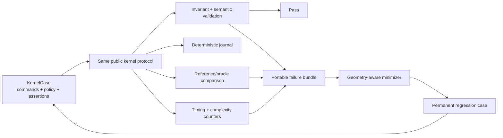

# Kernel test and robustness strategy

Status: working blueprint
Last reviewed: 2026-07-29

The test system is a first-class kernel component. Its governing rule is:

> A kernel operation succeeds only if it returns a shape that satisfies its declared geometric, topological, numerical, provenance, and persistence postconditions. Otherwise it returns a structured error and does not mutate the prior model.

The objective is not merely crash avoidance. A Boolean that returns a watertight but semantically wrong body is a failure; a fast operation that violates an invariant is a failed benchmark.

## One path from bug report to permanent protection

Every hand-authored example, UI command, imported model, fuzz discovery, benchmark, and customer bug should reduce to the same versioned `KernelCase` format.



The Rust UI must invoke the same command path as the case runner. There is no separate “test implementation” of a modeling operation.

## Developer tools

Start with one `kernel` CLI containing subcommands; split binaries only if maintenance or isolation requires it.

| Command | Purpose |
|---|---|
| `kernel case` | Run declarative scenarios and assertions |
| `kernel check` | Validate a shape and emit machine-readable diagnostics |
| `kernel replay` | Reproduce a command journal and compare its semantic digest |
| `kernel diff` | Run a case against native results and an external development oracle |
| `kernel fuzz` | Host structured/byte-level fuzz targets and corpus management |
| `kernel bench` | Measure performance, memory, fallbacks, and complexity slopes |
| `kernel minimize` | Shrink a failure while retaining its failure signature |

## Versioned case format

A case must contain enough information to reproduce numerical and scheduling decisions. A conceptual schema is:

```text
KernelCase {
  schema_version
  protocol_version
  case_id, title, tags
  required_capabilities
  units
  precision_policy
  supported_domain_claim
  deterministic_mode
  random_seeds
  initial_entities or imported_fixture
  command_journal
  expected_status or expected_error_code
  invariant_assertions
  semantic_assertions
  optional_reference_expectations
  optional_performance_budget
}
```

Rules:

- The schema is data, not executable test code. JSON is useful for interchange and review; a compact canonical binary form may be added later.
- A case is rejected unless its protocol version is supported and every command's native capability is explicitly listed in `required_capabilities`; the runner never substitutes its own current version.
- Serialized protocol and case numbers are finite-only. NaN and infinity are valid typed adversarial inputs to the in-process kernel boundary, but JSON serialization fails instead of rewriting either value to `null`. Derived non-finite measurements are classified without embedding the invalid numeric value so structured errors remain replayable.
- IDs inside a case are stable debug IDs, not assumptions about arena indices or result ordering.
- Expected outcomes use intervals, classifications, relations, and semantic digests rather than raw floating-point equality.
- Cases can be composed from named constructors and explicit entities, but expansion must be recorded in the journal.
- Every failure records the exact schema, protocol, and kernel build versions that produced it.
- Untrusted cases/imports have limits on entity count, degree, knot/control-point count, recursion, iterations, memory, and decompression.

## Numerical correctness contract

### Separate four concepts

| Concept | Question it answers | Typical mechanism |
|---|---|---|
| Predicate correctness | Which side/order/orientation is mathematically correct? | Filtered exact sign calculation |
| Geometric uncertainty | How far can this computed object be from the intended locus? | Intervals and certified error bound |
| Modeling resolution | Which separations are intentionally indistinguishable in this document? | Versioned product policy |
| Display tolerance | How accurately should the B-rep be triangulated for this view/export? | Chord/angle/normal criteria |

Display tolerance never participates in topology. Modeling resolution never replaces a predicate whose exact sign can be determined.

### Predicate escalation ladder

1. Evaluate with `f64` and a proven roundoff-error filter.
2. If the result cannot be certified, use adaptive expansions or exact dyadic/rational arithmetic for the predicate.
3. For curve/surface roots and constructed intersections, use interval arithmetic, subdivision, and higher precision until the root/sign is isolated to the operation contract.
4. Return `NumericallyIndeterminate` with bounds and trace when certification cannot be achieved within policy limits.

Predicates return `Negative | Zero | Positive | Indeterminate`. For exact represented inputs, `Zero` means the represented mathematical predicate is exactly zero. For entities carrying uncertainty, `Negative`, `Zero`, or `Positive` is returned only when that result is invariant over the entire admissible input enclosure; if admissible values span signs or mix zero with a nonzero sign, the result is `Indeterminate`. Product-resolution equivalence is a later merge/classification policy and is never reported as mathematical `Zero`. “Absolute value smaller than epsilon” is not a general zero test.

The initial M1 `artificer-geometry::orient2d` implementation is deliberately the first stage of this ladder, not the whole ladder. Its outward-rounded binary64 intervals certify clear clockwise/counter-clockwise signs; a canonical cyclic anchor prevents a loop's starting vertex from changing that certification decision; directly evident duplicate-point or shared-coordinate cases certify collinearity; unresolved cancellation and exceptional arithmetic return `Indeterminate`. Its first independent oracle corpus covers 100,000 deterministic large and near-collinear integer inputs with exact `i128` determinants. Adaptive/exact fallback and the broader corpus required by gate T1 remain mandatory before the predicate can satisfy the full M1 contract.

### Required numerical rules

- Reject non-finite inputs and illegal domains before an algorithm begins.
- Use separate length, squared-length, angle, parameter, curvature, and weight policies.
- Use local coordinate normalization for conditioning where useful, while mapping bounds back to model units.
- Record every filter escalation, iteration cap, unresolved interval, snap/merge, and uncertainty change in a tolerance ledger.
- A merge can consume only a declared uncertainty budget. There is no repeated tolerance growth until edges happen to meet.
- Test policy boundaries at the adjacent representable values (`nextafter`), immediately below, exactly at, and immediately above each threshold.
- Cross scale and translation across every supported magnitude decade.
- Correctness builds prohibit fast-math transformations that invalidate error analysis.

Shewchuk's adaptive predicates and CGAL's distinction between exact predicates and exact versus inexact constructions are the principal precedents: [paper](https://people.eecs.berkeley.edu/~jrs/papers/robustr.pdf), [CGAL kernel manual](https://doc.cgal.org/latest/Kernel_23/index.html).

## Always-available invariant validator

The validator supports profiles for isolated geometry, wires, sheet bodies, closed shells, solids, compounds, and explicitly allowed non-manifold intermediates. It reports stable codes, entity paths, measured residuals, and policy bounds.

### Geometry checks

- All coordinates, weights, knots, domains, transforms, derivatives, and tolerances are finite and legal.
- Curve and surface domains are non-empty and agree with trims.
- Knot vectors are non-decreasing, multiplicities are legal, weights meet the representation policy, and evaluated results remain finite.
- Conservative bounds contain sampled and certified extrema.
- Analytic metadata and evaluation agree.

### Topology checks

- Every handle resolves to a live entity of the expected type.
- Ownership, incidence, forward adjacency, and reverse adjacency agree.
- Edge endpoints agree with their vertices within certified bounds.
- A coedge's 3D curve and face p-curve represent the same locus within their error envelopes.
- Wires are connected and correctly closed/oriented for their profile.
- Face loops are valid in UV space, nest correctly, do not improperly cross, and explicitly handle periodic seams and poles.
- A closed manifold shell has exactly two oppositely oriented coedge uses per ordinary edge.
- Shells are connected as required, orientable, and watertight when declared closed.
- Solid shells have consistent outward orientation, valid nesting, and no improper self-intersection.
- Euler-characteristic checks account for genus and connected components; they do not assume every solid is sphere-like.

### Semantic checks

- Bounding volumes conservatively contain source geometry.
- Point/body classification agrees with boundary orientation.
- Signed volume, area, centroid, and inertia are finite and mutually consistent.
- Tessellation source maps reference live faces/edges and shared-edge vertices agree.
- Operation history correctly labels generated, modified, deleted, and unchanged entities.

Run cheap structural checks after each stage in debug/test builds and the complete validator before committing an operation. Release builds may choose validation profiles, but public stable operations still check their essential postconditions.

## Test families

### Unit and analytic tests

Prefer independent closed-form answers wherever they exist:

- Points, vectors, transforms, planes, lines, circles, conics, spheres, cylinders, cones, and tori.
- Boxes and simple combinations with known intersection, volume, area, centroid, and classification.
- Bézier/B-spline endpoint, derivative, subdivision, knot insertion, and degree-elevation identities.
- Explicit malformed geometry/topology for every public validator and parser error code.
- Solver roots with known multiplicity, tangency, and closely spaced solutions.

The experimental `ExtrudePolygon` constructor now exercises a focused simple-linear-profile matrix: finite-only protocol round trips; bounded deserialization and three-to-256-vertex limits; empty-source transaction enforcement; clockwise/cyclic-start normalization; convex, concave, and safe-collinear loops; analytic measures; XY/YZ/XZ frame equivariance; translated/skew-frame representability preflight; unique exhaustive history; deterministic CLI replay; and explicit self-crossing, repeated, tiny-edge, near-non-adjacent-edge, non-finite, indeterminate, degenerate-frame, coordinate-envelope, stale-snapshot, and cancellation failures. Concave caps use deterministic ear clipping for source-mapped diagnostic display. This is slice evidence, not satisfaction of the full M4 or T2/T5 gates.

The M4e `ExtrudeFaceProfile` matrix uses the same certified simple linear profile class on strictly inset axis-aligned planar supports. Tests cover rectangular, triangular, and concave target boundaries; existing face holes; concave and triangular Add/blind Cut; repeated operations on generated ends and sides; exact +X/+Y/+Z and negative-side frames; local/world support round trips; stale/wrong-kind entity binding; analytic volume, area, centroid, and bounds; deterministic replay; and complete mode-specific provenance. A first rectangular feature on the canonical cuboid must produce exactly 16 vertices, 24 edges, 48 coedges, 12 loops, 11 faces, one shell, and one solid: the shoulder is one face with an authoritative inner loop, not four coplanar patches.

The protocol-v4 exact planar-region contract adds three independently testable layers. Sketch-analysis tests permute and reverse separately authored lines/arcs, require exact coordinate-key endpoint matching rather than epsilon closure, reject open/branched/intersecting graphs, and prove canonical cyclic start, region order, and winding. Containment tests require direct holes at odd depth and islands at even depth, including concentric and offset analytic circles, and verify that profile fill never covers a hole. Protocol tests round-trip line, circular-arc, complete-circle, hole, and multi-region payloads; the streaming bounded deserializer must reject over-limit regions, loops, or curves before retaining the overflowing element, and kernel preflight independently enforces the 32-region, 128-loop, and 1,024-curve ceilings.

The executable linear matrix retains three to 256 line uses per loop; declared direct holes must be non-nested and separated from the outer and one another by more than the active minimum feature distance. Standalone tests cover a hollow prism with exact measures, multiple disjoint regions producing multiple solids, declaration-order and winding-independent semantic digests, and transactional rejection of touching/overlapping regions or unsupported holed frames. Selected-face tests cover one linear region with direct holes in Add, blind-Cut, and through-Cut modes. A compound-snapshot regression edits one target solid while preserving all sibling solids. A splitting cut must map the source shell/solid to every fragment exactly once, and the persistent resolver must report that one-to-many continuation as `Ambiguous`.

The native analytic matrix proves construction rather than transport alone. Standalone closed-form tests cover a disk, annulus, rectangular outer with circular hole, circular outer with linear rectangular hole, mixed line/arc outer, asymmetric disjoint circles with aggregate centroid, and an annulus whose void contains a separate depth-two circular island. The island regression requires two valid solids and exact `12π` volume at height two. They require exact `Circle` edge carriers and parameter ranges, planar caps, cylindrical wall surfaces, explicit seam generators, cap/wall p-curves, valid oriented shells, analytic volume/surface area/centroid, and extrema-aware bounds. Validator mutations must reject malformed curve/cylinder frames, invalid parameter ranges, and a bowed p-curve whose endpoints match but whose interior locus/tangent does not. Similarity transforms must preserve analytic carriers and scale their metric parameters correctly; semantic digests must include curve/surface frames and ranges; debug tessellation must be precision-driven, source-mapped, and remain downstream of authoritative topology. UI tests commit a circle and annulus through the visible confirmation path and pixel-test both analytic preview and committed result.

The selected-face analytic matrix requires exactly one counter-clockwise complete-circle outer with no profile holes on an axis-aligned planar face. Unit tests exercise Add, blind Cut, and resolved through Cut on every signed cuboid face, including exact volume/surface area and valid topology; the public execution regression additionally requires complete history, source-mapped curved display edges, and a reusable analytic shoulder support. The circle route's owning shell may already contain cylindrical siblings. Its conservative exact sweep preflight must inspect the complete source snapshot: transverse planar contacts are classified against trimmed material rather than face bounds alone, axis-parallel planar contacts use exact distance, parallel cylinders use radial distance, and unsupported/ambiguous cylindrical contacts reject. The positive chain matrix proves a smaller concentric through-hole crosses an earlier circular boss shoulder void and that circle Add/Cut on a linear rectangular boss preserves closed-form measures and complete history. Negative regressions require a cut crossing an existing perpendicular cylinder and a circular Add aimed into a sibling solid to fail as `FACE_FEATURE_SWEEP_COLLISION`; the compound case must leave digest, measures, and debug scene unchanged. Arcs/mixed loops, several regions, and circle profiles with holes must return `FACE_PROFILE_ANALYTIC_DOMAIN_UNSUPPORTED`; the separate linear route must still reject an analytic-faced owning solid as `FACE_FEATURE_SOURCE_UNSUPPORTED`. UI eligibility tests require both unsupported classes to stop before preview staging or a kernel attempt, while a circle on an analytic cap and the concentric boss-through-hole chain remain stageable and executable. Placement outside actual face material and other invalid requests must retain the input snapshot.

The standalone analytic route still has a negative matrix. A profile containing any analytic curve is handled as one analytic request; its outer and direct-hole loops may be complete circles or exactly connected line/arc wires. Wrong winding, malformed radius/sweep, open or self-intersecting hole wires, cross-region boundaries at or below minimum clearance, an outer nested in another region's filled material, and unsupported precision/coordinate envelopes must fail without publishing a snapshot. A region wholly inside another region's hole is intentionally positive material-island coverage, not an overlap failure. The application may sample curves for presentation only; no negative test may pass by replacing an exact curve with a polygon.

Permanent regressions cover both user-reported cut failures. A cut from a boss end may pass through the void in its earlier coplanar shoulder and remain blind in the base. A cut reaching one certified opposite planar exit becomes an exact through hole, and additional overtravel must produce the same snapshot/digest as the exact exit distance. Intervening or ambiguous contacts still fail closed. Validator tests independently cover outer/inner loop winding, loop intersection, hole containment, incidence, genus-aware Euler characteristic, signed measures, planar-support inner boundaries, hole-aware triangulation, and semantic history coverage.

The separate `native.push_pull_face.v0` matrix proves topology-preserving whole-face motion rather than treating a face boundary as an inset sketch. Tests extend and shorten all six cuboid caps, move triangular/concave linear prism caps and generated boss ends, assert exact volume/area/bounds, require unchanged topology counts and entity IDs, and cover every output exactly once with precise `Modified`/`Unchanged` history. Determinism and persistent target rebinding are required. Annular, non-cap, rotated, stale, non-finite, too-small, support-contact, support-crossing, coordinate-limit, and unrepresentable cases must reject without a snapshot. The canonical declarative case carries the capability explicitly and replays a three-step push/pull chain.

Workbench tests require the camera to arrive on the selected face's exterior side for all six axis signs while preserving V-up, the extrusion handle to receive pointer priority, signed drag through zero to switch Add/Cut without publishing, and end-on drag to use a stable fallback. Zero distance cannot confirm; cancellation is neutral; the shared tick or bare `Enter` remains the only kernel publication route. Concave preview triangulation and handle sampling retain the 60 Hz headless interaction budget.

The sketch dimension interaction has a parallel UI contract suite: every primitive's reconstruction rules, independent locks, invalid-text retention, stable pending identity, actual-focus `Tab`/`Enter`/`Escape` ownership, global confirmation separation, accessible names, fixed viewport geometry, visual leaders, order-independent multi-loop certification, hole-aware fill, exact analytic payload/preview separation, and active-overlay frame cost are regression tested. A separate animated viewport budget exercises the maximum bounded profile while dense face labels collapse to hovered/selected feedback. These measurements remain transient workbench intent rather than solver constraints.

The M4b expandable shell retains a separate presentation contract. Tests must cover independent ribbon, Browser, inspector, and History visibility; reachable expansion rails; retained pending intent across layout changes; and an always-reserved confirmation rail at the supported minimum window. Layout and navigation remain presentation evidence. The History strip, however, is now tested as a projection of the M5a `artificer-model` document rather than the former session-only ledger: successful confirmed actions append exactly once, while staging, cancellation, rejection, and visibility-only changes cannot invent kernel history. Browser tests require separate New Body commands to remain independent rows, while a two-region result or split result is one explicitly labelled `Body group N · k solids`. Hide/show and whole-body transforms act on the group, and group visibility must survive rollback/roll-forward; no test may imply that member solids already have independent Browser controls. The kernel transform regression starts from a two-region compound, preserves both solids and every topology count, scales aggregate measures, and emits complete one-to-one history atomically.

The M5a document foundation has its own model-layer matrix. Tests require monotonic `FeatureId`/`BodyId`/`SketchId` allocation without reuse across undo; ordered and load-validated inputs, dependencies, and outputs; bounded undo/redo; read-only and visibility behavior; branch-local dirty propagation and suppression; rejection of committed appends through dirty, suppressed, or uncommitted dependencies; independent New Body roots and snapshot chains; deterministic rebuild plans; ordered result recording; stale-transaction rejection; and atomic commit or rollback. A serialized `Start | After(FeatureId) | End` cursor is tested independently of suppression: rollback reconciles each branch to its last active body/sketch association, retains later recipes and cached associations, rolls forward to the exact prior branch head, creates one undo checkpoint per completed UI move, and prevents append while away from `End`. Native loading rejects a missing cursor feature or active object/head association inconsistent with the cursor.

F1 adds a typed parameter and portable-document matrix. Stable `ParameterId` values must not be reused after undo. Length, angle, scalar, integer, Boolean, and choice types exercise canonical units, defaults, bounds, steps, user exposure, explicit overrides, bounded expression size/depth, dimensional arithmetic, reference cycles, missing inputs, deterministic evaluation, and SHA-256 binding digests. Changing one binding dirties direct and transitive consumers without touching unrelated branches. Parameterized kernel recipes exercise all current cuboid-size and standalone/face-extrusion-distance targets, the 16-binding ceiling, unique targets, exact feature-input agreement, Length typing, independent versus persistently targeted templates, deterministic canonical resolution, positive finite result enforcement, serde validation, and atomic rejection when a parameter type or recipe becomes incompatible. Version 6 is the current writer; versions 1 through 5 migrate in memory and write v6, unknown newer versions fail closed, and absent additive parameter/component/joint/sketch-authoring fields receive validated defaults or an exact legacy-profile adapter as appropriate.

Every new v4 sketch feature must carry exactly one finite, bounded, revision-specific `SketchPayload`. Tests round-trip exact frame and line/arc/circle `PlanarProfile2` geometry, require origin support to remain branchless, require planar-face support to match its `BodyId` and a preceding persistent producer, and reject a payload on a non-sketch feature or a missing/unmarked v4 payload. A pre-v4 sketch without geometry migrates only as an explicit legacy omission; no test may invent a profile. A body-supported `SketchRecord` retains its exact `support_body`; append and native-load tests reject consuming that sketch while modifying another body. Sketch-output tests reconstruct committed snapshot and geometry revision after suppression or cursor movement and prove that replaying Body 1 cannot rewrite an unrelated dirty sketch on Body 2. Auto-hide tests attribute the default hidden state to the consuming Extrude/Add/Cut feature and prove that its existing undo/redo checkpoint restores both feature and visibility without inventing a second history action.

Fresh-process hydration is a separate atomic acceptance boundary. Tests replay independent roots and chained commands, rebuild component roots while respecting component suppression, rebind a persistent target only from operation reports regenerated during that load, apply feature suppression and the saved history cursor, and verify clean persisted input/output/digest provenance. Tampered provenance, a missing/ambiguous target, or a late kernel failure must return no publishable partial runtime. Kernel-lab save/load tests require equal and unequal parameterized component variants, resolved values, body visibility, and a rolled-back cursor to survive a new application instance and roll forward exactly. Dedicated UI tests require reloaded origin and face-supported sketches to remain visible and separately extrudable. `Open` itself must remain staged: red-cross cancellation preserves the current workspace and green-tick confirmation atomically publishes the replayed one.

Persistent-reference tests seed recipes by producing `FeatureId`, exact `OperationRole`/ordinal, and `EntityKind`, optionally qualify them with upstream lineage, and compose explicit `OperationReport` history into a current snapshot. A one-to-many face, shell, or solid split must be `Ambiguous`; deletion, missing producer/report/role, unsupported recipe version, and absent current descendant must be `Missing`. Late binding must overwrite the stale raw face placeholder before execution; `ExtrudeFaceProfile`, `ExtrudeFacePlanarProfile`, and `PushPullFace` require `TargetedKernel`, and their plain snapshot-scoped forms are rejected by document append/load validation. Regenerated operation reports remain application caches, not serialized document truth; the hydration matrix now proves the bounded fresh-process persistent-rebind claim.

F2 separates definition, variant, and occurrence tests. Catalog package tests require canonical embedded JSON, deterministic SHA-256 addresses independent of absolute paths, typed fixed/parametric public interfaces, strict ID/revision parsing, resource ceilings, digest tamper detection, and exact byte round trips. Store acceptance tests require idempotent no-overwrite publication, conflict on different content at the same definition/revision, exact resolution, deterministic search, reopen, complete index rebuild from refs, symlink/path safety, and exclusion plus typed diagnostics for corrupt objects.

`ComponentInstanceId` values must be stable and non-reused. Each occurrence must atomically link its creating feature and every produced body to an exact definition key/revision/digest, canonical resolved parameters, derived binding digest, finite rigid pose, visibility, suppression, and grounded state. Archive validation rejects missing bodies, invalid poses, and a mismatched binding digest. Part Library UI tests require missing Length to disable Add without mutation; Add to stage only; red-cross cancellation to retain the entered value; tick/`Enter` to create exactly one feature, separate body, and occurrence; 310 mm and 455 mm variants to produce exact 124,000 mm³ and 182,000 mm³ volumes; equal values to retain separate occurrence IDs with equal binding digests; different values to change the binding and snapshot; and the selected intent to pin the exact verified store digest. Minimum-size layout evidence keeps Library reachable beside Save/Open, and Browser rows must truncate long component labels with a complete hover label. Pixel tests cover both staged and committed states.

F3 adds `JointId` non-reuse, fixed/revolute recipe validation, single-parent/cycle prevention, endpoint integrity, enable/disable semantics, bounded resources, undo/redo, and v4-to-v5 migration. Placement helpers must prove order-independent +X non-overlap, conservative rotated world bounds, scale rejection, pivot-correct composition/inversion, grounded rejection, and finite canonical pose fields. Viewport tests use content-identical snapshots at separate poses and cover bounds, rendering, hit-testing, overlays, previews, gizmos, and a posed 32-body 60 Hz preparation budget. `assembly_ui` requires placement staging/cancellation neutrality, confirmation with unchanged B-rep snapshot/digest/kernel-attempt count, pose undo/redo, confirmed ground/release and joint creation, and fresh-process pose/joint hydration. `assembly_visual` checks separate occurrences, the placement gizmo with compact tick/cross rail, and a named committed revolute joint.

Kernel-lab tests named `face_feature_ui`, `model_document_ui`, `parametric_history_ui`, `part_library_ui`, and `assembly_ui` cover the exposed modeling, Browser/sketch, History/native-document, local component-insertion, and first assembly paths. Together they establish the current M5a/F1/F2/F3 foundation. They do not satisfy the full T5 edit matrix because constrained sketch solving, entity-level editing of reloaded sketches, arbitrary feature/parameter editing and reorder, general mate solving, and the complete reference-repair UI remain ahead.

### Semantic golden fixtures

Do not golden-test arbitrary entity order, allocator IDs, or raw B-rep bytes. A canonical semantic digest should contain:

- Topology counts and geometry-type histograms.
- Canonical incidence signatures independent of storage order.
- Normalized curve/surface metadata and continuity classes.
- Bounding boxes and measure intervals.
- Volume, area, centroid, and inertia intervals.
- Deterministic off-boundary classification probes.
- Validation summary and stable diagnostic codes.
- Optional tessellation digest at a fixed, versioned display policy.

Raw byte goldens are appropriate only for canonical native serialization. A golden update must show the semantic diff, validator report, and before/after geometry; it is never automatically blessed.

The current M0–M4a `SemanticDigest` still hashes the deterministic authoritative record representation, including record IDs and storage order. It is sufficient for exact replay of the present canonical builders, but it is not yet the storage-independent canonical digest specified above. Repacking-independent digest versioning remains an explicit kernel-foundation task rather than an implied guarantee of this slice.

### Property-based tests

Use constructive generators that normally produce valid geometry, plus explicit invalid generators. Persist and shrink every failure.

Core properties:

- Rigid-transform equivariance.
- Uniform-scale equivariance inside the supported range.
- Curve/surface reparameterization invariance.
- Reversing orientation twice is identity.
- Splitting and rejoining preserves geometry.
- Knot insertion and degree elevation preserve a spline.
- `A union A = A`, `A intersect A = A`, and `A minus A = empty` semantically.
- Union and intersection commute semantically.
- `V(A union B) + V(A intersect B) = V(A) + V(B)` when boundaries are certified and regularization semantics apply.
- Serialization/replay preserves semantic state.
- Undo then redo restores the same digest.
- Cancellation/error leaves the transaction's input snapshot unchanged.

Rust `proptest` is a plausible initial engine because it supports shrinking and persistent failure seeds: [documentation](https://docs.rs/proptest/latest/proptest/).

### Metamorphic/adversarial matrix

Random geometry alone rarely finds the hardest CAD cases. Systematically cross:

| Dimension | Values |
|---|---|
| Relationship | Separated, crossing, tangent, coincident, overlapping, contained |
| Gap/offset relative to resolution `r` | `0`, `+/-0.5r`, `+/-r`, `+/-2r`, comfortably separated |
| Transform | Identity, translation, arbitrary rotation, mirror, reversed orientation |
| Scale | Every supported order of magnitude and large translation with small local features |
| Surface condition | Seam crossing, pole contact, repeated knots, high curvature, sliver/narrow face, tiny edge |
| Representation | Analytic form and equivalent NURBS form |
| Topology | Single component, holes, nested shells, multiple bodies, deliberately invalid incidence |

Each operation defines a reduced but explicit Cartesian product of this matrix as its supported-domain corpus.

### Differential testing

Use independent implementations as evidence:

- Exact or arbitrary-precision reference code for predicates and analytic constructions.
- Pinned Open CASCADE for B-rep operations and STEP exchange.
- `truck` for selected Rust-native geometry/topology comparisons.
- Manifold or voxel classification as a coarse independent solid/mesh check.

Compare semantics, not face counts alone. Valid kernels may split or merge same-domain topology differently. Useful comparisons are:

- Invariant validity and closed/manifold status.
- Bounding volumes and mass properties.
- Certified off-boundary point classifications.
- Bidirectional sampled/certified surface distance.
- Source/provenance categories where both systems expose them.

Every disagreement is minimized and classified as native defect, reference defect, representational difference, unsupported/ambiguous input, or case error. Two kernels agreeing is evidence, not proof.

### Fuzzing

Maintain separate targets for:

- Native and exchange-format parsers/migrations.
- Curve/surface constructors and evaluation.
- Root isolation, projection, and intersections.
- Topology creation/editing, sewing, and validation.
- Boolean command trees.
- Feature-history recomputation and persistent-reference resolution.
- Serialization, Rust API boundaries, external oracle process, and cancellation.

Use arbitrary-byte fuzzing for parsers and typed, geometry-aware command trees for modeling. Custom mutations/shrinkers should delete operations, simplify transforms/numbers, lower spline degree, remove knots/control points, reduce topology, and move inputs toward or away from degeneracy.

Required fuzz properties:

- No panic, crash, memory error, hang, unbounded allocation, or non-finite leakage.
- Invalid inputs produce bounded structured errors.
- Successful output passes full validation and operation postconditions.
- Replaying the artifact produces the same outcome.

Use `cargo-fuzz`/libFuzzer initially: [Rust Fuzz Book](https://rust-fuzz.github.io/book/), [LLVM libFuzzer](https://llvm.org/docs/LibFuzzer.html).

## Serialization and compatibility tests

The native document format is distinct from STEP and uses explicit units, stable references, semantic provenance, deterministic ordering, versioned schemas, and resource limits. Catalog packages add a verified content digest around their canonical definition and embedded native document.

Test:

- Encode/decode semantic round trips.
- Canonical encoding stability on one schema version.
- Cross-platform decoding and semantic replay.
- Migration from every retained released version.
- Required exact v4 sketch payloads and explicit, non-invented legacy v1-v3 omissions.
- Atomic fresh-process hydration with clean feature provenance verification and saved-cursor restoration.
- Typed parameter/component identity, canonical binding digests, and tamper rejection.
- Canonical catalog-package bytes, digest verification, exact revision pinning, and rebuildable-store corruption handling.
- Unknown optional field preservation or defined rejection.
- Truncation, corruption, duplicates, dangling handles, cycles, unreasonable counts, and compression bombs.
- NaN, infinity, negative zero, subnormal, and extreme coordinate policy.
- STEP semantic round trips rather than byte equality.

Retain fixtures from every released schema. A future kernel must not silently reinterpret an old model under a new tolerance or feature policy.

## Deterministic replay

Every transaction records:

- Case/schema, kernel build, protocol, and document versions.
- OS/architecture, compiler, CPU features, floating-point mode, and feature flags.
- Units and complete precision policy.
- Snapshot ID, input semantic hashes, and command parameters.
- Snapshot-scoped entity IDs, stable failure-bundle debug IDs, and provenance mappings. Process-local generational handles are never serialized.
- Threading/determinism mode and all random seeds.
- Output status, semantic digest, and validator summary.

Deterministic test mode uses stable traversal order, deterministic reductions, fixed seeds, and either controlled parallel scheduling or a single-threaded path.

- Require bitwise replay for the same build and platform where promised by the schema.
- Require semantic-digest replay across supported platforms.
- A scheduling-dependent validity or semantic result is always a defect.

## Portable failure bundle

A failure emits one directory/archive containing:

- Minimized `KernelCase` plus the original command journal.
- Input, last valid, and diagnostic partial-output B-reps.
- Validator report with entity paths and stable error codes.
- Predicate escalation and interval/root-isolation trace.
- Tolerance/uncertainty ledger.
- Intersection graph, split fragments, and classifier probes.
- Provenance mapping and unresolved reference explanation.
- Timing, iteration, candidate count, allocation, and peak-memory data.
- Watertight debug meshes/glTF with per-entity colors and UV-trim plots.
- Environment/build manifest.

The desktop/workbench UI should open this bundle, step through operation stages, and highlight the referenced topology. Until that view exists, the bundle must still be understandable from CLI reports and standard mesh/JSON files.

## Performance and complexity programme

Correctness and performance are measured in the same scenario.

Track:

- Predicate latency and exact-fallback rate.
- Curve/surface evaluation, projection, and root iterations.
- Intersection candidates, subdivisions, branches, and residuals.
- Boolean/sewing/fillet/import/tessellation/history latency.
- Allocations, peak memory, topology growth, and output complexity.
- Cancellation latency and worker utilization.
- Complexity slope as representative input size doubles.

Initial policy on a dedicated stable host:

- More than 5% statistically credible slowdown: warning with report.
- More than 10% slowdown or 15% memory increase: block unless explicitly approved.
- Any new timeout, pathological topology growth, or unexpected complexity-class jump: block.
- Later, add product-facing budgets for preview latency and committed operations.

Use statistical benchmarking rather than one noisy sample; Criterion is suitable for Rust microbenchmarks: [documentation](https://docs.rs/criterion/latest/criterion/).

### Versioned robustness evidence manifest

Before a capability can be beta or stable, check in an evidence manifest that fixes:

- Conformance corpus version/hash and required case tags.
- Property generator version, fixed seed list, case count, and shrink policy.
- Fuzz target/corpus versions, CPU-time or execution-count budget per target, resource limits, and required platforms.
- Pinned external oracle/version and the differential subset.
- Allowed `Unsupported`/`Indeterminate` outcomes and an issue-linked allowlist of adjudicated reference differences.
- Performance host/profile, sample policy, thresholds, and complexity input series.
- Defect severities that block the declared maturity level.

“Clean” means the declared evidence run completed within its resource policy, all permanent cases passed, no new reproducible crash/hang/invariant/semantic defect appeared, and every differential disagreement is classified in the versioned allowlist. The exact CPU budgets are established in M0 from available infrastructure and may only change through reviewed manifest history.

## CI cadence

| Cadence | Budget/intent | Required work |
|---|---|---|
| Local | Under ~30 seconds | Affected units, validator smoke, retained current failures, format/lint/static checks |
| Every PR | Roughly 10 minutes | Units, smoke goldens, fixed-seed properties, serialization, replay, public API compatibility |
| Merge queue | 30–60 minutes | Full conformance corpus, larger properties, sanitizers, differential subset, old files, benchmark smoke |
| Nightly | Multi-platform | Manifested fresh/fixed seeds and execution budgets, fuzz corpora, sanitizers/Miri where applicable, full differential suite, semantic replay |
| Weekly | Long-running | Manifested distributed fuzz budget, high-precision oracle sweeps, scale/degeneracy matrix, stress/complexity, dedicated benchmarks, mutation testing |
| Release candidate | Evidence pack | Exact versioned evidence manifest, full corpus/compatibility run, declared fuzz budget, zero unallowlisted blocking defects, performance gates |

Never “rerun until green.” A flaky geometry test is evidence of nondeterminism and blocks merging until explained.

## Acceptance gates

| Gate | Capability | Acceptance contract |
|---|---|---|
| T0 | Harness, validator, replay | Injected failures reproduce on two machines; malformed fixtures yield expected stable codes; 100 repeats have one semantic digest |
| T1 | Predicates | Exhaustive small-integer grids plus at least one million random/near-degenerate cases per critical predicate agree with an independent exact oracle; zero wrong signs |
| T2 | Geometry/topology/primitives | Required constructors and edits pass full validation, transform properties, canonical serialization, and 100k constructive generated cases |
| T3 | Curves/surfaces/intersections | Analytic identities pass; roots/intersections have certified residuals/enclosures; no false “none” in the versioned conformance matrix; its evidence-manifest fuzz budget is clean |
| T4 | Sewing/booleans | Versioned operand matrix passes all declared gap/angle/orientation/scale bands; every success validates; semantic identities pass; every differential disagreement is reproducible and recorded in the adjudicated allowlist |
| T5 | Features/naming | Each feature has a contract suite; parameter edits regenerate deterministically; generated/modified/deleted mappings satisfy persistent-reference rules |
| T6 | Persistence/UI boundary | Retained versions migrate; corrupt input is resource-bounded; undo/redo/replay preserve state; cancellation is transactional; worker-process tests contain crashes/resource failures; in-process unwind reporting is best-effort |
| T7 | Stable release | The pinned supported-platform evidence manifest passes; no unallowlisted high-severity numerical/topological defect remains; latency/memory/complexity budgets pass |

The numeric counts above are initial minimum evidence, not a substitute for coverage quality. They can rise as generators and compute capacity improve, but cannot be reduced merely to make a gate green.

## Definition of done for one modeling operation

An operation is not complete until all of the following exist:

- Written semantics including regularization, orientation, degeneracy, precision, and unsupported-domain behaviour.
- Typed command, outcome, warnings, errors, and cancellation points.
- Entity provenance/history contract.
- Unit/analytic cases and deliberately invalid cases.
- Adversarial supported-domain matrix.
- Validator postconditions and semantic digest fields.
- Property/metamorphic tests and geometry-aware generators/shrinkers.
- Differential cases where an independent oracle exists.
- At least one fuzz target and seeded corpus.
- Replay/failure artifacts for every fixed defect.
- Latency, memory, topology-growth, and complexity benchmarks.
- User-facing diagnostics that identify the failed entities/stage without requiring a debugger.
- Documentation of stable, experimental, and explicitly unsupported subdomains.

That definition creates a repetitive development rhythm while allowing the supported domain to expand incrementally and honestly.
